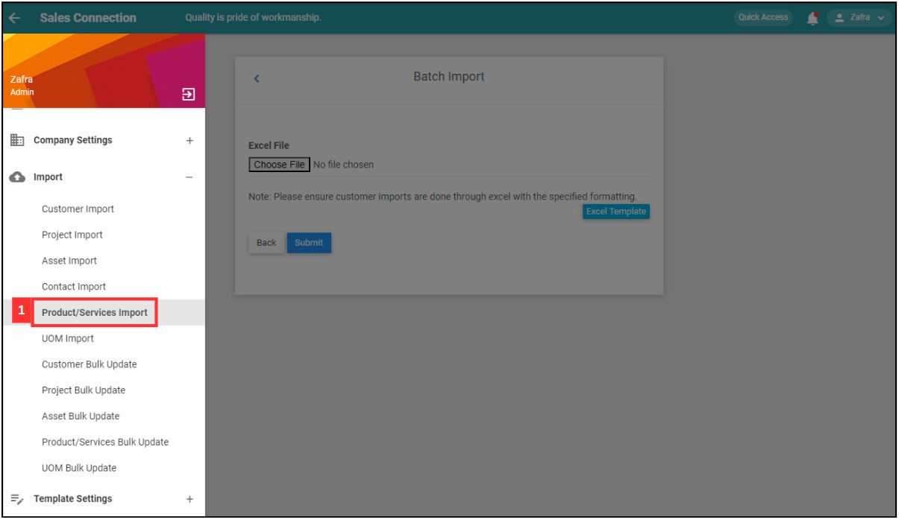
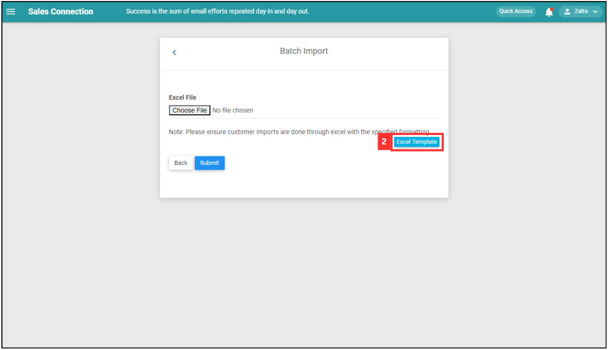
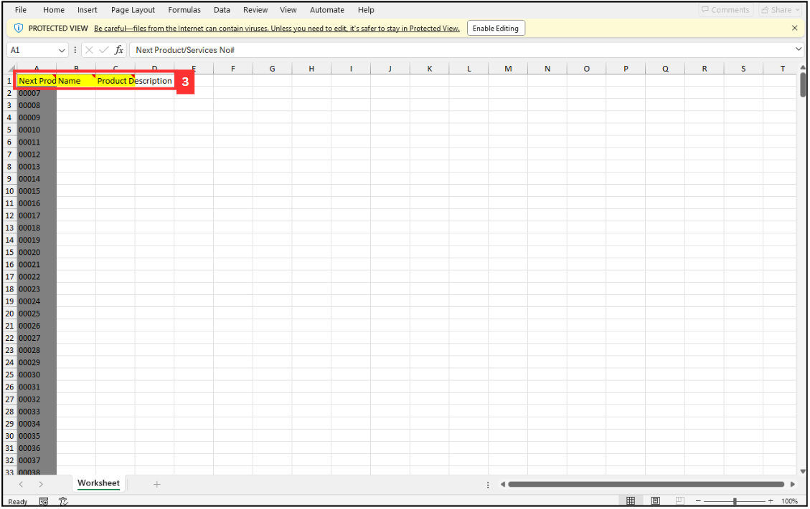
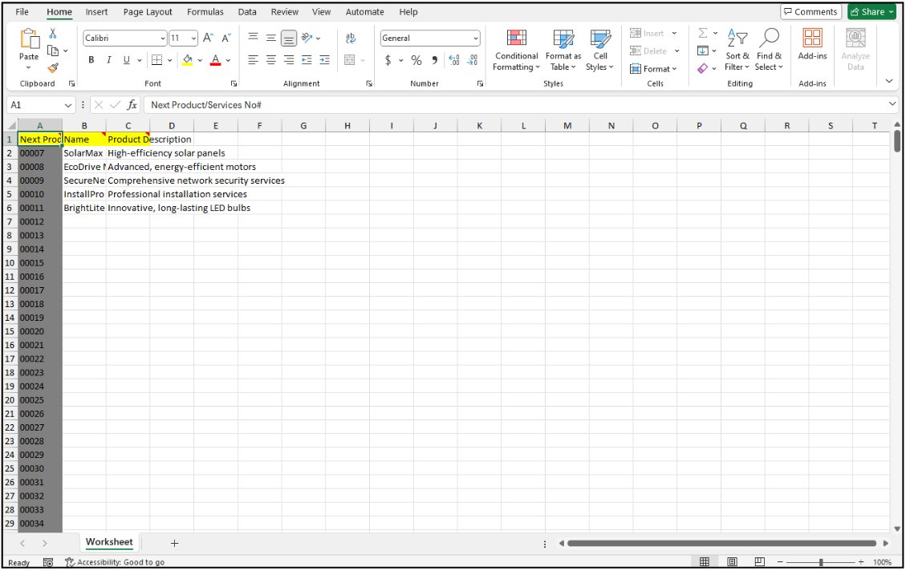
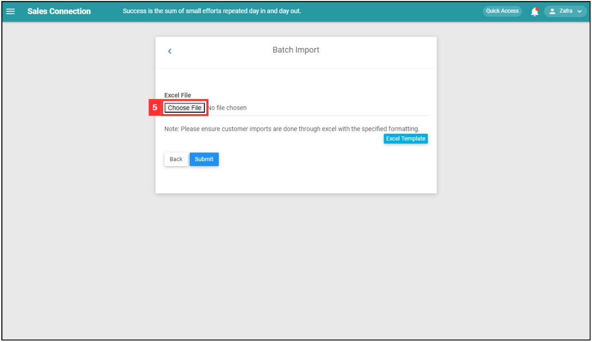
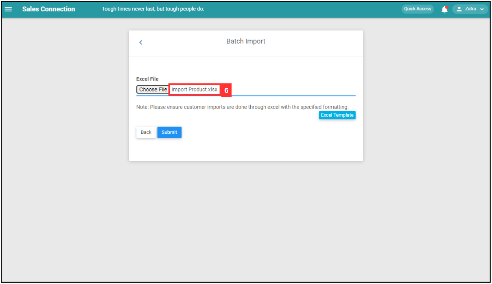
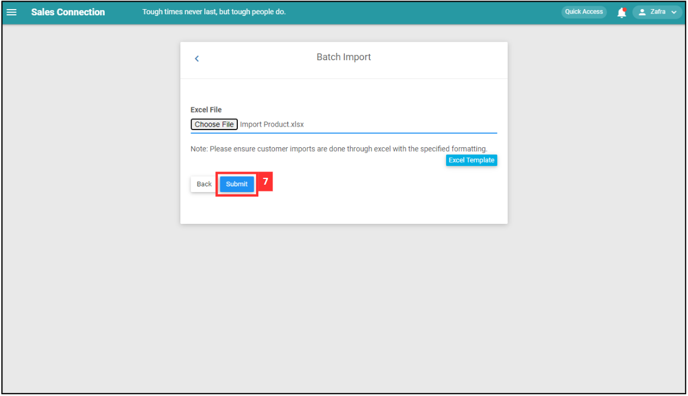
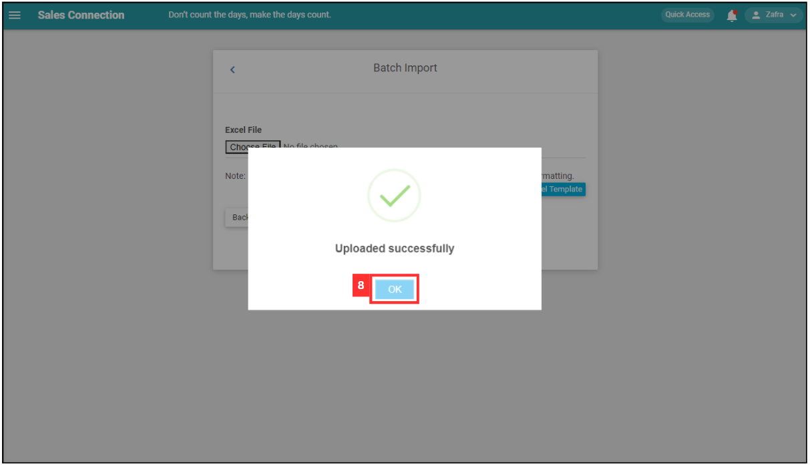

Version 1.0 
Created: 19 June 2024 
Updated: 19 June 2024 
## How to Import New Product/Services(s)?
    
  1. At the desktop site's navigation bar, go to Import > Product/Services Import. 
     **Import Product/Services(s) Here:** [https://salesconnection.my/productupload](https://salesconnection.my/productupload) 

     

       
     

     *Note: You must have access to Import menu to perform this action. Please request permission or help from your admin if you do not have access to the menu. 

  2. Click "Excel Template". 

     

       
     

  3. Fill out the details of the new product/services. Available column fields may differ depending on your company’s system setup. 
     a. The details include: 
        - Name 
        - Product Description 
    
     

       
     

     
  4. Make sure all the information of the product/services is correct and save the file. 

     

       
     

     *Note: Make sure that "Name" of the product/services is unique. 
     
  6. Go back to the product/services import page and choose the correct file by clicking "Choose File" to import. 

     

       
     

  7. Make sure the file uploaded is correct. 

     

       
     

  8. Click on the "SUBMIT" button. 

     

       
     

  9. Your items are successfully added when the “Uploaded successfully” prompt appears. 

     

       
     

     

**Related Articles** 
- [How to Import New Customer(s)?](Import_Customer.md)
- [How do I Import New Project(s)?](Import_Project.md)
- [How do I Import New Asset(s)?](Import_Asset.md)
- [How to Import New UOM(s)?](Import_UOM.md)
- [How do I Import New User(s)?](Import_User.md)
- [How to Import New Contact(s)?](Import_Contact.md)

<!-- [Link Text](https://salesconnection.github.io/Sales-Connection-Support/Import_Product_Services.html) -->
