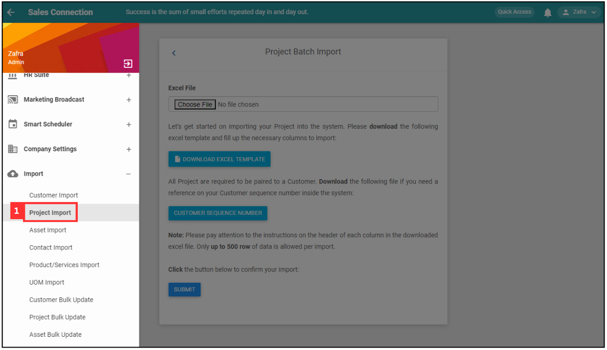
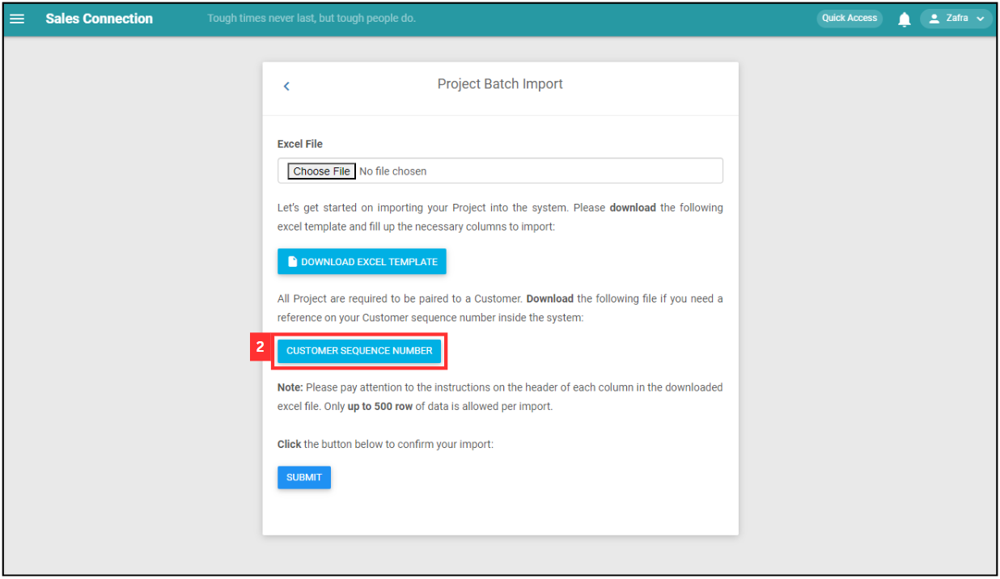
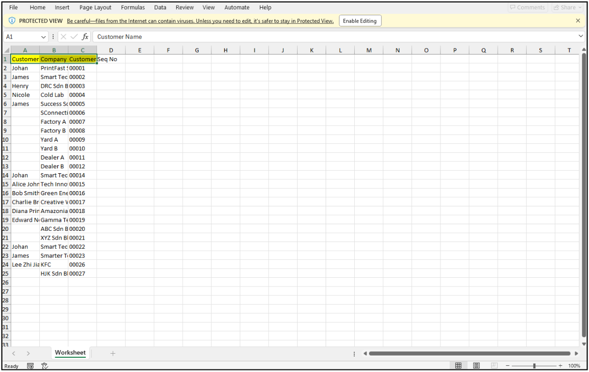
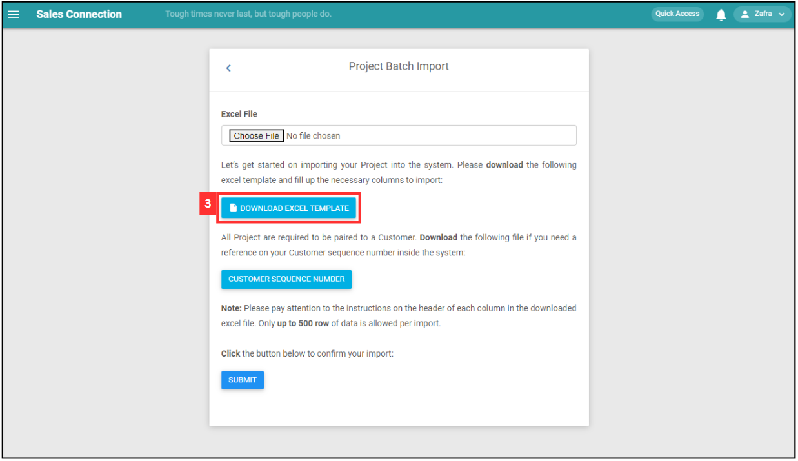
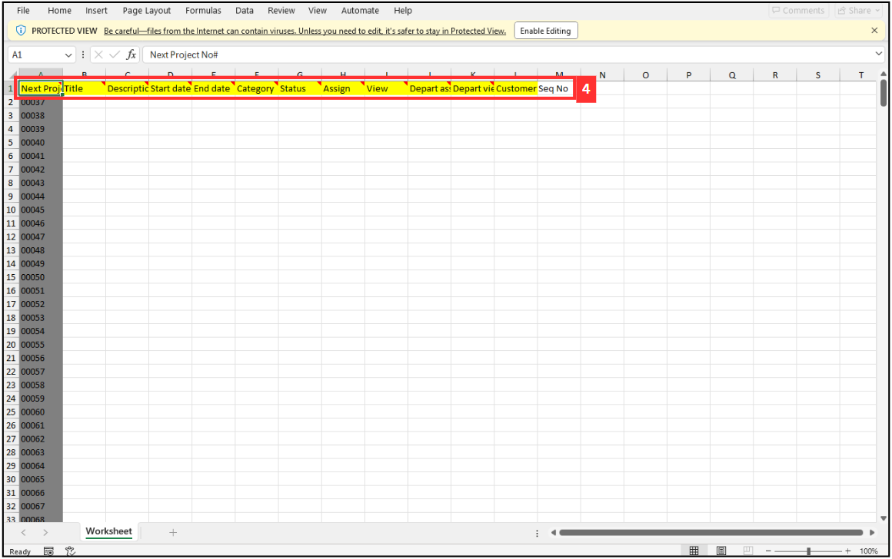
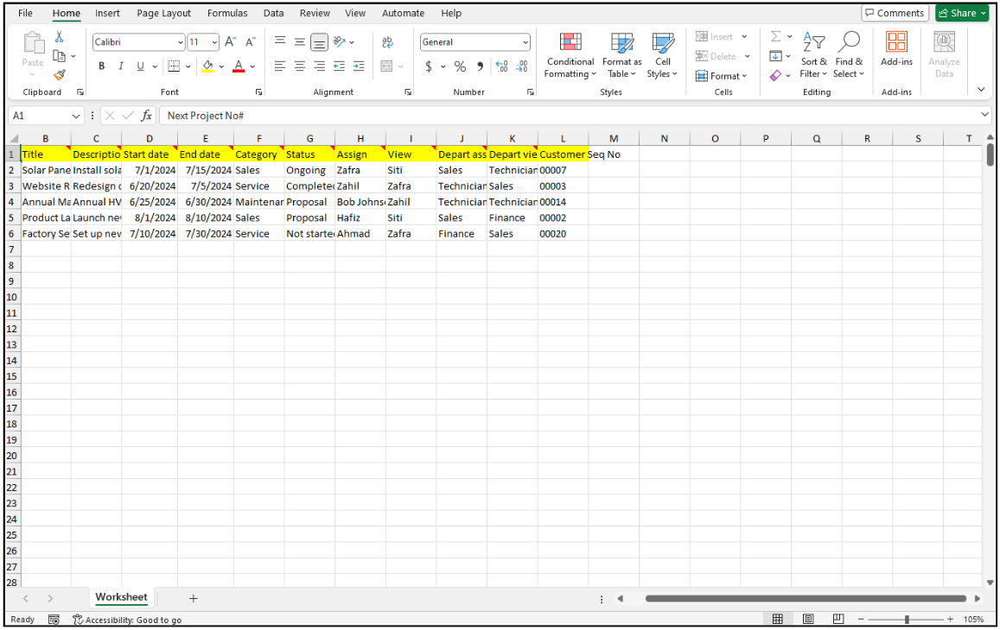
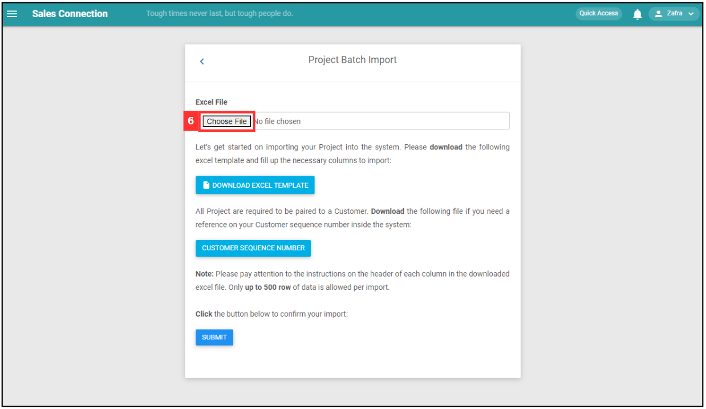
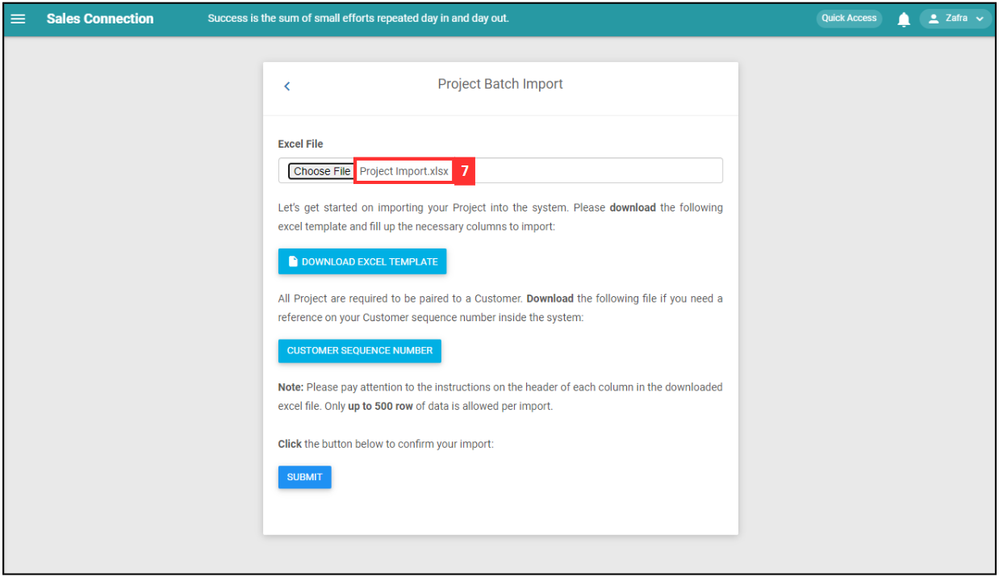
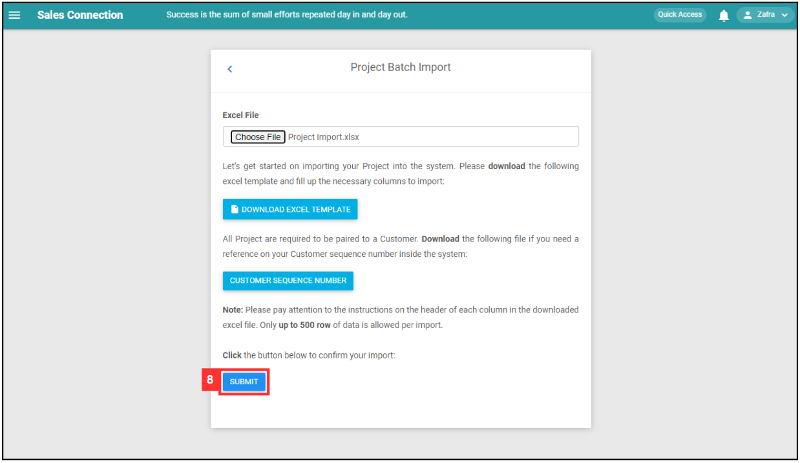
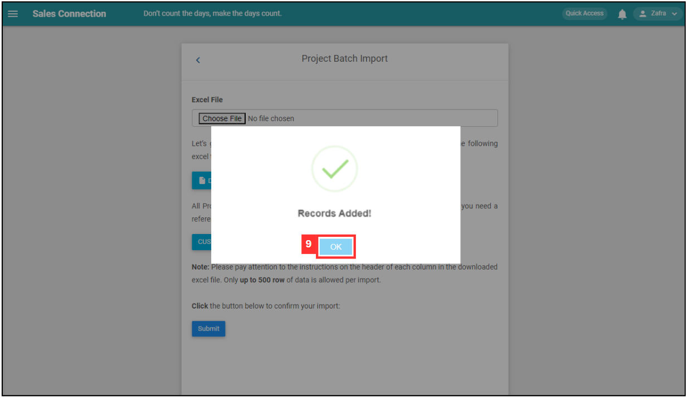

Version 1.0 
Created: 24 June 2024 
Updated: 24 June 2024 
## How do I Import New Project(s)?
    
  1. At the desktop site's navigation bar, go to Import > Project Import. 
     **Import Project(s) Here:** [https://salesconnection.my/dealupload](https://salesconnection.my/dealupload) 

     

       
     

     *Note: You must have access to Import menu to perform this action. Please request permission or help from your admin if you do not have access to the menu. 

  2. Click "CUSTOMER SEQUENCE NUMBER" and refer to the Customer sequence number. 

     

       
     

     This is the sample of the Project sequence number Excel file. 

     

       
     

  3. Click "DOWNLOAD EXCEL TEMPLATE".

     

       
     

  
  4. Fill out the details of the new Projects. Available column fields may differ depending on your company’s system setup. 
     a. The details include: 
        - Title 
        - Description 
        - Start date 
        - End date 
        - Category 
        - Status 
        - Assign 
        - View 
        - Depart assign 
        - Depart view 
        - Customer Seq No 
    
     *Note: Please include + and the international code for the phone number's country followed by the phone number itself. Eg: +60122780122; +60358805110. 

     

       
     

     
  5. Make sure all the information of the Projects is correct and save the file. 

     

       
     

  6. Go back to the Project import page and choose the correct file by clicking "Choose File" to import. 

     

       
     

  7. Make sure the file uploaded is correct. 

     

       
     

  8. Click on the "SUBMIT" button. 

     

       
     

  9. Your items are successfully added when the “Records Added” prompt appears 

     

       
     

     

**Related Articles** 
- [How to Add New Project?](Add_New_Project.md)
- [How do I Import New Customer(s)?](Import_Customer.md)
- [How to Import New Product/Services(s)?](Import_Product_Services.md)
- [How do I Import New Asset(s)?](Import_Asset.md)
- [How to Import New UOM(s)?](Import_UOM.md)
- [How do I Import New User(s)?](Import_User.md)
- [How to Import New Contact(s)?](Import_Contact.md)

<!-- [Link Text](https://salesconnection.github.io/Sales-Connection-Support/Import_Project.html) -->
