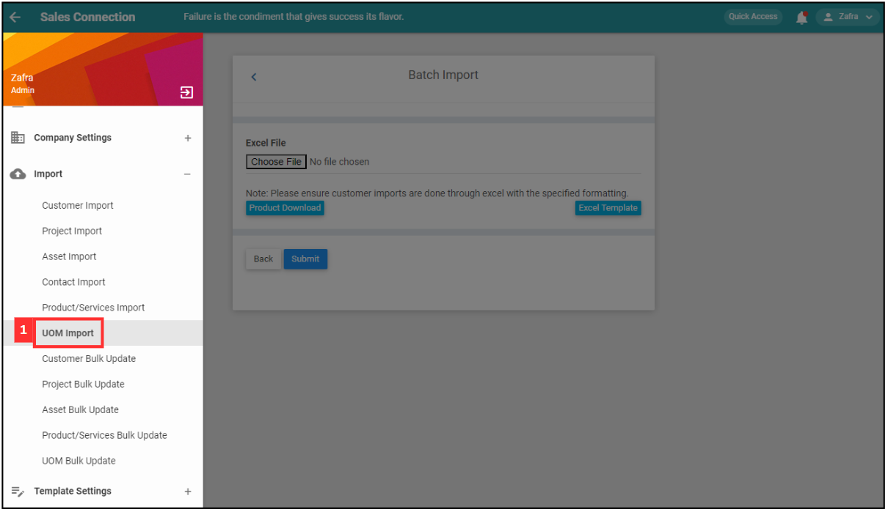
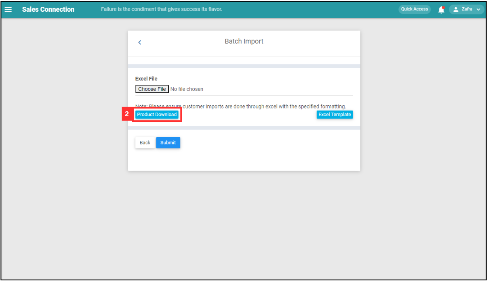
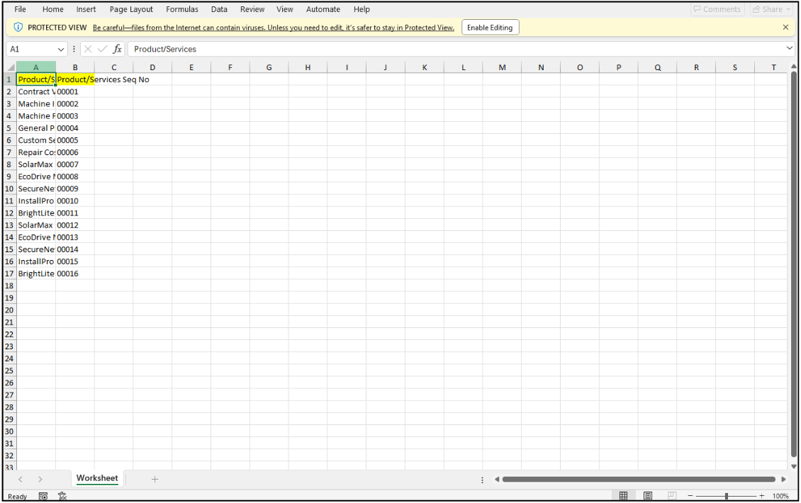
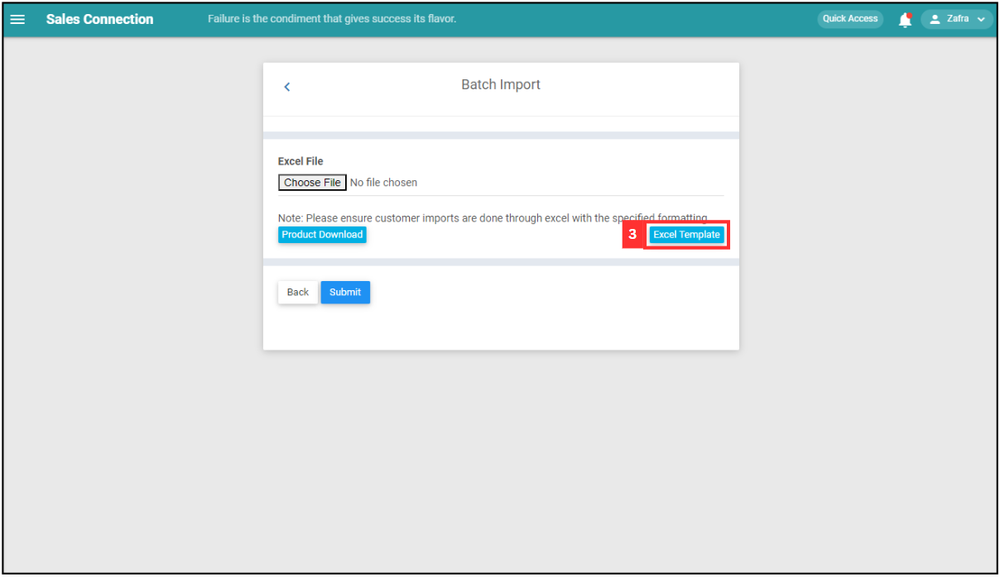
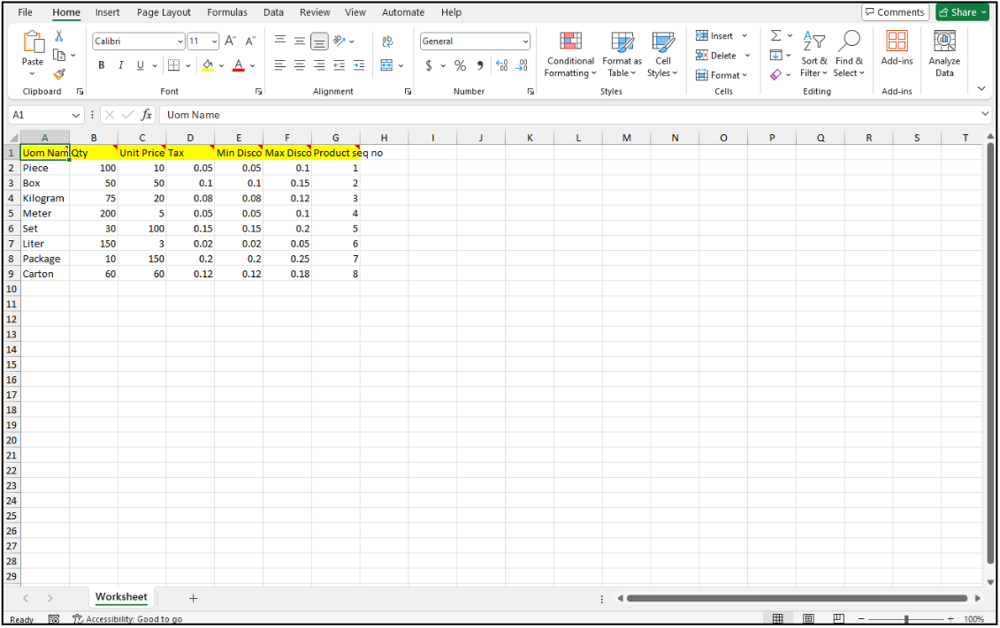
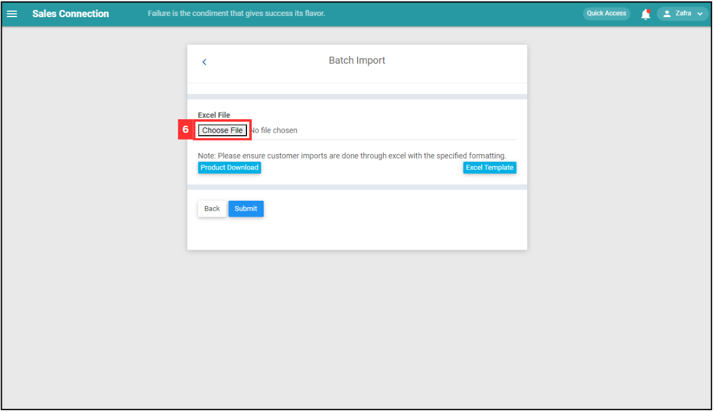
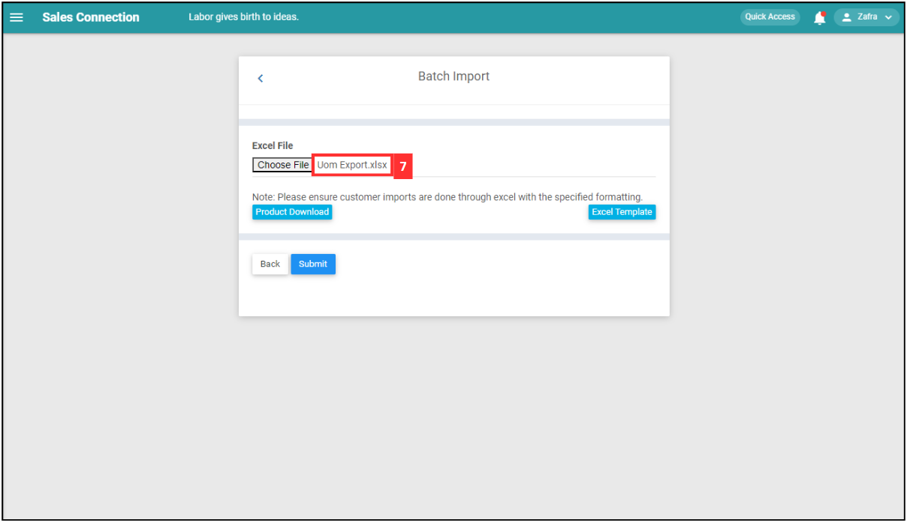
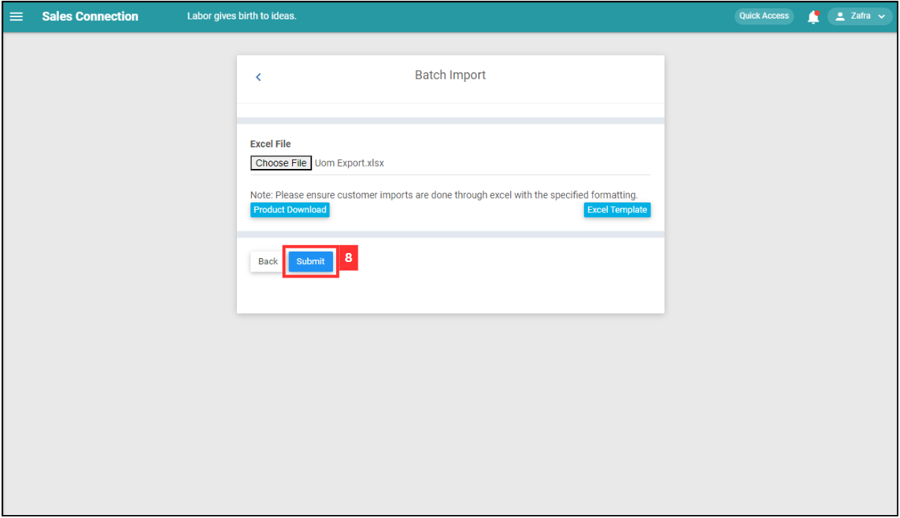
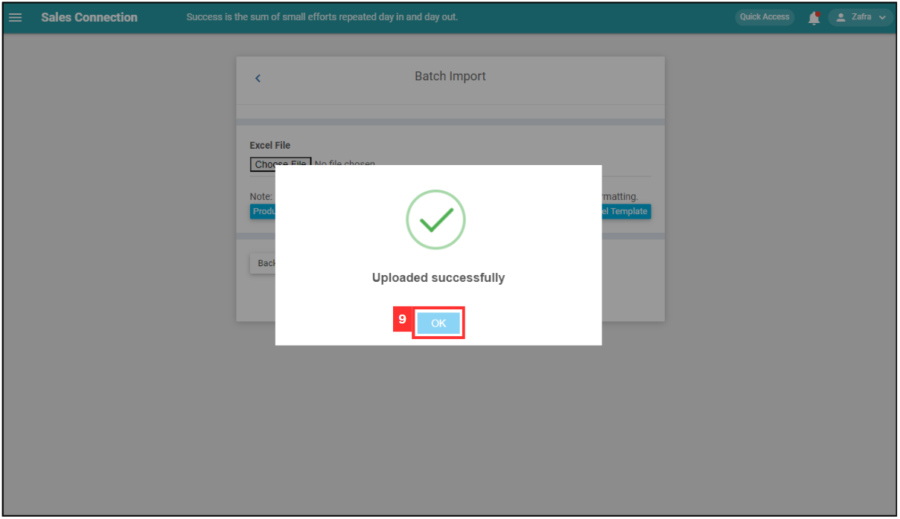

Version 1.0 
Created: 26 June 2024 
Updated: 26 June 2024 
## How do I Import New UOM(s)?

**UOM** stands for Unit Of Measurement. It allows you to attach information such as quantity, unit price, discount, tax to a product/services.

  1. At the desktop site's navigation bar, go to Import > UOM Import. 
     **Import UOM(s) Here:** [https://salesconnection.my/importuom](https://salesconnection.my/importuom) 

     

       
     

     *Note: You must have access to Import menu to perform this action. Please request permission or help from your admin if you do not have access to the menu.

  2. Download this file and refer to the product sequence number. 

     

       
     

     This is the sample of the product/services sequence number Excel file. 

     

       
     

  3. Click "Excel Template". 

     

       
     

  4. Fill out the details of the new UOM. 
     a. The details include: 
        - **UOM Name*** 
        - Qty 
        - Unit Price (Specific number indicates a fixed price while unit price = "0" allows free pricing which can input any value later) 
        - Tax (Data is in range of 0-100 percentage) 
        - Min Discount (Data is in range of 0-100 percentage) 
        - Max Discount (Data is in range of 0-100 percentage) 
        - **Product seq no***: Correspond to code from file in Step 2 

        *Note: Fields marked with an asterisk ( * ) are required. 
     
     

       
     

     
  5. Make sure all the information of the UOM is correct and save the file. 

     

       
     

  6. Go back to the UOM import page and choose the correct file by clicking "Choose File" to import. 

     

       
     

  7. Make sure the file uploaded is correct. 

     

       
     

  8. Click on the "SUBMIT" button. 

     

       
     

  9. Your items are successfully added when the “Uploaded successfully” prompt appears. 
     

       
     

     

**Related Articles** 
- [How do I Import New Customer(s)?](Import_Customer.md)
- [How to Import New Project(s)?](Import_Project.md)
- [How to Import New Product/Services(s)?](Import_Product_Services.md)
- [How do I Import New Asset(s)?](Import_Asset.md)
- [How do I Import New User(s)?](Import_User.md)
- [How to Import New Contact(s)?](Import_Contact.md)

<!-- [Link Text](https://salesconnection.github.io/Sales-Connection-Support/Import_UOM.html) -->
