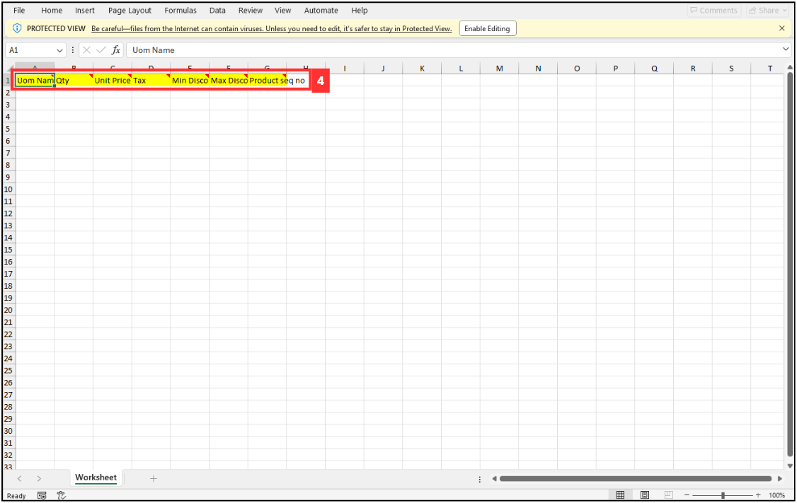

## How to Import New UOM?
    
  1. At the desktop site's navigation bar, go to Import > UOM Import. 
     **Import UOM Here:** [https://salesconnection.my/importuom](https://salesconnection.my/importuom) 

     

       
     

  2. Download this file and refer to the product sequence number. 

     

       
     

     This is the sample of the product/services sequence number Excel file. 

     

       
     

  3. Click "Excel Template". 

     

       
     

  4. Fill out the details of the new UOM. 
     a. The details include: 
        - UOM Name 
        - Qty 
        - Unit Price 
        - Tax 
        - Min Discount 
        - Max Discount 
        - Product seq no 
        
     

       
     

     
  5. Make sure all the information of the UOM is correct and save the file. 

     

       
     

  6. Go back to the UOM import page and choose the correct file by clicking "Choose File" to import. 

     

       
     

  7. Make sure the file uploaded is correct. 

     

       
     

  8. Click on the "SUBMIT" button. 

     

       
     

  9. Click "OK" and the UOM has been imported successfully. 
      

       
      

     

**Related Articles** 
- [How to Import New Customer/Project?](Import_Customer_Project.md)
- [How to Import New Product/Services?](Import_Product_Services.md)
- [How to Import New User?](Import_User.md)
- [How to Import New Asset?](Import_Asset.md)
