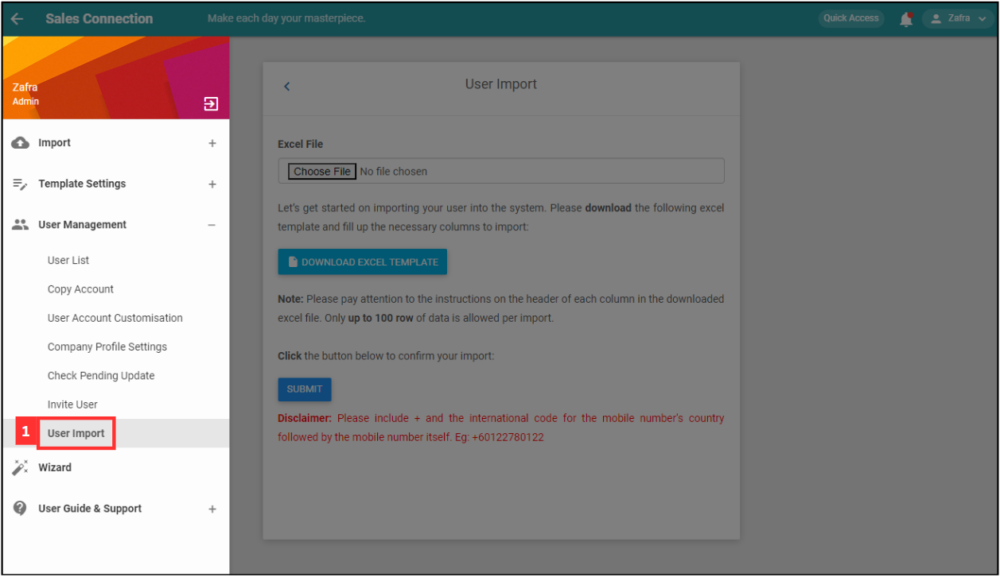
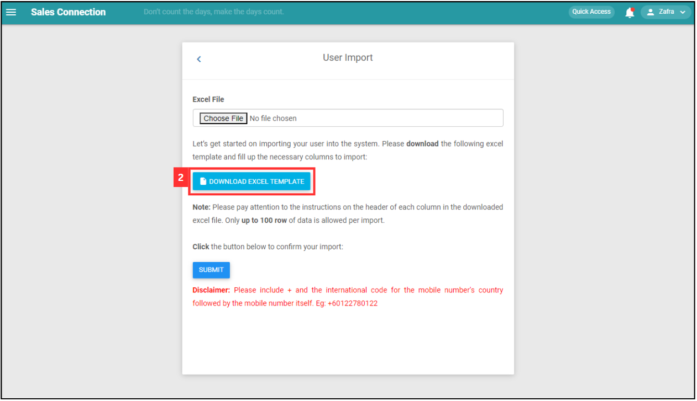
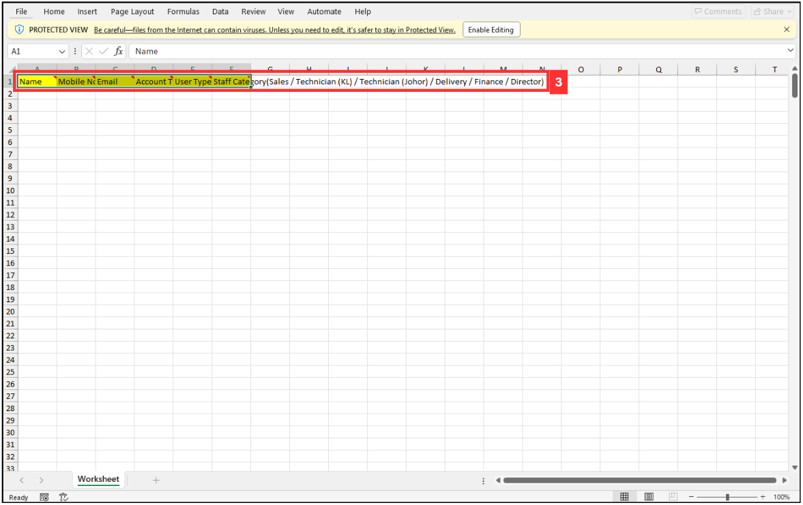
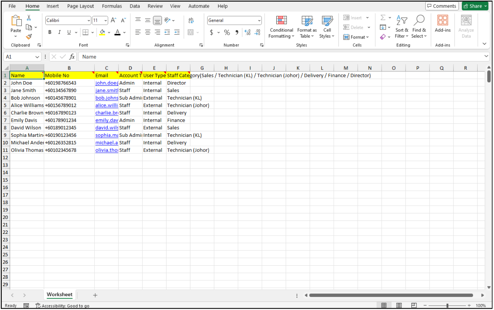
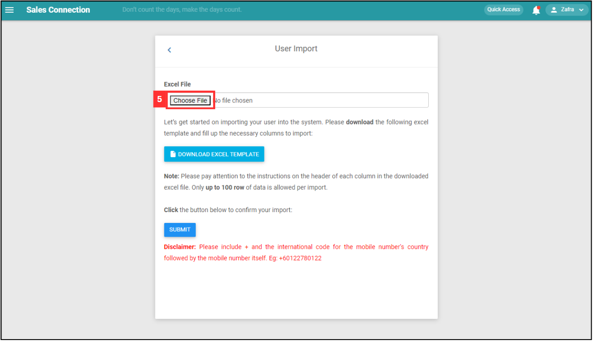
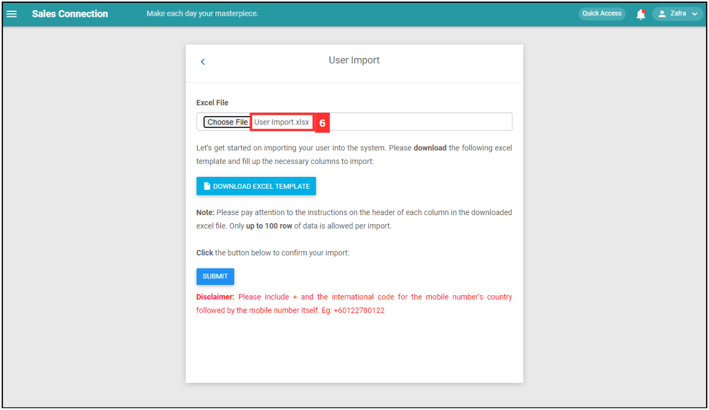
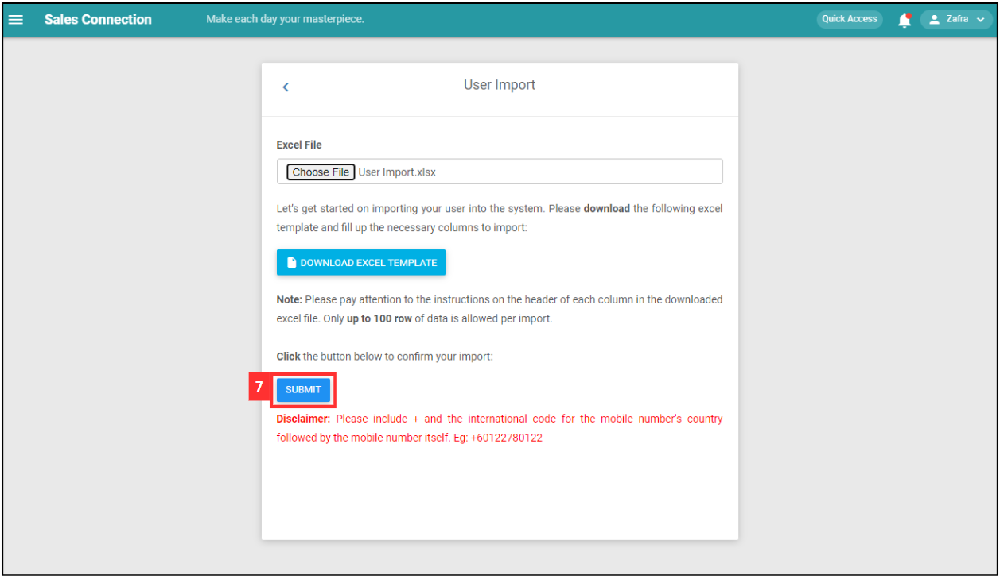
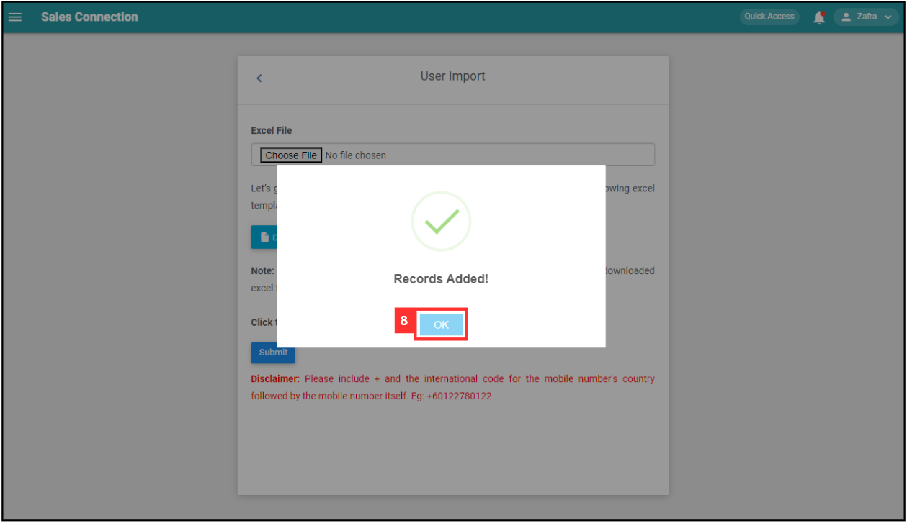

Version 1.0 
Created: 14 June 2024 
Updated: 14 June 2024 
## How do I Import New User(s)?
    
  1. At the desktop site's navigation bar, go to User Management > User Import. 
     **Import User(s) Here:** [https://salesconnection.my/usermanage/userimport](https://salesconnection.my/usermanage/userimport) 

     

       
     

     *Note: You must have access to User Management menu to perform this action. Please request permission or help from your admin if you do not have access to the menu. 
     
  2. Click "DOWNLOAD EXCEL TEMPLATE". 

     

       
     

  3. Fill out the details of the new users. 
     a. The details include: 
        - Name 
        - Mobile No 
        - Email (optional if the user is a Staff account type that only accesses the mobile app) 
        - Account Type 
        - User Type 
        - Staff Category 
        
     *Note: Please include + and the international code for the mobile number's country followed by the mobile number itself. Eg: +60122780122. 

     

       
     

     
  4. Make sure all the information of the users is correct and save the file. 

     

       
     

  5. Go back to the user import page and choose the correct file by clicking "Choose File" to import. 

     

       
     

  6. Make sure the file uploaded is correct. 

     

       
     

  7. Click on the "SUBMIT" button. 

     

       
     

  8. Your user(s) are successfully added when the "Record Added!" prompt appears. 

     

       
     

     

**Related Articles** 
- [How to Add New User?](Add_New_User.md)
- [How to Import New Customer(s)?](Import_Customer.md)
- [How do I Import New Project(s)?](Import_Project.md)
- [How to Import New Product/Services(s)?](Import_Product_Services.md)
- [How do I Import New Asset(s)?](Import_Asset.md)
- [How to Import New UOM(s)?](Import_UOM.md)
- [How to Import New Contact(s)?](Import_Contact.md)

<!-- [Link Text](https://salesconnection.github.io/Sales-Connection-Support/Import_User.html) -->
