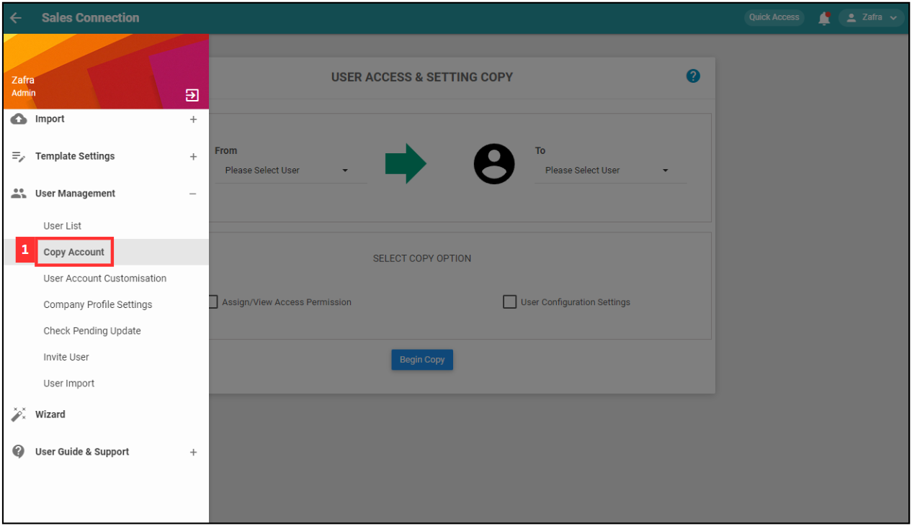
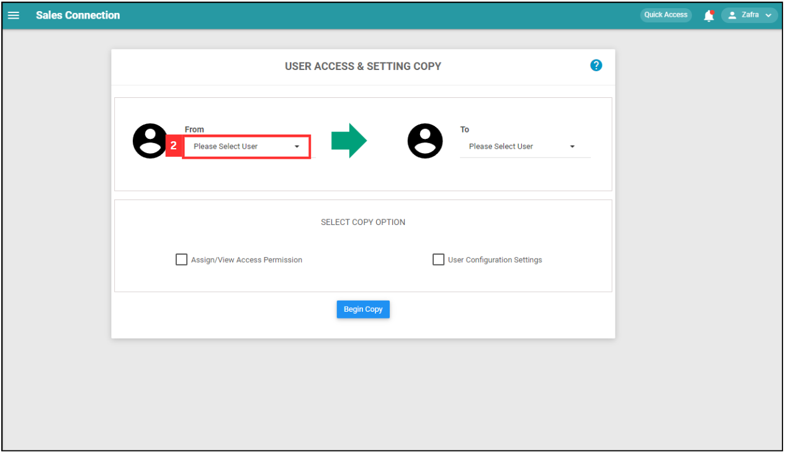
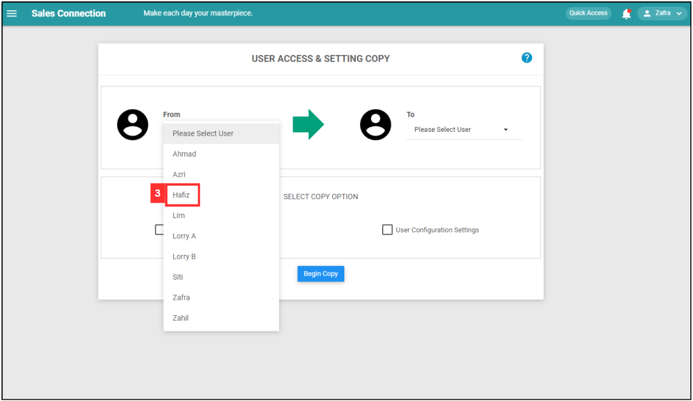
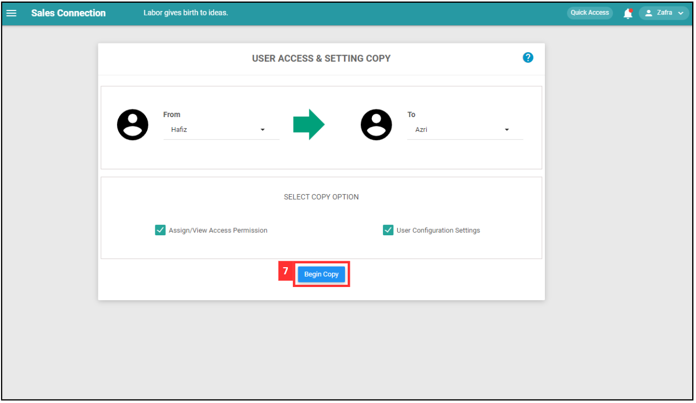
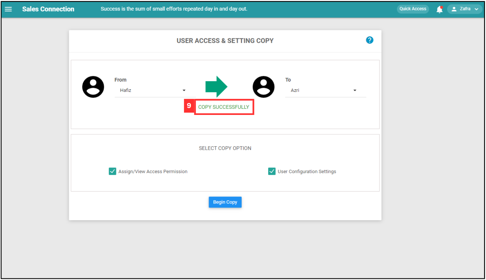

## How to Import New User?
    
  1. At the desktop site's navigation bar, go to User Management > User Import. 
     **Import User Here:** [https://salesconnection.my/usermanage/userimport](https://salesconnection.my/usermanage/userimport) 

     

       
     

  2. Click on the "+" button to access the "Add New User" page. 

     

       
     

  3. Fill out the details of your new team member. 
     a. The details include: 
        - Name 
        - Telephone 
        - Email (optional if the user only uses a mobile device) 
        - Staff Category 
        - Account Type 
        - Color (Choose one to represent the user in the system) 

     

       
     

     
  4. Click “Submit Form” to add new user. 

     

       
     

  5. The new user has been added successfully. 

     

       
     

  6. At the desktop site's navigation bar, go to User Management > Copy Account. 
     **Copy Account Here:** [https://salesconnection.my/transferAccount](https://salesconnection.my/transferAccount) 

     

       
     

  7. Click on the expand button. 

     

       
     

  8. Select the user who needs to copy the account from. 

     

       
     

  9. Click on the expand button. 

     

       
     

  10. Select the user who needs to copy the account to. 

      

       
      

  11. Select the copy option. 

      

       
      

  12. Click on the "Begin Copy" button. 

      

       
      

  13. Click "Yes" to copy the account. 

      

       
      

  14. The account has been copied successfully. 

      

       
      

     

**Related Articles** 
- [How to Add New User?](Add_New_User.md)
- [How to Assist My New User to Login?](New_User_Login.md)
- [How to Login Into Sales Connection Using Mobile and Desktop?](Login.md)
