Version 1.0 
Created: 4 July 2024 
Updated: 4 July 2024 
## How to use Job Dashboard?

   **Navigate to the section by clicking it.** 

   - [Select Job Category](#section1)
   - [Filter](#section2)
   - [Favourite Filter](#section3)
   - [Default Filter](#section4)
   - [Clear All Filter](#section5)
   - [Change Job Status](#section6)
   - [Edit Job Details](#section7)
   - [Add New Job](#section8)
   - [Refresh Page](#section9)
      

   *Note: This guide can also be applied to Project and Digital Form Dashboard.

   1. At the desktop site's navigation bar, go to Business Management > Dashboard > Job. 
      **Open Job Dashboard Page Here:** [https://salesconnection.my/dashboard/task](https://salesconnection.my/dashboard/task) 
     
      

       
      
 
                         
   2. There are three choices at the top right corner of Job Dashboard page. You can click on them to enter another dashboard page.

      

        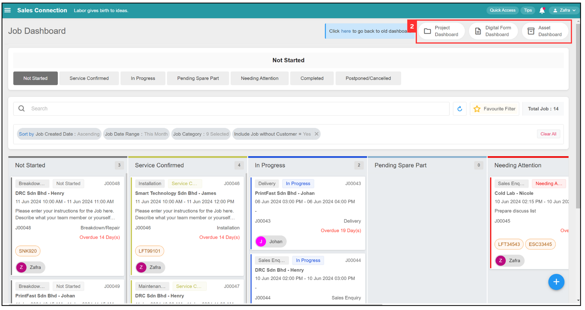
      
 
  
      
   
      **Select Job Category**
   
   3. You can the job status that you want to view.

      

        
      
 

   4. For example, select "Completed". The job dashboard will display the completed jobs as shown in the picture below.

      

        
      
 

   5. Click on this filter bubble if you want to sort the order of job created date.
  
      

        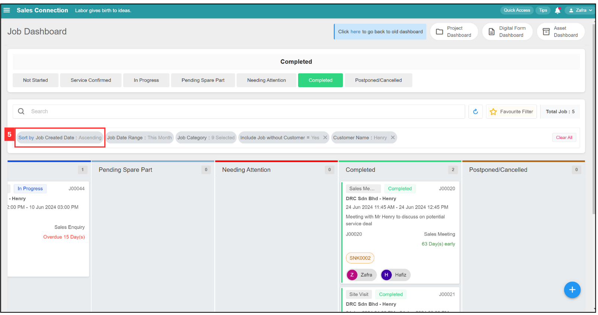
      
 

   6. The default filter value sorts the jobs by ascending order. You can change it to sort by descending order based on your preference.

      

        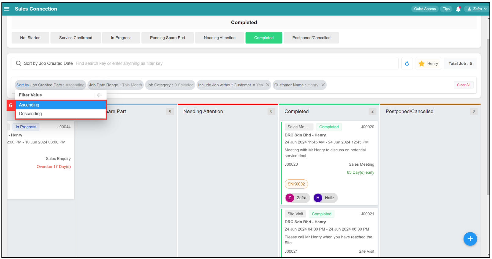
      
 
      
   7. Click on this filter bubble if you want to change the job date range.

      *Note: The default Job Date Range is filtered by this month.

      

        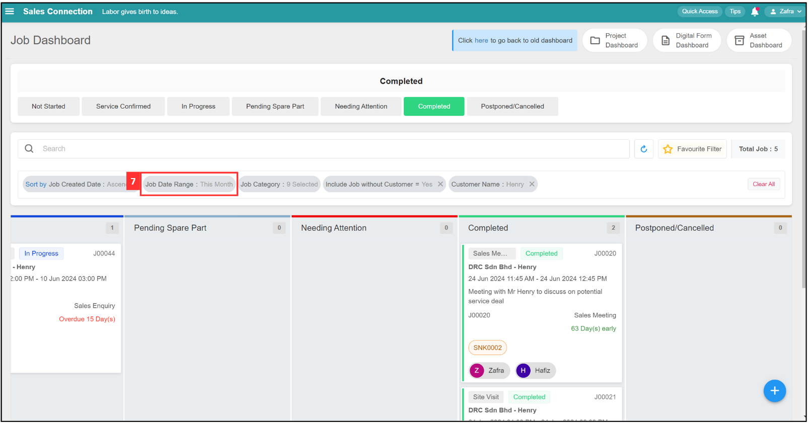
      
 

   8. You can select the job filter date range based on your own preference.  

      

        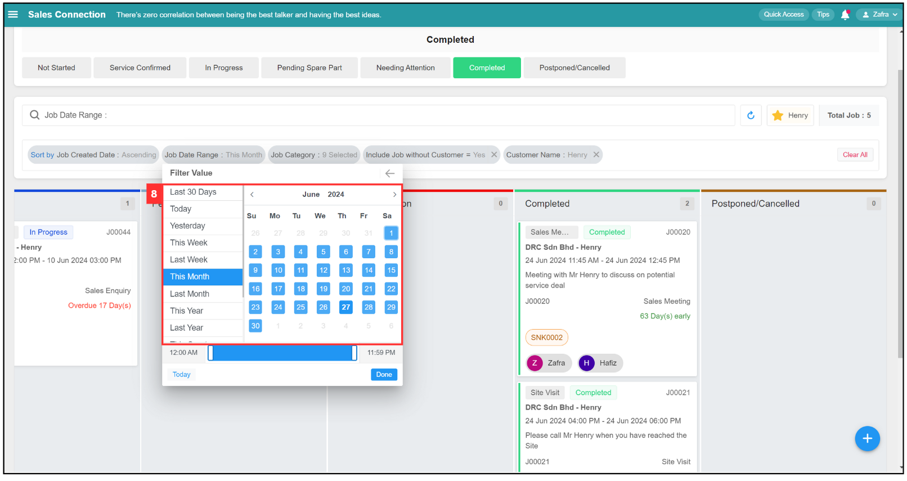
      
 

   9. Click "Done" to apply job by the selected the job date range.
   
      

        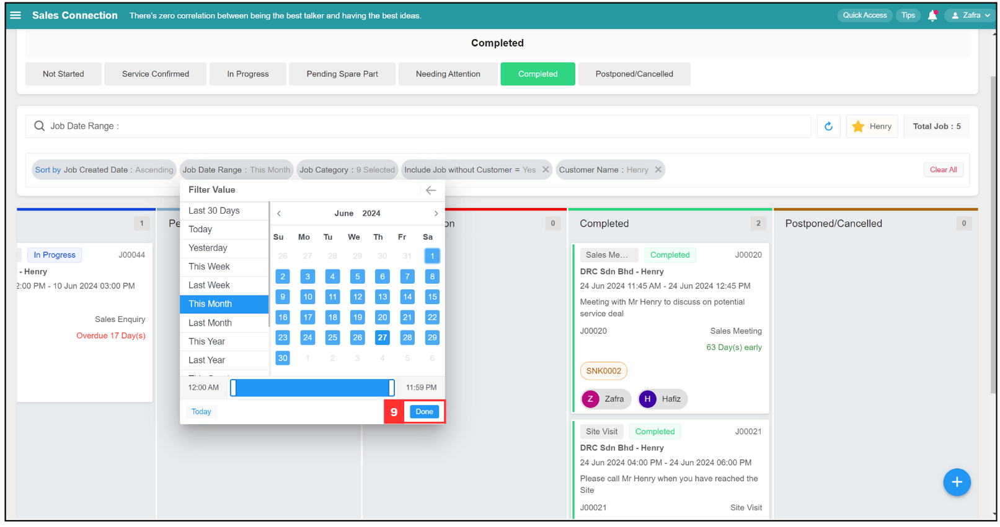
      
 

  10. Click on this filter bubble if you want to filter job by job category.
    
      

        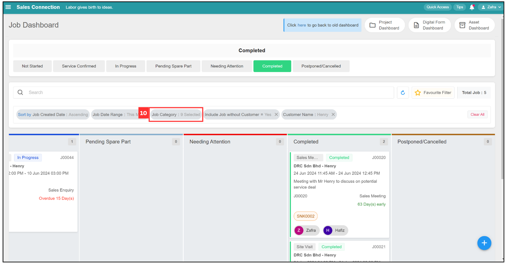
      
 
      
  11. Select/unselect the job category by ticking/unticking them.

      

        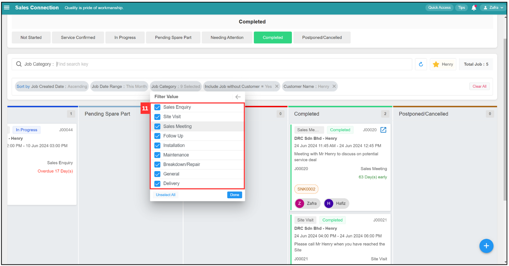
      
 
  
  12. Click "Done" to apply the job category filter value.

      

        
      
 
  
  13. Click on this filter bubble if you want to filter job by either include / no include job without customer.
  
      

        
      
 

  14. Select for yes or no, and the filter value will apply successfully. 
  
      

        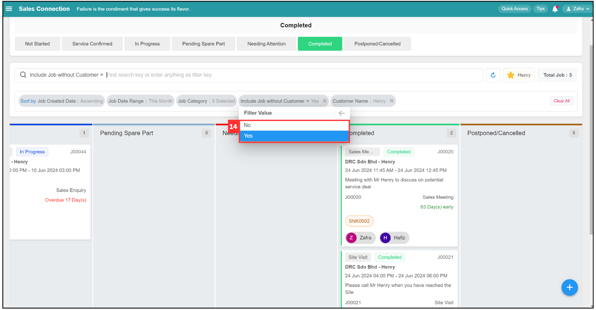
      
 
 
      

      **Filter**
   
  15. Click on the search bar to filter for job.

      

        
      
 

  16. Click on the group you want to filter. For example, click "# Customer. 

      

        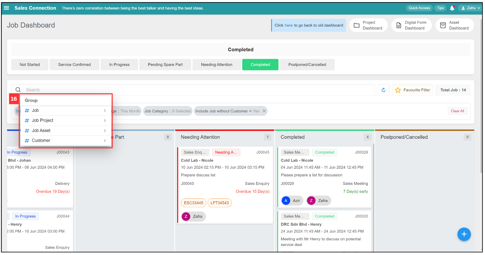
      
 

  17. Click on the "Filter Variable" you want. For example, click "Customer Name".

      

        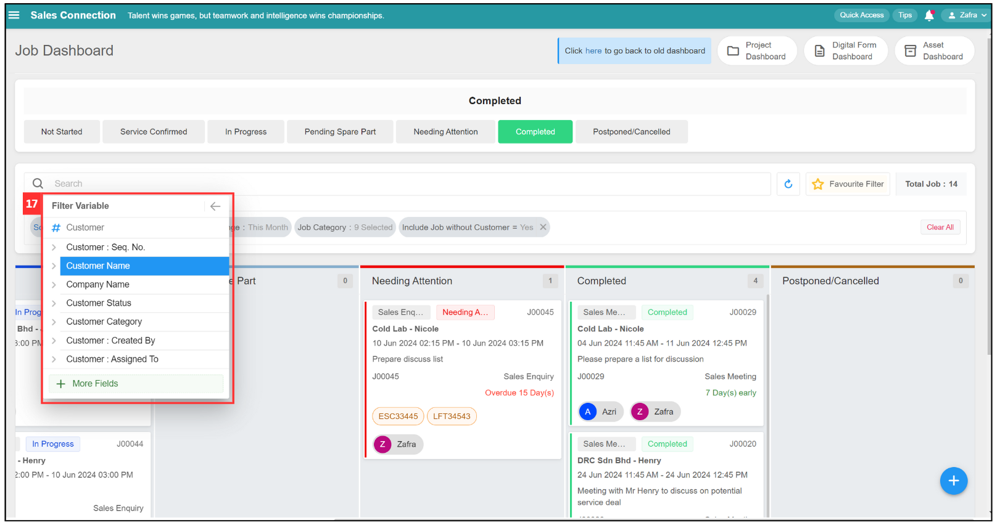
      
 

  18. Click on the "Operator" you want. For example, select "Contain", and all the filter values available will be shown.

      | Operator | Definition | 
      |---------|:-----|
      | Contain | The result will show all relevant results based on the filter values. (Not consider capital letter and small letter, recommend to use it if you are not remember the exact customer name.) |
      | Not Contain | The results will show all relevant results except the selected filter values. (Not consider capital letter and small letter.)| 
      | Equal | The results will only show exact the same based on the filter value (Consider capital letter and small letter, recommend to use it if you remember the exact customer name.)| 
      | Not Equal | The results will only show except the exact filter value. (Consider capital letter and small letter.) |

      

        
      
 

  19. Click on the search bar to enter the filter value you want.

      

        
      
 
 
  20. After enter the customer name on the search bar, press enter key in your keyboard to search for the job of the customer.

      

        
      
 

  21. The filter applied will show in the filter bubble and the result will be shown as below. 

      

        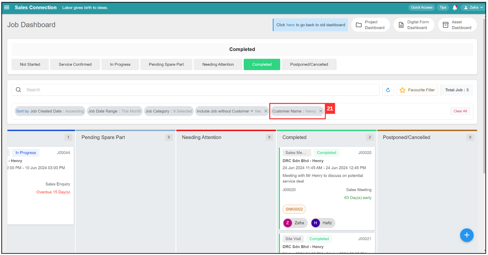
      
 

       
  
      **Favourite Filter** 
  
  23. If you want to save the filter from previous step, you can click on the "Favourite Filter".

      

        
      
 

  24. Click "+ Add" to apply favourite filter.

      

        
      
 

  25. Click on the text box to enter the label name of the favourite filter.

      

        
      
 

  26. Click on the "Save" button to apply the favourite filter.

      

        
      
 

  27. The favourite filter has been saved successfully when you see this.

      

        
      
 
  
      

      **Default Filter**
  
  27. Click the favourite filter, if you want to apply that favourite filter as default filter. 

      

        
      
 

  28. There were 4 buttons behind each favourite filter. 

       | Button | Function |
       |-------|:---------|
       | Set Global | The filter option will be shared and used by all other users once enable.  *Note: This action can only performed by an admin.|
       | Share | You can copy this link and share it with other users so they can apply the same filter in the Job Dashboard. *Note: Paste the link into the text box in step 25.
       | Edit | Rename the favourite filter. |
       | Delete | Delete the favourite filter. |

      

        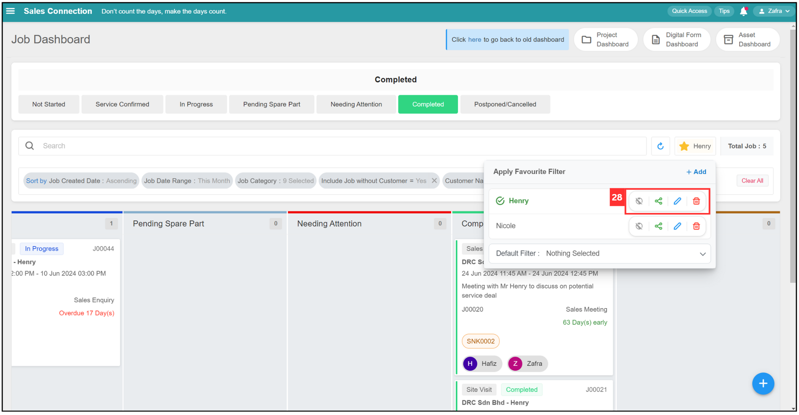
      
 
  
  29. Click on the "Default Filter" to select Favourite Filter and set it as default filter.

      

        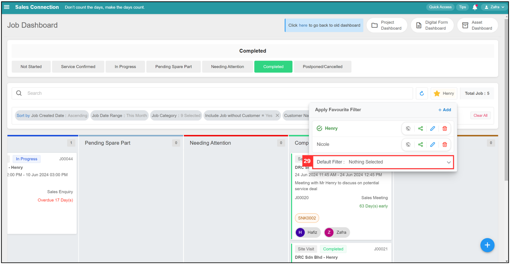
      
 
  
  30. Select for the favourite filter and apply it as default filter.

      

        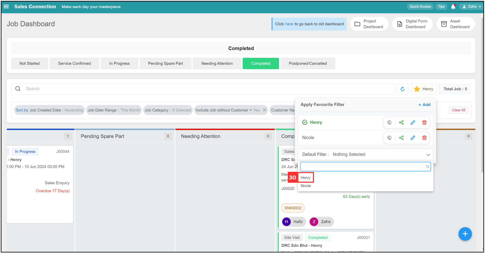
      
 

  31. When you saw this, it means that the default filter as been set successfully. When you log in the next time, it will automatically show you the results applying the default filter you’ve selected.

      

        
      
 

      

      **Clear All Filter**
  
  32. If you want to clear all filters that you have applied manually, click "Clear All" and all filters will be cleared.
  
      *Note: The first four filter bubble are system default filter, these filters would not cleared by clicking "Clear All". If you want to clear these default filter.

      

        
      
 
  
      

      **Change Job Status**

  33. For example, if you want to change a job's status from service confirm to Postponed / Cancelled. Click on the "Service Confirmed".

      

        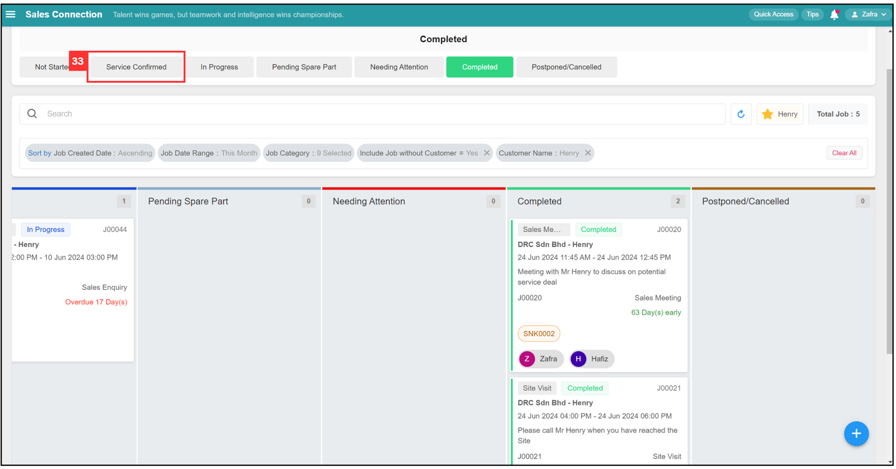
      
 

  34. Select the job that you want to change the job status.

      

        
      
 

  35. Drag the job to the right side.

      

        
      
 

  36. Put the job in "Postponed / Cancelled" job status.

      

        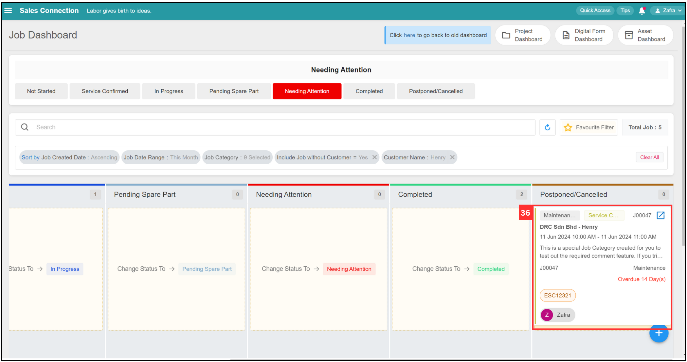
      
 

  37. Click "Update" to confirm your job update status.

      

        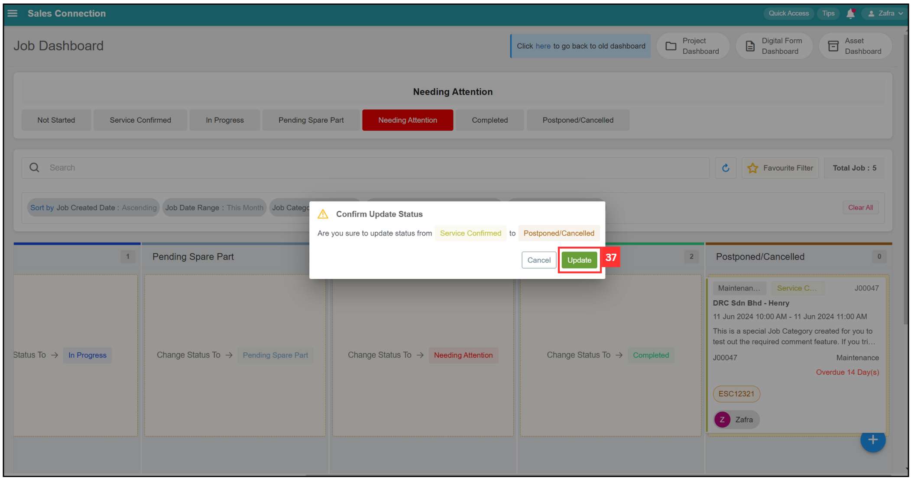
      
 

  38. The job status has been changed successfully when this prompt appears.

      

        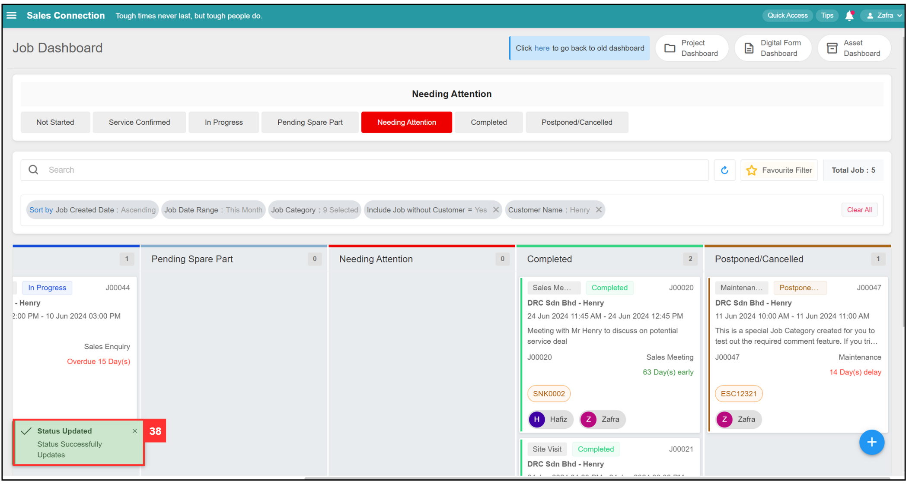
      
 

      

      **Edit Job Details**
  
  39. You can click the expand button to edit the job details.

      

        
      
 

      *Note: The expand button will appears when your mouse pointer is placed at the top right corner of each job.

      
      
      **Add New Job**
  
  40. Click the on the + button at the bottom right corner if you want to create a new job.

      

        
      
 

      
      
      **Refresh Page**
  
  41. Click on the refresh button to ensure all newly created jobs or job status changes are shown on this page.

      

        
      

         

**Related Articles**
- [How to Add New Job?](Add_New_Job.md)      
- [Asset Dashboard](Asset_Dashboard.md)

<!-- [Link Text](https://salesconnection.github.io/Sales-Connection-Support/Job_Dashboard.html) -->
