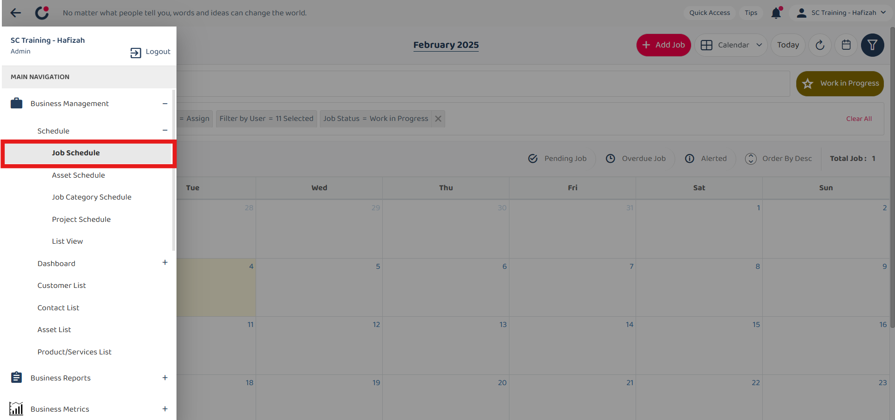
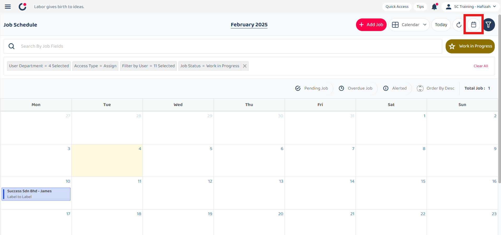
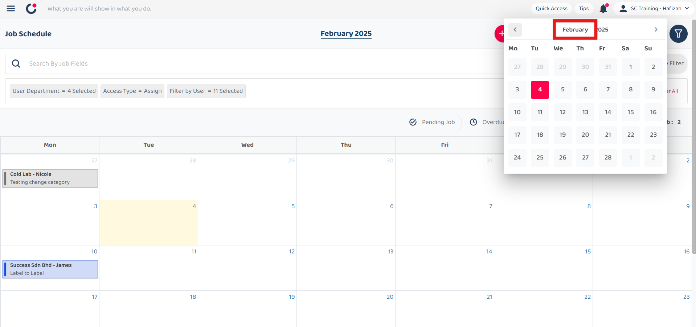
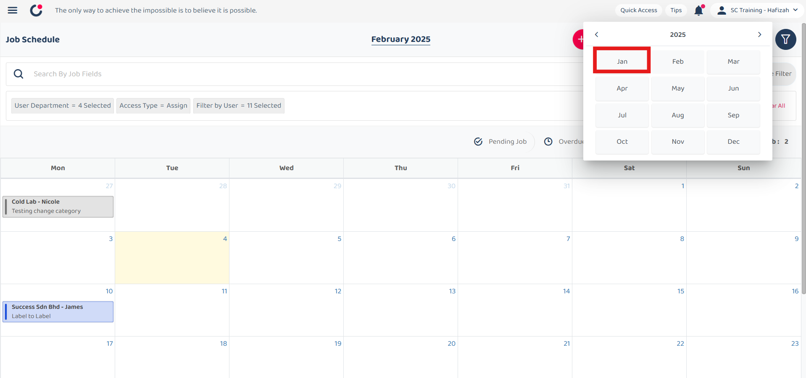
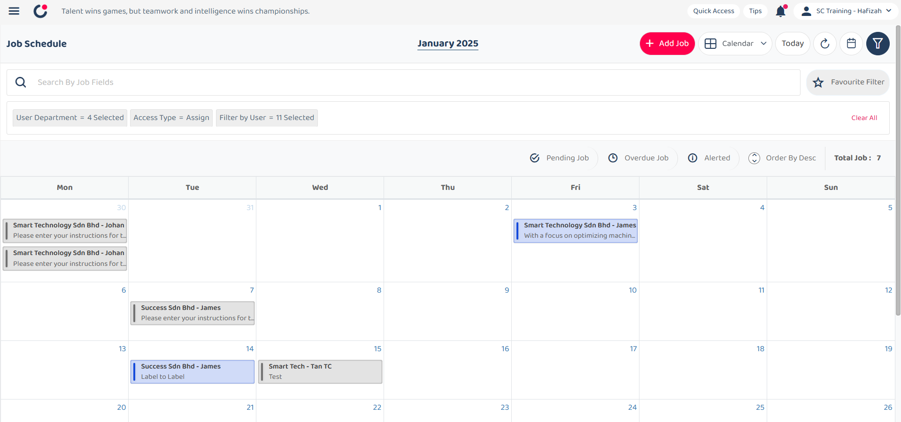
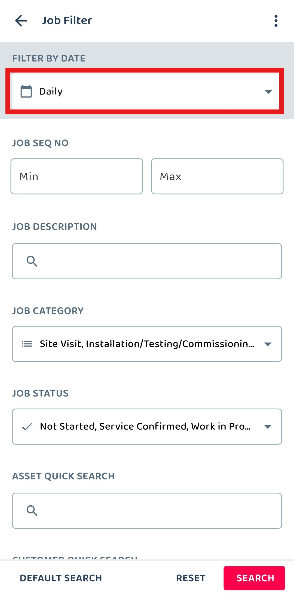
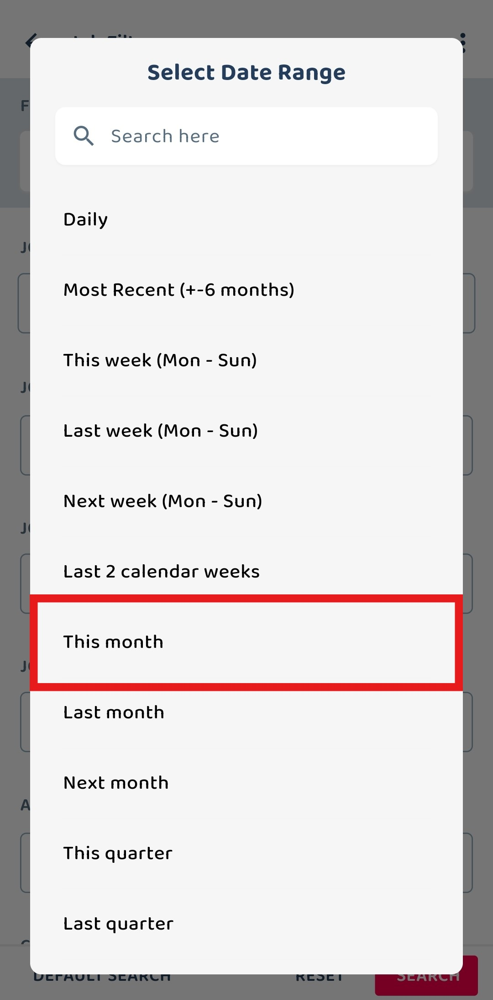
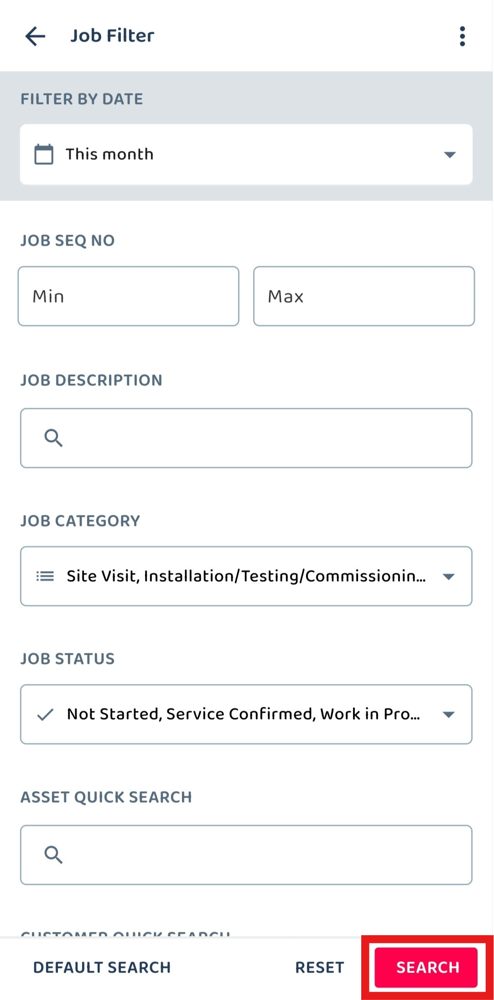

Version 1.0 
Created: 23 May 2024 
Updated: 23 May 2024 
## 🧾 How to filter job by date range?

**Desktop site:** 

 1. To filter job, go to Main Navigation> Business Management > Schedule > Job Schedule. 
   **Filter Job Here:** [https://salesconnection.my/activity/scheduler](https://salesconnection.my/activity/scheduler)

    

      
    

 2. Click the calendar icon in the top right corner of the page.

    

       
    

 3. After that, it will show this Calendar. You can select which month you want to view for. For example, if you want to view the job in April 2024, click "May" and you will be able to select a month.

    

      
    
   

 4. Click on any month that you like to search. For example, click on "Apr".

    

      
    

 5. Select the date that you want to view.

    

      
    

 6. Now, you are able to view the jobs created in April 2024.

    

      
    

     
    
**Mobile App:** 
  1. At the Sales Connection mobile app, select the "Schedule" page in the bottom center.

     

       
     

     
  2. Select the filter icon in the top right of the page. 

     

       
     

  3. Click on the dropdown icon beside the word "Daily".

     

       
     

  4. Select the date range that you want.

     

       
     

  5. Click "SEARCH" to continue.

     

       
     

  6. Now, you are able to view the jobs for this month.

     

       
     

        

**Related Articles** 
- [How to Set Customized Favourite Filter as Default - Desktop ](Default_Favourite_Filter.md)
- [How to Set Customized Favourite Filter as Default - App ](Default_Favourite_Filter_App.md)
- [How to Set Up the Column View in the Report Page?](How_to_Set_Up_the_Column_View_in_the_Report_Page.md)
- [How to Use Update Report Filter?](Job_Update_Report_Filter.md)

<!-- [Link Text](https://salesconnection.github.io/Sales-Connection-Support/Job_Filter_by_Date_Range.html) -->
