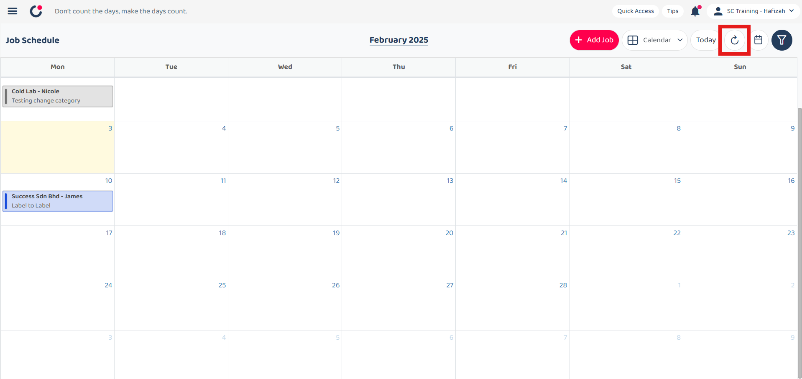
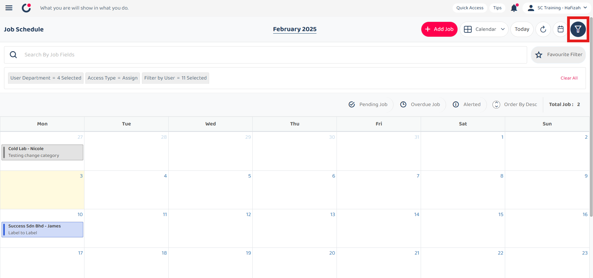
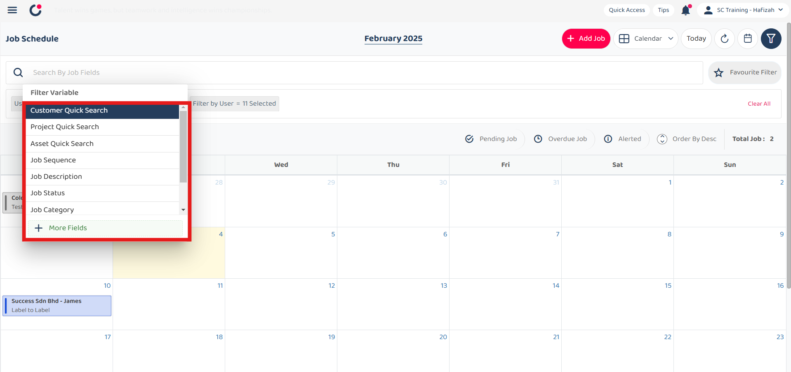
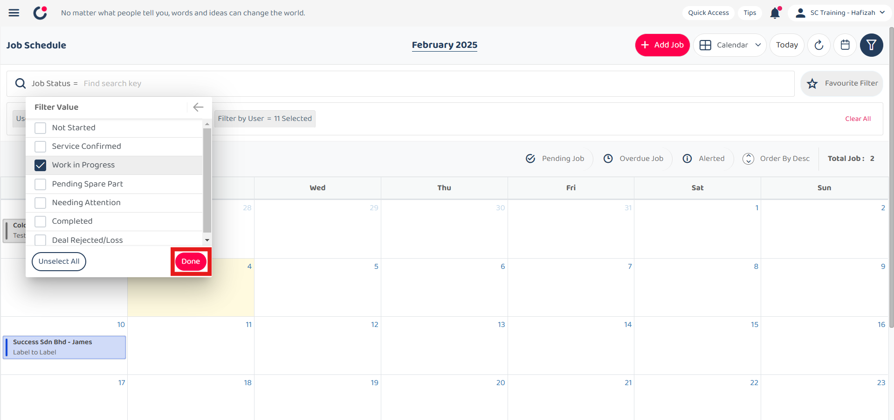
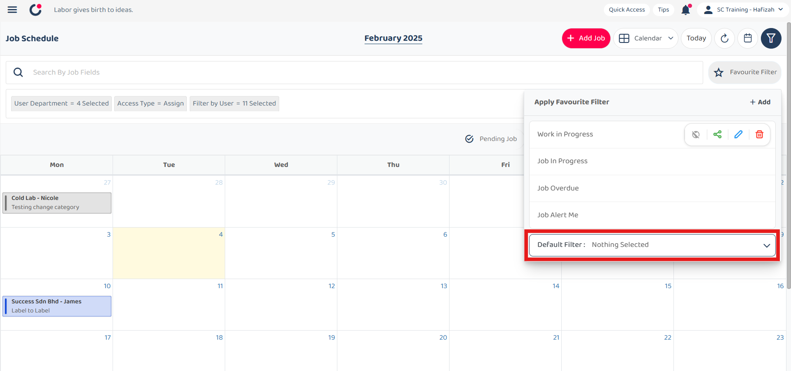
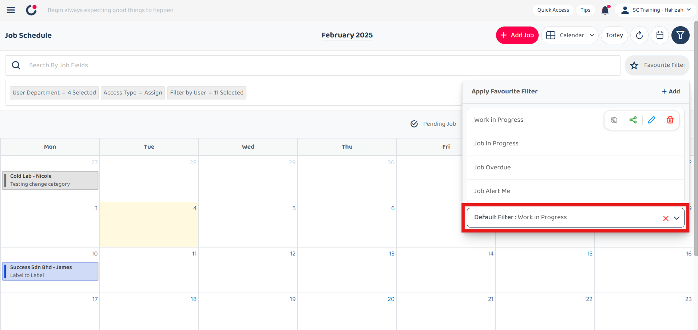

## Job Schedule Page

**Job Schedule** organizes and displays upcoming jobs and tasks in a calendar format, detailing job descriptions, statuses, and assigned personnel. It helps users manage and track the scheduling and progress of various jobs.  

1. At the desktop site navigation bar, go to Business Management > Schedule > Job Schedule. 
   **Open Job Schedule Here:** [https://salesconnection.my/activity/scheduler](https://salesconnection.my/activity/scheduler) 

   

      
   

2. Click on the "Calendar".

   

      
   

  
3. Click on the "previous" or "next" button to go to the previous or next month.

   

      
   

   
4. Click on the date you want to view.

   

      
   

5. The calendar will be shown as below.

   

      
   

6. Click on the "Calendar".

   

      
   

  
7. Choose the view option.

   

      
   

  
8. The picture below shows the weekly view.

   

      
   

  
9. Click "Today" to view the job today.

   

      
   

  
10. Click on the "Refresh" button to get the latest information. 

    

      
    

11. Click on the "Calendar".

    

      
    

  
12. Click on the "previous" or "next" button to go to the previous or next month.

    

      
    

  
13. Click on the date you want to view.

    

      
    

14. The calendar will be shown as below.

    

      
    

  
15. Click "Filter" to expand or show the filter bar.

    

      
    

  
16. Edit the filter to filter the job.

    

      
    
  

17. For example, click "Access Type = Assign" if you want to edit the access type filter.
    
    

      
    
  

18. Click "Alert".
    
    

      
    

  
19. Jobs with the filter will be shown as below.

    

      
    

  
20. Click on the filter bar.

    

      
    
  

21. Click on the filter variable you want to filter the jobs.
    
    

      
    
  

22. Select the filter value you want.
    
    

      
    

  
23. Click on the "Done" button.

    

      
    

  
24. The jobs with the filter will be shown as below.

    

      
    
  

25. Click "Favourite Filter" if you want to set the filter as favourite filter.
    
    

      
    
  

26. Click "+ Add".
    
    

      
    

  
27. Enter the name of the favourite filter.

    

      
    

  
28. Click "Save" and the favourite filter has been saved successfully.

    

      
    
  

29. Click "Favourite Filter" if you want to set a favourite filter as default filter.
    
    

      
    
  

30. Click "Default Filter".
    
    

      
    

  
31. Select the favourite filter you want to set as default filter.

    

      
    

  
32. The default filter has been saved successfully and it will be apply automatically everytime you entered this page.

    

      
    
  

33. Click "Clear All" if you want to delete all the filter applied.
    
    

      
    
  

34. Click on the options to filter the jobs.
    
    

      
    

35. Click on the "+" button to add a new job.
    
    

      
    

       

**Related Articles**
- [How to Add New Job?](Add_New_Job.md)
- [Project Schedule Page](Project_Schedule_Page.md)
- [Wizard Page](Wizard_Page.md)
