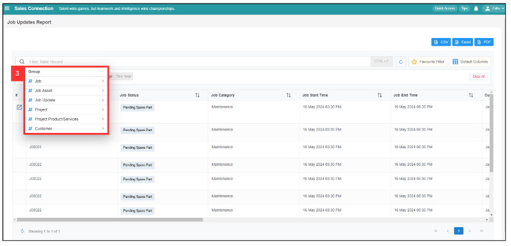
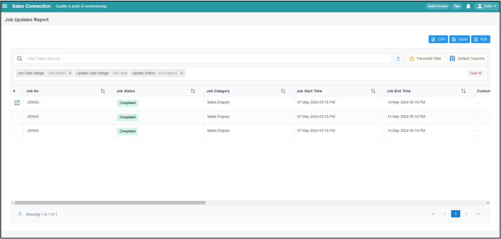

## Job Update Report Filter

### How to use job update report filter?

1. To use job update report filter, go to Business Report > Job Update Report. 
   **Open the link here:** [https://salesconnection.my/reports/activity-update](https://salesconnection.my/reports/activity-update)

   

     
   

2. Click the "Filter Table Record" and it will show the filter below.

   

     
   

3. You can choose by what group that you want to show. For example, select "Job Update" and it will show the filter variable below. 

   

     
   

4. For example, select "Update Status". It will show the operator, which includes "Update Status Contains" and "Update Status Not Contains".

   

     
   

5. For example, select "Contains" if you want to show which filter value. After that, it will show the filter value as shown below.

   

     
   

6. For example, select "In Progress" in the filter value. It will show relevant jobs as below. "Not Contains" means that these jobs searched by the filter are being updated.

   

     
   
  

**Wondering How to Set Your Favourite Filter? Click Here:** [https://salesconnection.github.io/Sales-Connection-Support/Favourite_Filter.md](https://salesconnection.github.io/Sales-Connection-Support/Favourite_Filter.md)
