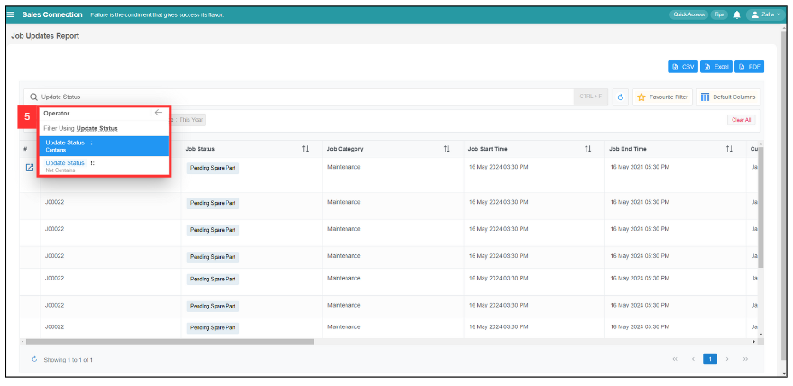

Version 1.0 
Created: 24 May 2024 
Updated: 24 May 2024 
## How to Use Update Report Filter?

1. For example, to use filter for "Job Updates Report", go to Business Report > Job Update Report. 
   **Open the link here:** [https://salesconnection.my/reports/activity-update](https://salesconnection.my/reports/activity-update)

   

     
   
 

2. Click the "Filter Table Record" in the Search Bar, and the filter will show up as displayed below.

   

     
   
 

3. You can choose by what group that you want to show. For example, select "Job Update" and it will show the filter variable below. 

   

     
   
 

4. For example, select "Update Status". 

   

     
   
 

5. It will show the operator, which includes "Update Status Contains" and "Update Status Not Contains". For example, select “Contains”, and all the filter values available will be shown.

   

     
   
 

  Note: After selecting “Not Contains” and all the filter values, the results will show all relevant results except the selected filter values. 
  
6. For example, if “In Progress” is the selected filter value, all relevant jobs will be shown. 

   

     
   
 

7. For example, if “Completed” is the selected filter value, all relevant jobs will be shown.

   

     
   
   

   

**Related Articles** 
- [How to Search Job Using Date Range?](Job_Filter_by_Date_Range.md)
- [How to Set Customized Favourite Filter as Default - Desktop ](Default_Favourite_Filter.md)
- [How to Set Customized Favourite Filter as Default - App ](Default_Favourite_Filter_App.md)
- [How to Set Up the Column View in the Report Page?](How_to_Set_Up_the_Column_View_in_the_Report_Page.md)

<!-- [Link Text](https://salesconnection.github.io/Sales-Connection-Support/Job_Update_Report_Filter.html) -->
