## Label-to-Label Mapping
#### Definition: Label-to-label mapping automatically transfers values from one field to another in different pages or modules, provided the field names are identical.

### How to Perform Label-to-Label Mapping (Example for Project & Job) 
1) Select left corner menu icon to open sidebar.  

         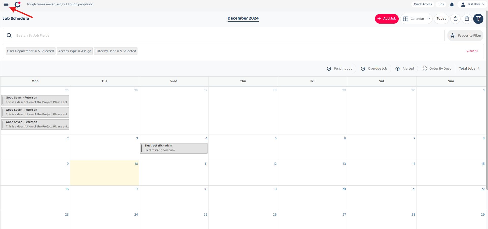

 

2) Select 'Template Settings', under it select and open both 'Project Template' and 'Job Template'.  

         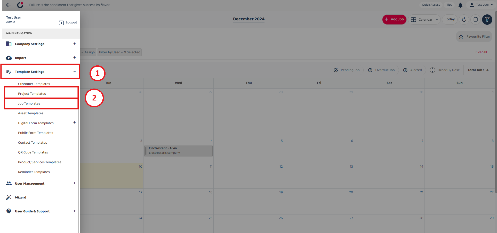

 

3) Scroll down to the 'DEFAULT FIELD PRE-POPULATE VALUE SETTINGS' section, ensure that the field names in both Project & Job Template are identical(eg. Description).  

 Project Template Setting 
         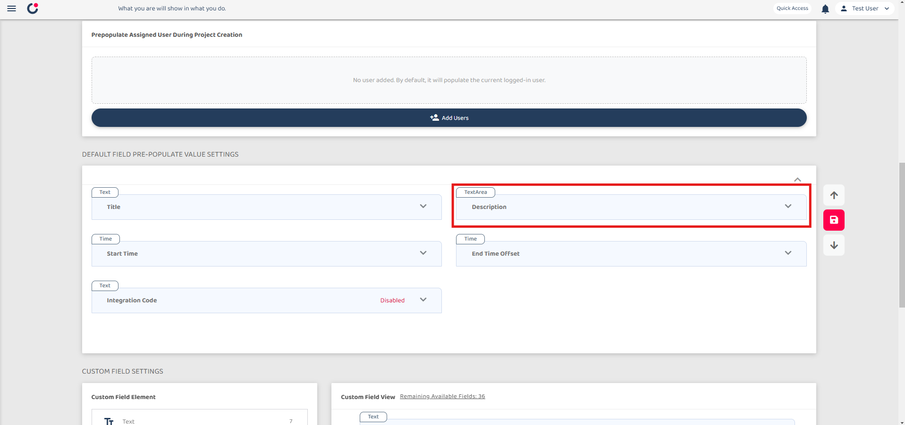

 

 Job Template Setting 
         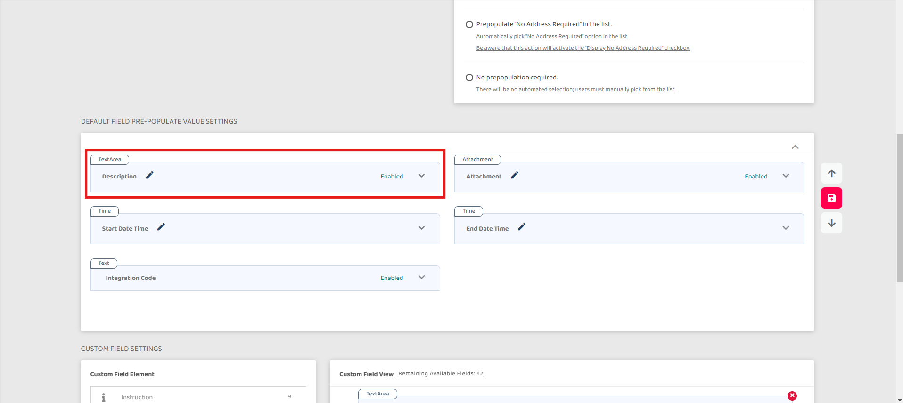

 

### How Label to Label works ? 
4) Back to 'Job Schedule' and click '+ Add Job' button.  

         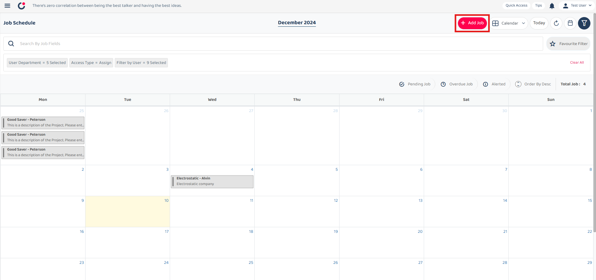

 

5) Back to 'Job Schedule' and click '+ Add Job' button.  

         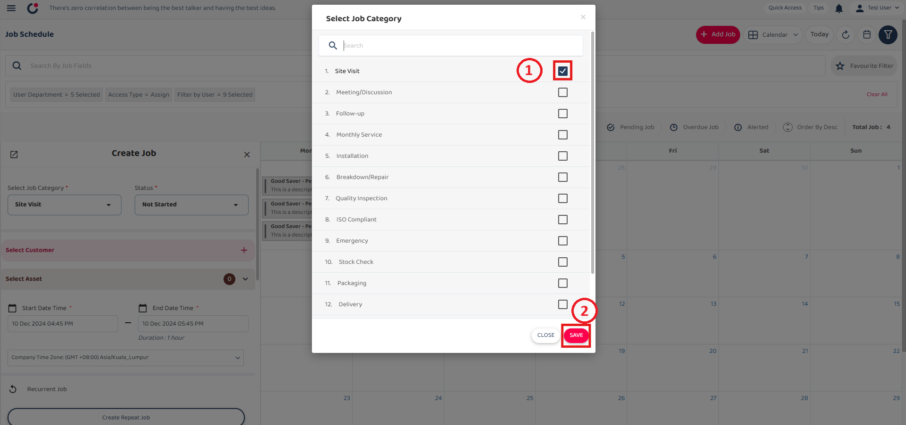

 

6) Back to 'Job Schedule' and click '+ Add Job' button.  

         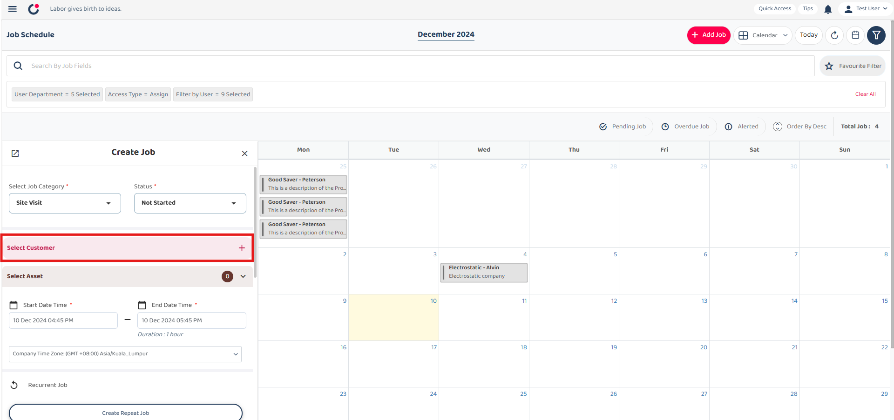

 

7) Back to 'Job Schedule' and click '+ Add Job' button.  

         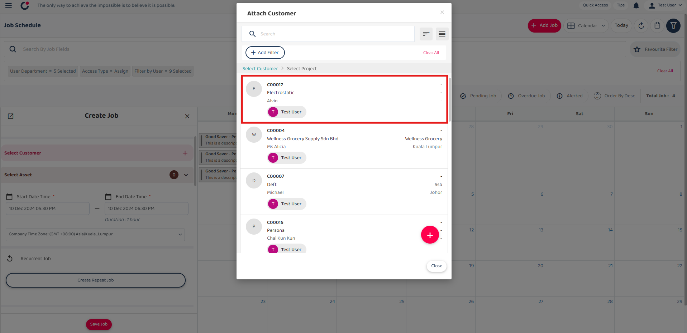

 

8) Back to 'Job Schedule' and click '+ Add Job' button.  

         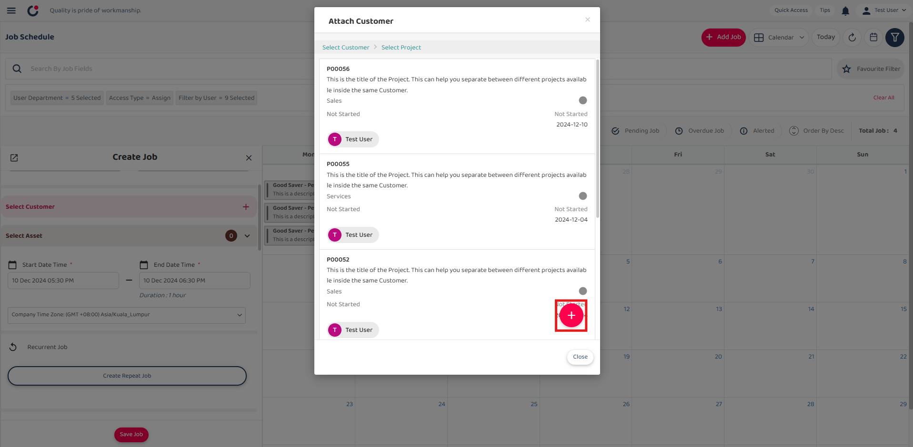

 

9) Back to 'Job Schedule' and click '+ Add Job' button.  

         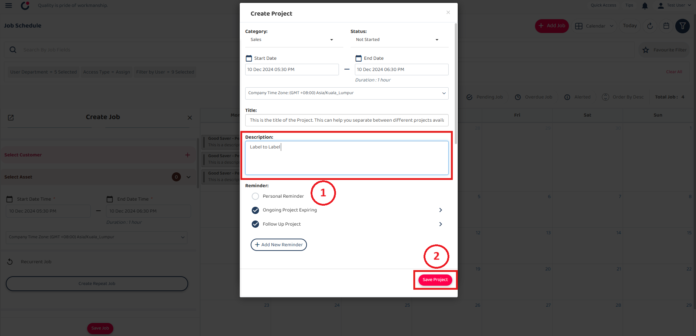

 

10) Back to 'Job Schedule' and click '+ Add Job' button.  

         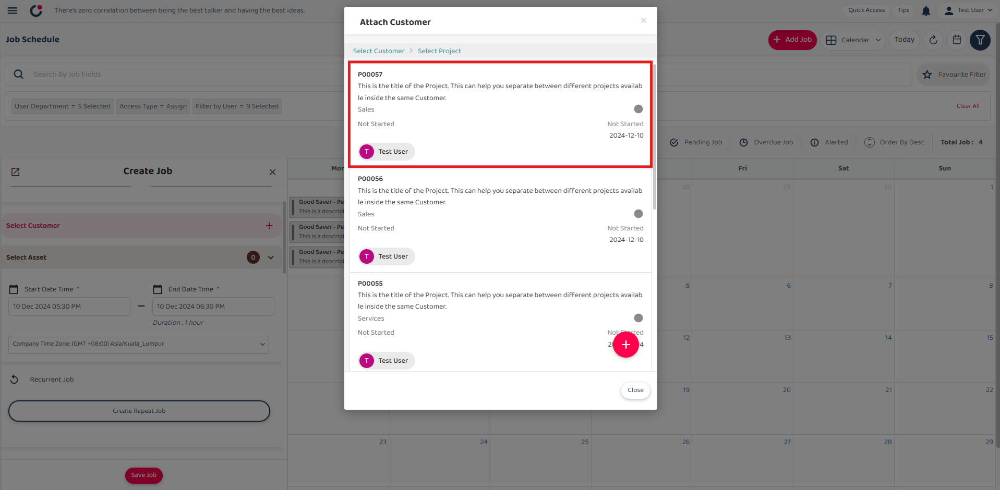

 

11) Back to 'Job Schedule' and click '+ Add Job' button.  

         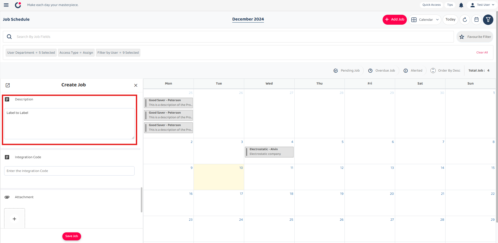

 
