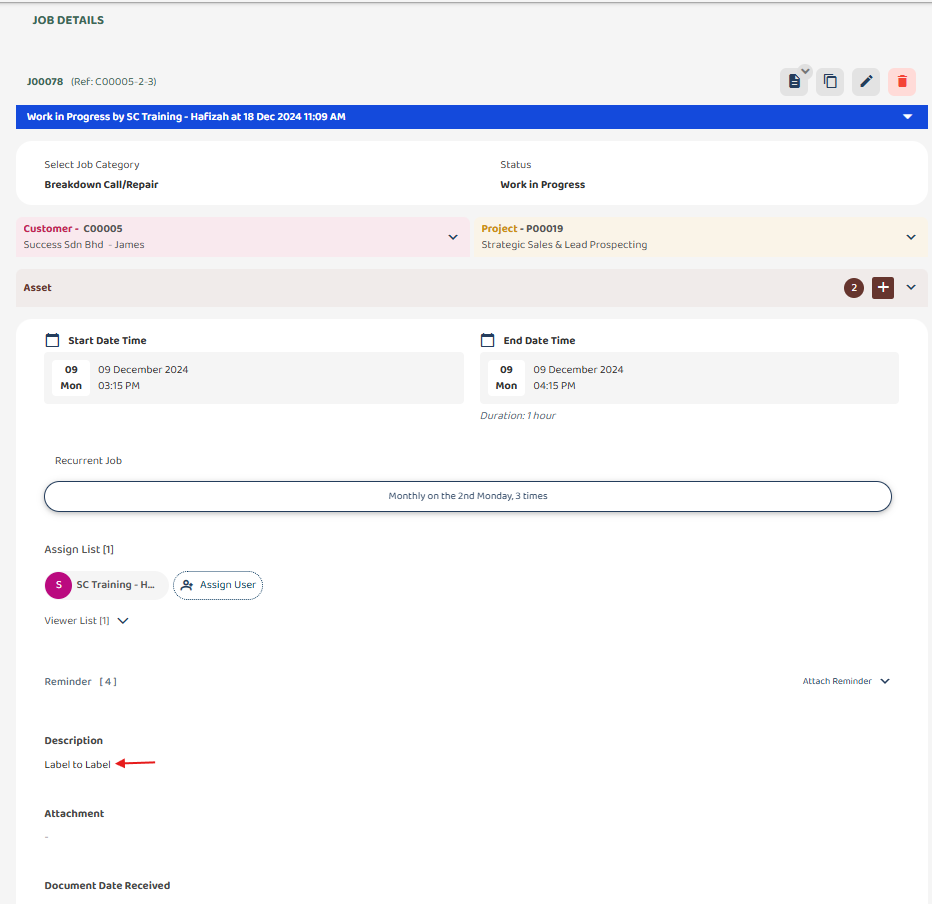

## Label-to-Label Mapping
### How to Perform Label-to-Label Mapping (Example for Project & Job)
#### Label-to-label mapping automatically transfers values from one field to another in different pages or modules, provided the field names are identical.

*Note: For label-to-label mapping, both the spelling and the field type must match precisely to ensure accurate mapping and functionality. 

1) Select left corner menu icon to open sidebar.  

         

 

2) Select 'Template Settings', under it select and open both 'Project Template' and 'Job Template'.  

         

 

3) Name the fields in the Project and Job templates exactly the same for correct label-to-label mapping (e.g., 'Description'). 

 Project Template Setting 
         

 

 Job Template Setting 
         

 

### How Label to Label works ?
*Note: Data Synchronization: Changes made in the source field will update the destination field automatically.  
4) The values entered in the Project level will automatically populate in the corresponding fields at the Job level.  
*Note: The mapping follows a top-down hierarchy, transferring values from the upper data level (Project) to the lower data level (Job). This process is one-directional and does not support transferring values in the opposite direction (Job to Project).  

         

 
<!---
5) Select category and save it.  

         

 
--
6) Click 'Select Customer'.  

         

 
--
7) Select customer.  

         

 
--
8) Click '+' icon to create project.  

         

 
--
10) Select created project to attach.  

         

 
-->

5) Write description and save project.  

         

 

6) Project description synchronize to the Job description  

         

 
