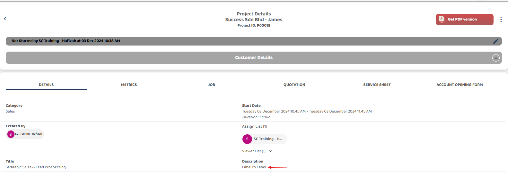

## Label-to-Label Mapping
#### Definition: Label-to-label mapping automatically transfers values from one field to another in different pages or modules, provided the field names are identical.

### How to Perform Label-to-Label Mapping (Example for Project & Job)
*Note: Field Name Consistency: Ensure exact spelling, capitalization, and spacing when naming fields. 

1) Select left corner menu icon to open sidebar.  

         

 

2) Select 'Template Settings', under it select and open both 'Project Template' and 'Job Template'.  

         

 

3) Scroll down to the 'DEFAULT FIELD PRE-POPULATE VALUE SETTINGS' section, ensure that the field names in both Project & Job Template are identical(eg. Description).  

 Project Template Setting 
         

 

 Job Template Setting 
         

 

### How Label to Label works ?
*Note: Data Synchronization: Changes made in the source field will update the destination field automatically.  
4) Back to 'Job Schedule' and click '+ Add Job' button.  

         

 

5) Select category and save it.  

         

 

6) Click 'Select Customer'.  

         

 

7) Select customer.  

         

 

8) Click '+' icon to create project.  

         

 

9) Write description and save project.  

         

 

10) Select created project to attach.  

         

 

11) Project description synchronize to the Job description  

         

 
