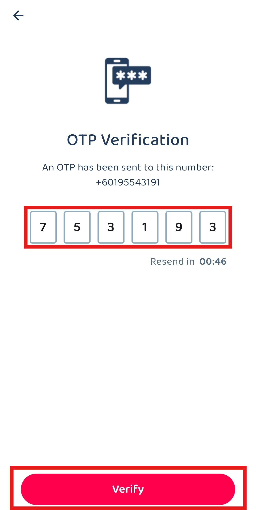

## 👩‍💼 How to Login?
    
  **Desktop Version** 
  *Note: Only certain staff will have the desktop access.
  1. Visit Sales Connection's website and click "Login".
     **Open Sales Connection's Website Here:** [https://salesconnection.my/](https://salesconnection.my/) 

     

       
     

  
  2. Login using the **registered** email address with the **correct** password. 
     **Login Here:** [https://salesconnection.my/login](https://salesconnection.my/login) 

     

       
     

  3. Click the "Login" button to login. 

     

       
     

       

  **Mobile Version** 
  **Phone Login** 
  1. Download the Sales Connection app from Google Playstore or App Store. 
     **Download Here for Android User:** [https://play.google.com/store/apps/details?id=com.connection.crm](https://play.google.com/store/apps/details?id=com.connection.crm) 
     **Download Here for IOS User:** [https://apps.apple.com/us/app/sales-connection/id1327210298](https://apps.apple.com/us/app/sales-connection/id1327210298) 

     

       
     

  
  2. Open the Sales Connection's App, click the "Login" button then enter the **registered** phone number and click "Login". 

     

       
     

  3. Check your "Messages" app and look for the "OTP Code" sent by 62002. 

     

       
     

     *Note: Please wait for the "OTP Code" at least 5 minutes before applying the new "OTP Code".

  4. Enter the "OTP Code" you received and click the "SUBMIT" button to login to the app. 

     

       
     

      
  
**Email Login** 
1. Download the Sales Connection app from Google Playstore or App Store. 
     **Download Here for Android User:** [https://play.google.com/store/apps/details?id=com.connection.crm](https://play.google.com/store/apps/details?id=com.connection.crm) 
     **Download Here for IOS User:** [https://apps.apple.com/us/app/sales-connection/id1327210298](https://apps.apple.com/us/app/sales-connection/id1327210298) 

     

       
     

  
  2. Open the Sales Connection's App, click the "Login" button and choose "Login via Email". 

     

       
     

  3. Enter the **registered** email with the **correct** password. 

     

       
     

  4. Click the "Login" button to login. 

     

       
     

        

**Related Article** 
[Why My Staff Cannot Login with New Device?](IMEI.md)
