## Metric Dashboard Layout Settings

Metric Dashboard Layout Setting allows you to create charts and adjust the elements to customize the dashboard’s metric display.

**Navigate to the section by clicking it.** 

- [Create Dashboard Group](#section1) 
- [Create Chart](#section2) 
- [Edit Created Chart](#section3) 
- [Delete_Chart](#section4)
   

1. At the desktop's navigation bar, go to Company  > Metric Dashboard. 
   **Open Metric Dashboard Here:** [https://salesconnection.my/dashboard/metric/overview/template](https://salesconnection.my/dashboard/metric/overview/template)
   

     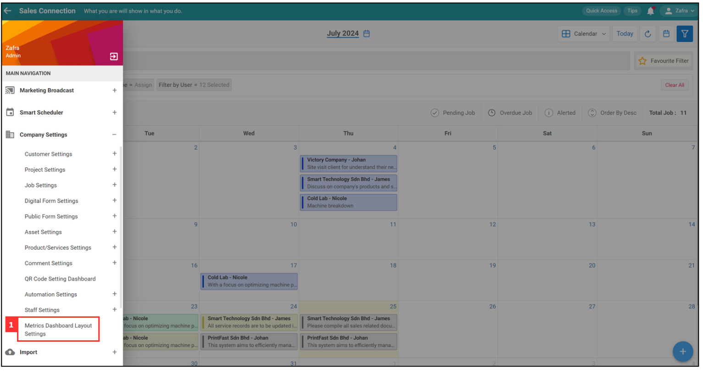
   

    

### Create Dashboard Group

1. For example, if you want to create a dashboard for admin group. Click "Create Group".

   

     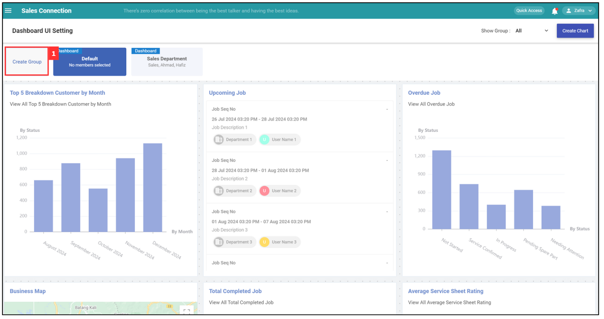
   

2. Enter the details of the dashboard group.

   

     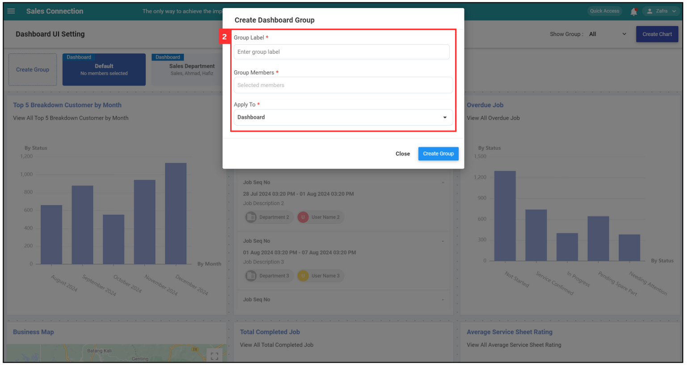
   

3. Click "Create Group".

   

     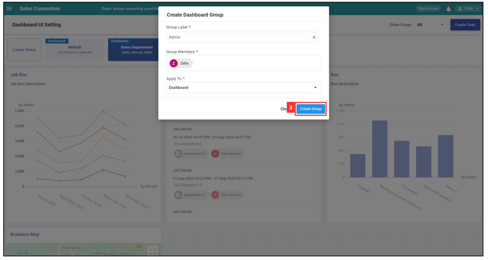
   

4. The admin group's dashboard has been created successfully.

   

     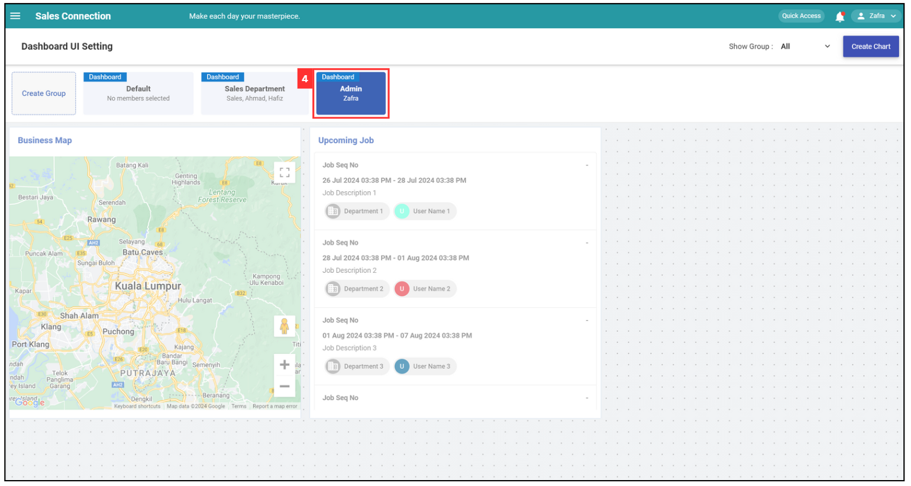
   

5. If you want to change the UI settings of another dashboard group, click here to select the dashboard group.

   

     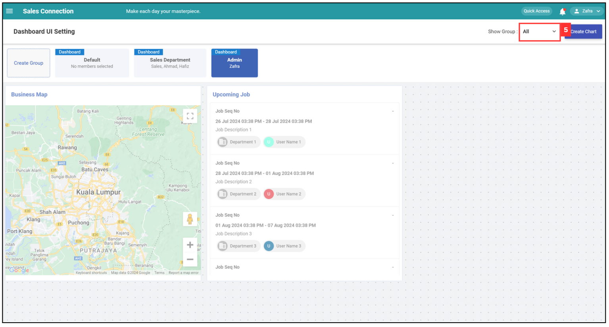
   

    

### Create Chart

1. If you want to create a chart for a dashboard, click "Create Chart".

   

     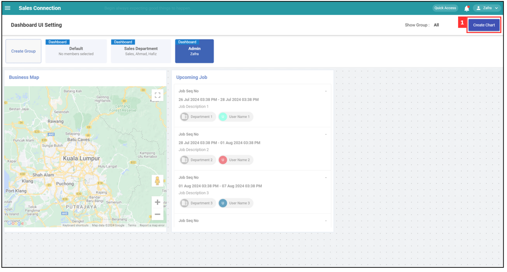
   

2. Select the domain.

   

     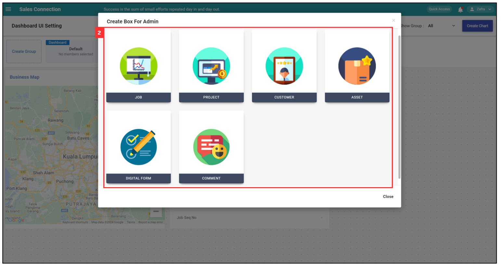
   

3. Select the chart type.

   

     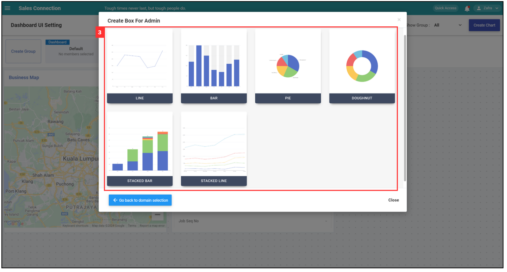
   

4. To configure the basic settings of the group, enter the required details of the desired chart.

   **Difference between Date Range Condition**
   
   | Terms | Description |
   |-------|-------------|
   | Within | Includes dates within the specified range (e.g., within this year). |
   | Till | Includes dates up to and including the specified end date. |
   | Upto | Includes dates up to but not including the specified end date. |

   

     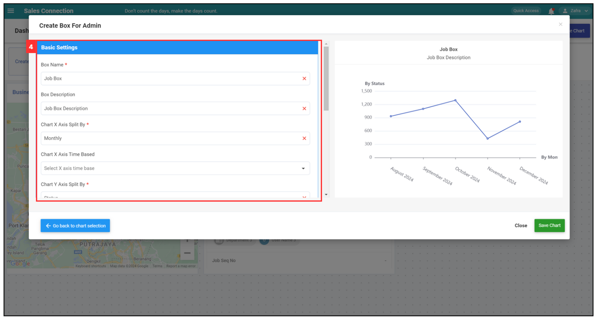
   

5. Click "Save Chart".

   

     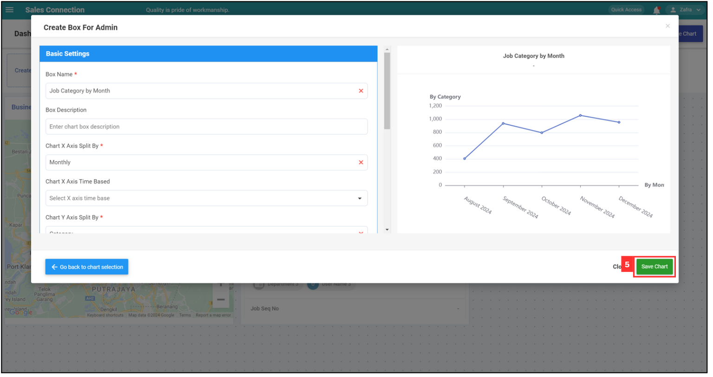
   

6. The chart has been created successfully.

   

     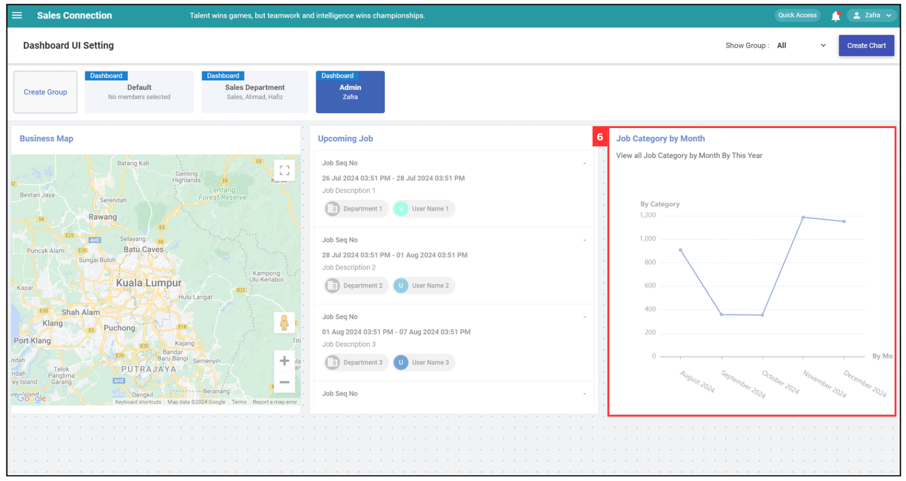
   

    

### Edit Created Chart

1. If you want to edit the details of a chart, click on the settings icon.

   

     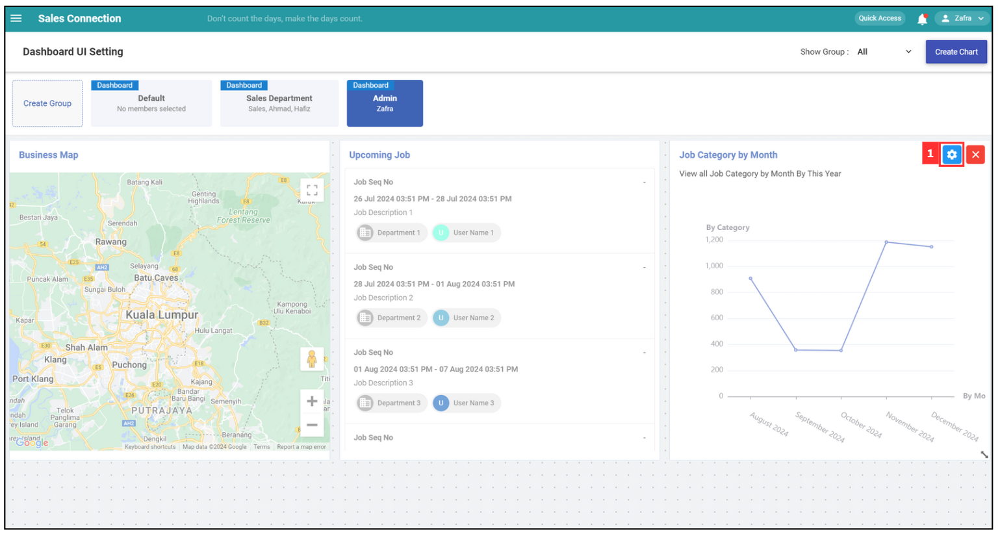
   

2. To configure the basic settings of the group, enter the required details of the desired chart.

   

     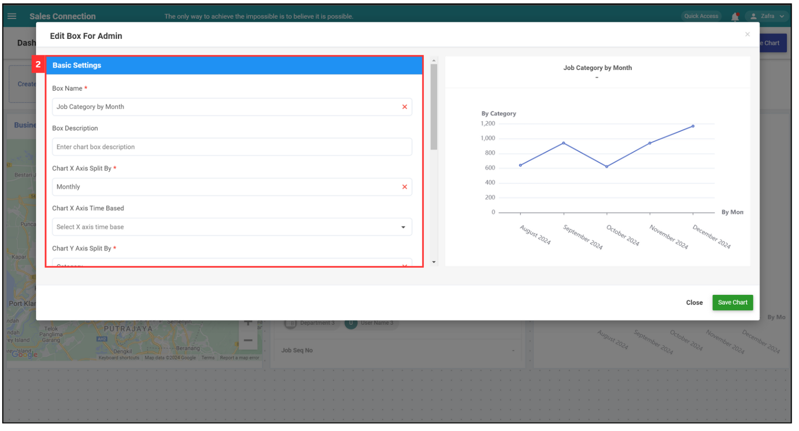
   

3. Click "Save Chart".

   

     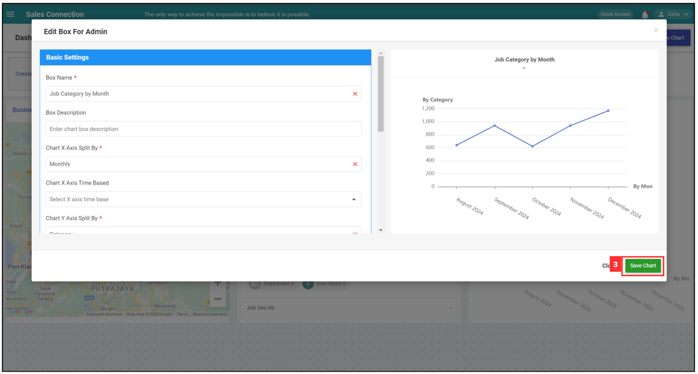
   

4. The chart details have been changed successfully.

   

     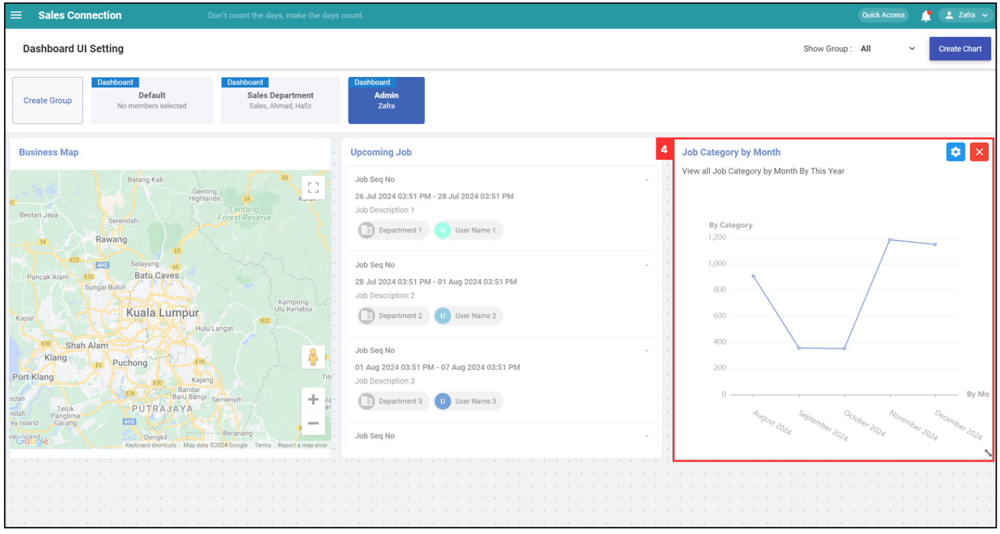
   

    

### Delete Chart

1. If you want to delete a chart, click on the "X" icon.

   

     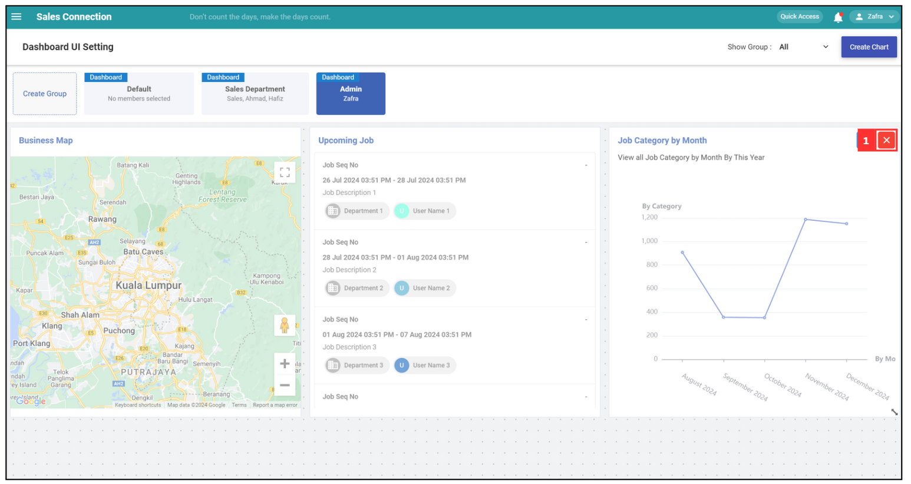
   

2. The chart has been deleted successfully.

   

     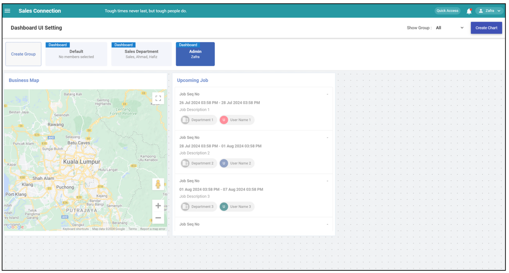
   

      

**Related Articles** 
- [Metric Dashboard](Metric_Dashboard.md)

<!-- [Link Text](https://salesconnection.github.io/Sales-Connection-Support/Metric_Dashboard.html) -->
