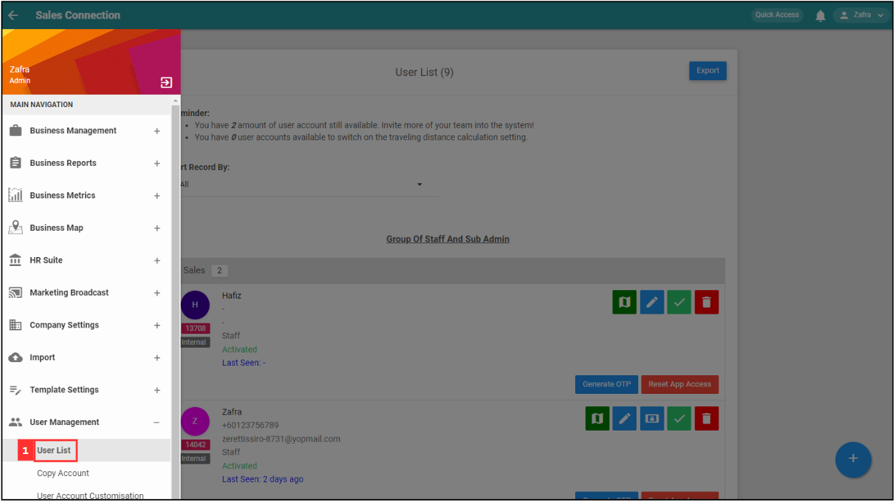
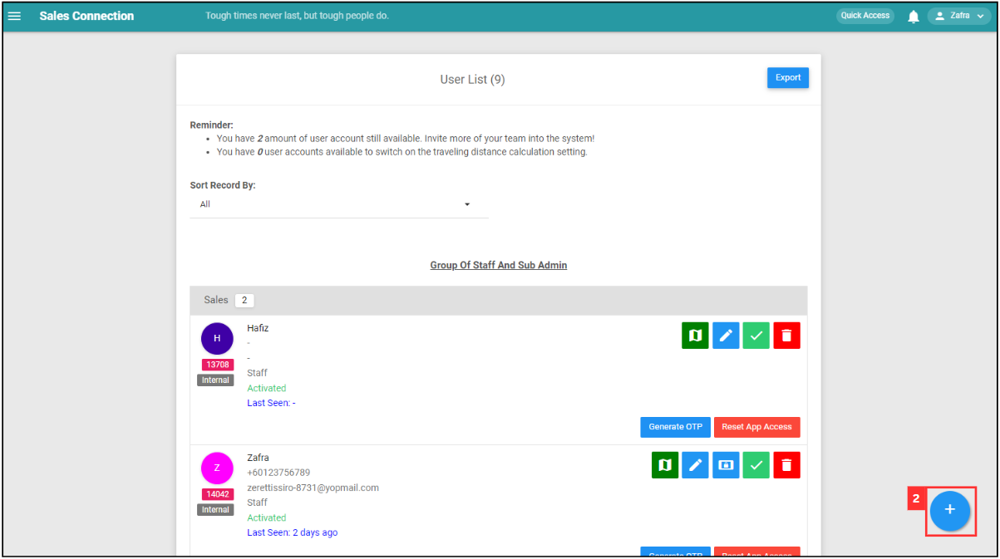
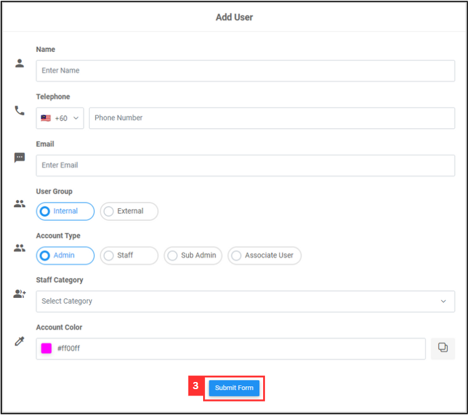

## How to do Mobile Login using OTP?
    
1. At the desktop site's navigation bar, go to User Management > User List.

   

      
   

2. Click on the "+" button to access the "Add New User" page.

   

      
   

3. Fill out the details of your new team member. 
   a. The details include: 
      - Name 
      - Telephone 
      - Email (optional if the user only uses a mobile device) 
      - Staff Category 
      - Account Type 
      - Color (Choose one to represent the user in the system) 
        
   b. Click “Submit Form” to finish the process. 

   

      
   

      

**Related Articles** 
- [How to Add New User Category?](Add_New_User_Category.md)
- [How to Assist My New User to Login?](New_User_Login.md)
- [How to Login Into Sales Connection Using Mobile and Desktop?](Login.md)

<!-- [Link Text](https://salesconnection.github.io/Sales-Connection-Support/Mobile_Login_Using_OTP.html) -->
