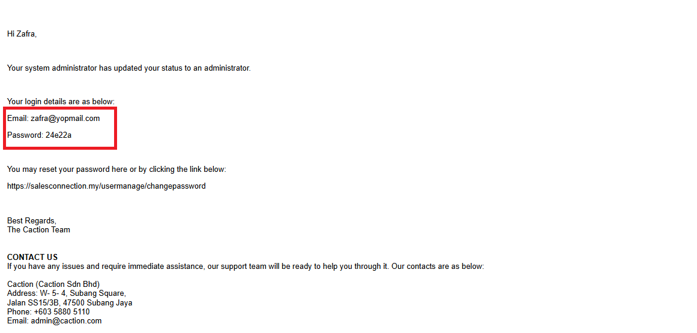

Version 1.0 
Created: 24 May 2024 
Updated: 24 May 2024 
## How to Assist My New User to Login?
  **Desktop Version** 
  1. Click "Verify Email" through a **verification email** sent from admin@salesconnection.my to verify it. 
     *Note: If you can't find the email, please try to look for the spam folder. 

     

       
     

  2. Another email with a **password** will be sent after the verification. 

     

       
     

     *Note: User can change password after login to the system. Visit this page to know more: [How to Change Account Password?](Change_Account_Password.md) 
  
  3. Login using the **registered** email address with the **correct** password. 
     **Login Here:** [https://salesconnection.my/login](https://salesconnection.my/login) 

     

       
     

  4. Click the "Login" button to login. 

     

       
     

     
     *Note: Only email addresses that are verified will be sent.  

  **Mobile Version** 
  1. Download the Sales Connection app from Google Playstore or App Store. 
     **Download Here for Android User:** [https://play.google.com/store/apps/details?id=com.connection.crm](https://play.google.com/store/apps/details?id=com.connection.crm) 
     **Download Here for IOS User:** [https://apps.apple.com/us/app/sales-connection/id1327210298](https://apps.apple.com/us/app/sales-connection/id1327210298) 

     

       
     

  
  2. Open the Sales Connection's App, click the "Login" button then enter the **registered** phone number and click "Login". 

     

       
     

  3. Check your "Messages" app and look for the "OTP Code" sent by 62XXX. 

     

       
     

  4. Enter the "OTP Code" you received and click the "SUBMIT" button to login to the app. 

     

       
     

        
  
**Related Articles** 
- [How to Add New User?](Add_New_User.md)
- [How to Change Account Password?](Change_Account_Password.md)
- [How to Login Into Sales Connection Using Mobile and Desktop?](Login.md)
- [I Can't Login to My Other Phone. Why?](IMEI.md)
- [My Staff Did Not Receive Their OTP. What Should I Do?](Not_Receiving_OTP.md)

<!-- [Link Text](https://salesconnection.github.io/Sales-Connection-Support/New_User_Login.html) -->
