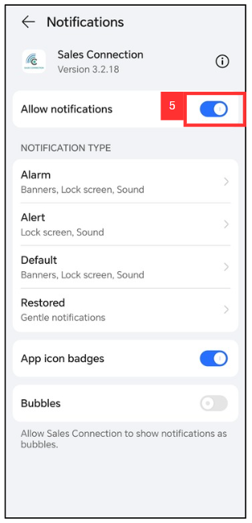

Version 1.0 
Created: 22 July 2024 
Updated: 22 July 2024 
## I am not getting any notification from the system on my device. Why?

**Navigate to the section by clicking it.** 

- [Mobile Version](#section1) 
- [Desktop Version](#section2)
   
 
 

- **Mobile Version**:

1. In Settings page of your phone, Select "Apps".

    

      
    

    *Note: Phone settings may vary depending on the phone model. 
    
2. Click "Apps".

   

     
   
 

3. Click "Sales Connection".

   

     
   
 

4. Click "Notifications".

   

     
   
 

5. Make sure the "Allow Notification" has been toggled.

   

     
   
 
     
     

 - **Desktop Version**:

1. For example, if you are using Google Chrome browser, click on the three dots icon.

   

     
   
 

2. Click on "Settings".

   

     
   
 

3. Click on "Privacy and security".

   

     
   
 

4. Click on "Site settings".

   

     
   
 

5. Click on "Notifications".

   

     
   
 

6. Click on the "Add" button.

   

     
   
 

7. Paste the Sales Connection link (https://salesconnection.my/activity/scheduler) in here.

   

     
   
 

8. Click on the "Add" button.

   

     
   
 

9. Once it is on “Allow”, you will begin receiving notifications from Sales Connection on the PC you are using similar to your mobile device that’s logged into Sales Connection.

   

     
   
 
      

**Related Article**
- [I Get Spammed By a Lot of Notifications. How Do I Disable It?](Disable_Notification.md)
- [Notification Settings by User Account](Notification_Settings_by_User_Account.md)

<!-- [Link Text](https://salesconnection.github.io/Sales-Connection-Support/Not_Getting_Notification.html) -->
