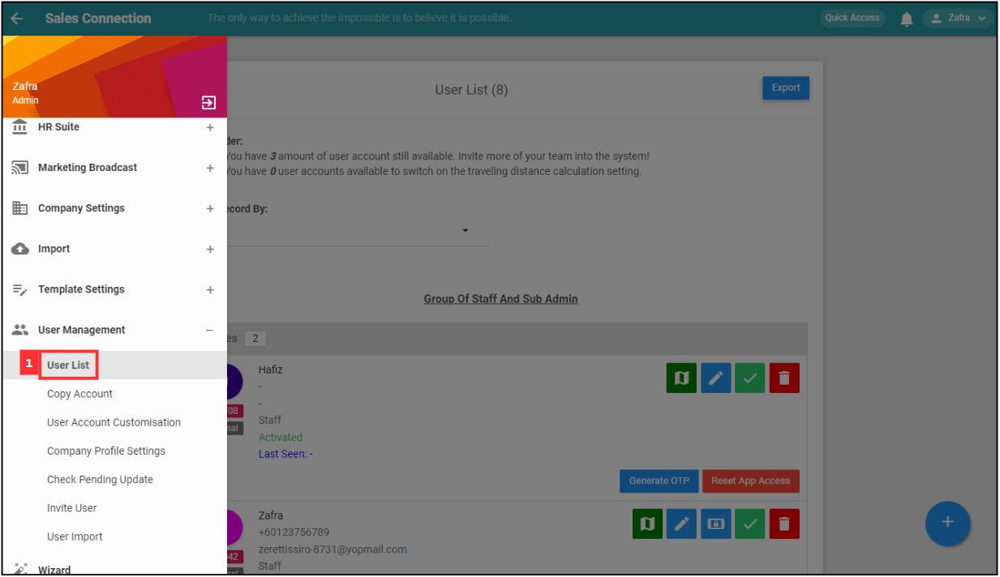

Version 1.0 
Created: 24 May 2024 
Updated: 24 May 2024 
## My Staff Did Not Receive Their OTP. What Should I Do?

*Note: Please ensure that you already wait for at least 5 mins for the "OTP Code". If you still not receiving it, please contact admin to perform further action.

  1. To generate "OTP Code" for users, go to User Management > User List. 
     **Open User List Page Here:** [https://salesconnection.my/usermanage/userlist](https://salesconnection.my/usermanage/userlist) 
     *Note: Only certain admins can generate OTP for users.

     

       
     

  
  2. Navigate to the user who does not receive the "OTP Code". 

     

       
     

  3. Click on the "Generate OTP" button. 

     

       
     

  4. Send the six-digit "OTP Code" generated to the user for login purpose. 
     *Note: The "OTP Code" generated is only **valid** for **10 mins**.

     

       
     

  5. To login with the "OTP Code" generated, open Sales Connection's app and click on the "Help" button at the top right corner of the page. 

     

       
     

  6. Enter the phone number and the "OTP Code" generated. 

     

       
     

  7. Click "SUBMIT" to login the app. 

     

       
     

        

**Related Articles** 
- [How to Login Using Mobile and Desktop?](Login.md)
- [How to Assist My New User to Login?](New_User_Login.md)
- [I Can't Login to My Other Phone. Why?](IMEI.md)
- [How to Change Account Password?](Change_Account_Password.md)
- [I forgot my password. How can I recover or reset it?](Forgot_Password.md)

<!-- [Link Text](https://salesconnection.github.io/Sales-Connection-Support/Not_Receiving_OTP.html) -->
