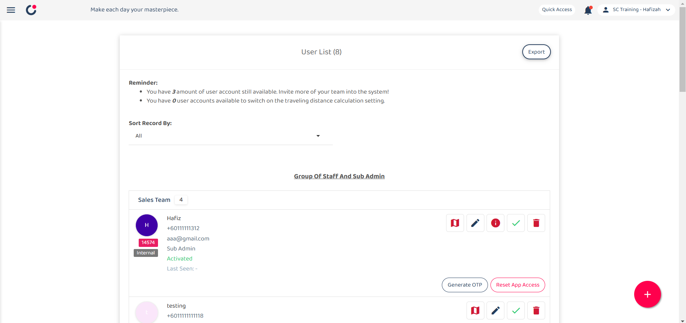

## I can’t receive the OTP to log in on my phone. How do I log in?

*Note: Please ensure that you already wait for at least 5 mins for the "OTP Code". If you still not receiving it, please contact admin to perform further action.

  1. To generate "OTP Code" for users, go to User Management > User List. 
     *Note: Only certain admins can generate OTP for users.

     

       
     

  
  2. Navigate to the user who does not receive the "OTP Code". 

     

       
     

  3. Click on the "Generate OTP" button. 

     

       
     

  4. Send the six-digit "OTP Code" generated to the user for login purpose. 
     *Note: The "OTP Code" generated is only **valid** for **10 mins**.

     

       
     

        

**Related Articles** 
- [How to Login Using Mobile and Desktop?](Login.md)
- [How to Assist My New User to Login?](New_User_Login.md)
- [I Can't Login to My Other Phone. Why?](IMEI.md)
- [I forgot my password. How can I recover or reset it?](Forgot_Password.md)
- [How to Change Account Password?](Change_Account_Password.md)
