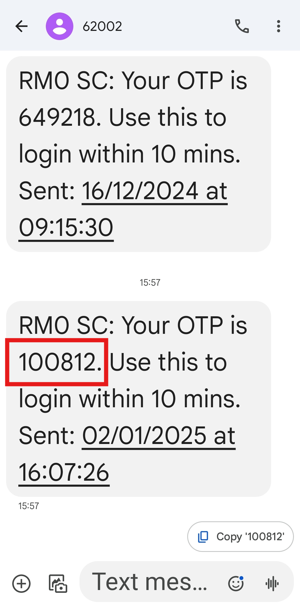

## I can’t receive the OTP to log in on my phone. How do I log in?

*Note: Please ensure that you already wait for at least 5 mins for the "OTP Code". If you still not receiving it, please contact admin to perform further action.

  1. To generate "OTP Code" for users, go to User Management > User List. 
     *Note: Only certain admins can generate OTP for users.

     

       
     

  
  2. Open the Sales Connection's App, click the "Login" button then enter the **registered** phone number and click "Login". 

     

       
     

  3. Check your "Messages" app and look for the "OTP Code" sent by 62XXX. 

     

       
     

     *Note: Please wait **at least 5 minutes** before applying a new "OTP Code".

  4. Enter the "OTP Code" you received and click the "SUBMIT" button to login to the app. 

     

       
     

        

**Related Article** 
[Why My Staff Cannot Login with New Device?](IMEI.md)
