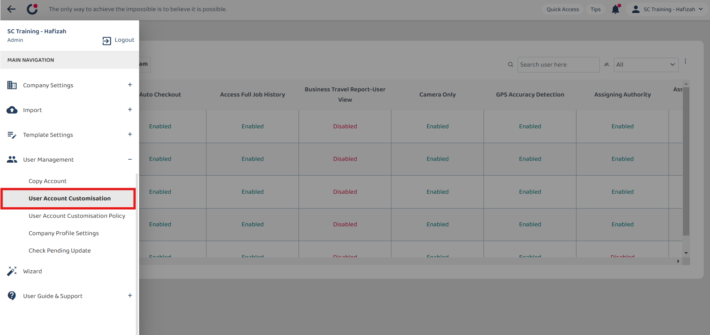
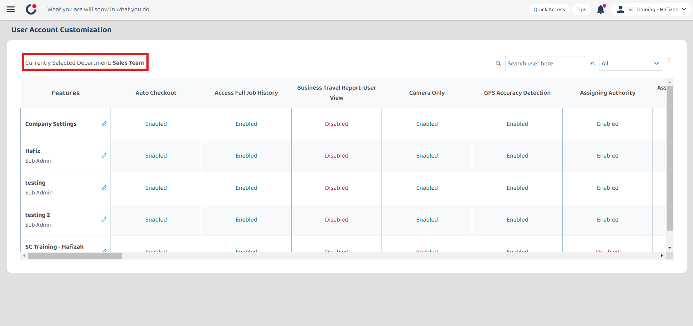
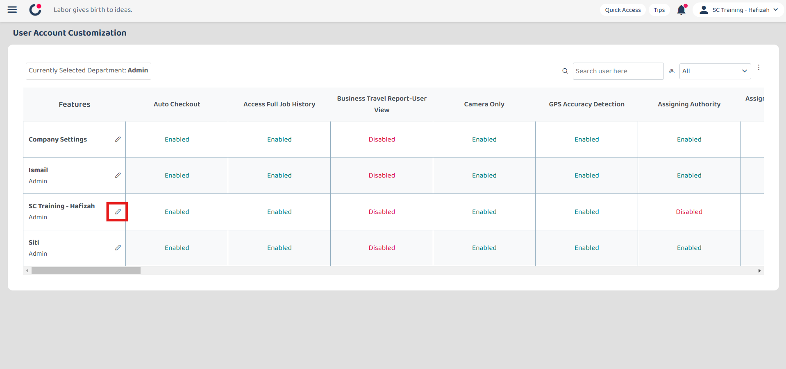
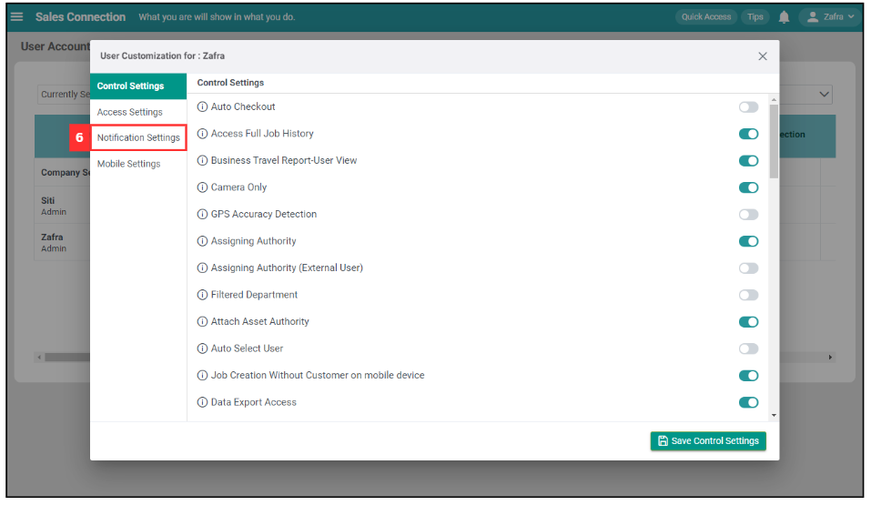
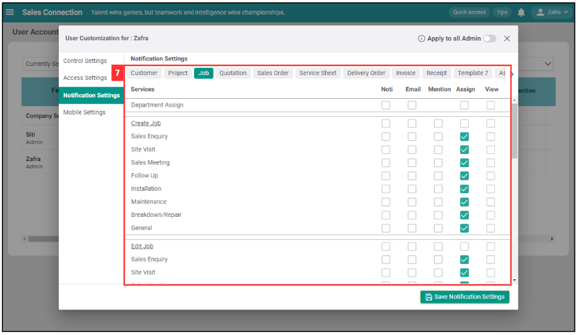
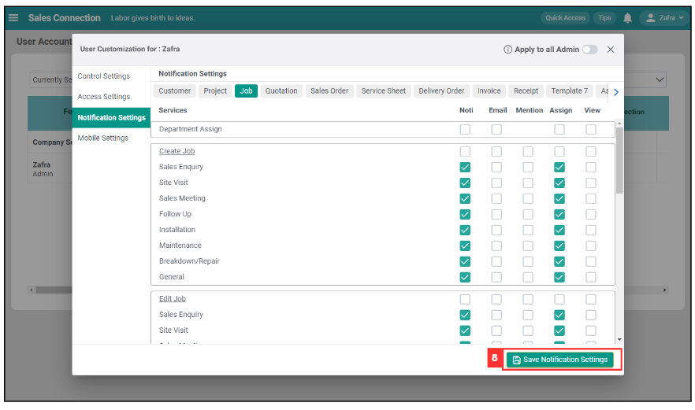
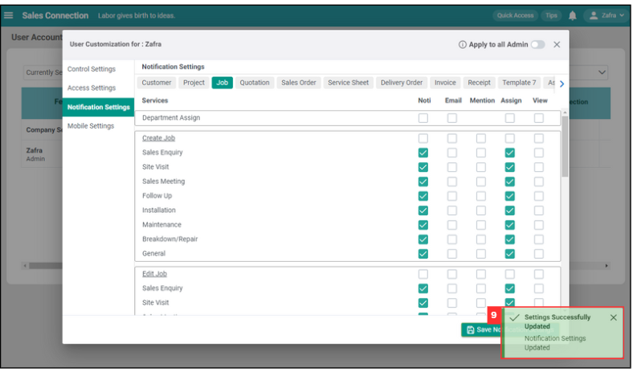

Version 1.0 
Created: 18 July 2024 
Updated: 18 July 2024 
## How to Manage Notification Settings for User Accounts?

Customise you and your team’s notification settings on the system to minimize unnecessary alert updates and optimise your team’s operations with the system.  

*Note: Only certain admins can edit the notification settings. Please contact your admin if you wish to enable the notifications. 
 
1. To enable notifications for users, go to desktop site navigation bar > User Management > User Account Customisation. 
   **Open UAC Page Here:** [https://system.caction.com/uac](https://system.caction.com/uac) 
     
   

     
   

     
2. Click on the department name. 
  
   

     
   

     
3. Enter the name of the user who needs to enable notification. 

   

     
   

  
4. Click on the "Select Department" button. 

   

     
   

5. Click the "pencil" icon beside the user who needs to enable the notifications. 

   

     
   

6. Click on the "Notification Settings". 

   

     
   

7. Tick the boxes next to the notifications you want to receive. For example, select all the job notifications.

   | Terms | Meaning |
   |-------|---------|
   | Noti | Push notifications that will appear on your device (such as your phone lock screen). |
   | Email | Notifications sent to your email address. |
   | Mention | Alerts when someone mentions you in a comment. |
   | Assign | Notifications when a task or job is assigned to you. |
   | View | Notifications for activities that require your view. |

   

     
   

8. Click "Save Notification Settings".

   

     
   

   
9. Notification settings are successfully updated once you see the “Settings Successfully Updated!” prompt appear.

   

     
   

      

**Related Articles**
- [I Get Spammed By a Lot of Notifications. How Do I Disable It?](Disable_Notification.md)
- [UAC Policy Management](UAC_Policy_Management.md)
- [Company Profile Settings](Company_Profile_Settings.md)
- [I am Not Getting Any Notification From the System On My Device. Why?](Not_Getting_Notification.md)

<!-- [Link Text](https://support.caction.com/Notification_Settings_by_User_Account.html) -->
