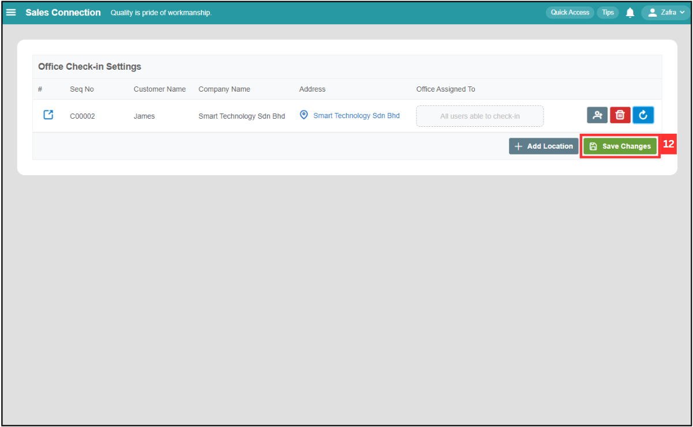
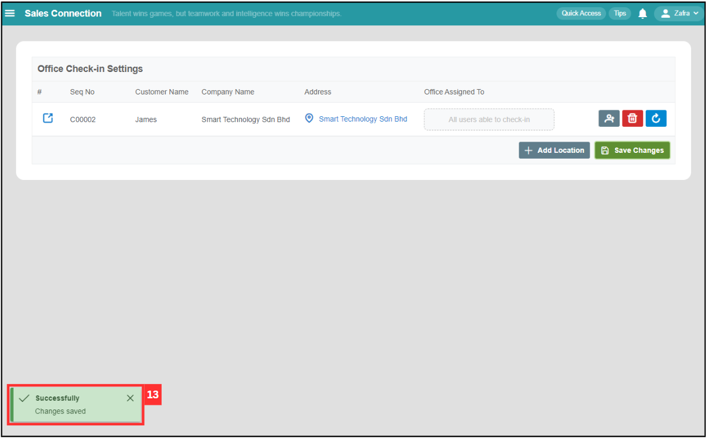
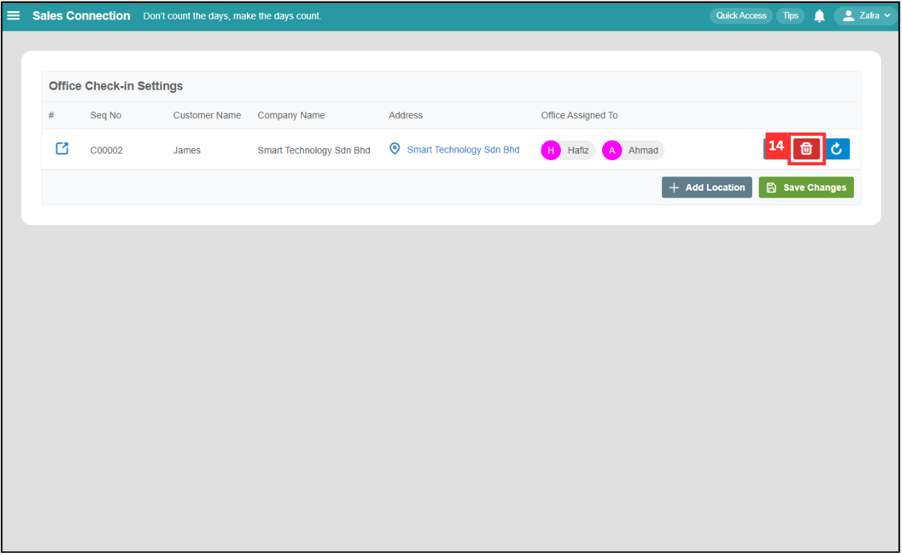
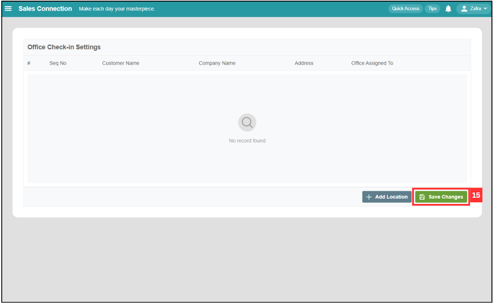
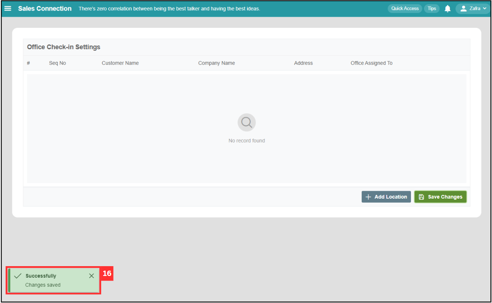

## Office Check-In Settings

1. At the desktop site navigation bar, go to HR Suite > Office Check-in Settings.
   **Open Office Check-In Settings Here:** [https://salesconnection.my/officecheckin/setting](https://salesconnection.my/officecheckin/setting) 

   

      
   

     
   *Note: You must have access to HR Suite menu to perform this action. Please request permission or help from your admin if you do not have access to the menu. 
   
2. Click "+ Add Location" to add an office check-in.

   

      
   

  
3. Tick the box of the customer's location.

   

      
   

  
4. Click "Apply Address".

   

      
   

  
5. Click on the "Add User" icon.

   

      
   

  
6. Enter the user name that you want to assign to the office check-in.

   

      
   

  
7. Tick the box of the user accordingly.

   

      
   

  
8. Click on the "Save" button.

   

      
   

  
9. Click "Save Changes".

   

      
   

  
10. The office check-in has been saved successfully when this prompt appears.

   

      
   

  
11. Click on the "Clear" icon to clear the assigned user.

   

      
   

  
12. Click "Save Changes".

   

      
   

  
13. All the users assigned have been cleared when this prompt appears.

   

      
   

  
14. Click on the "Delete" icon.

   

      
   

  
15. Click "Save Changes".

   

      
   

  
16. The office check-in has been deleted when this prompt appears.

   

      
   
  
     

**Related Articles**
- [How to Login Into Sales Connection Using Mobile and Desktop?](Login.md)
- [How to Assist My New User to Login?](New_User_Login.md)
