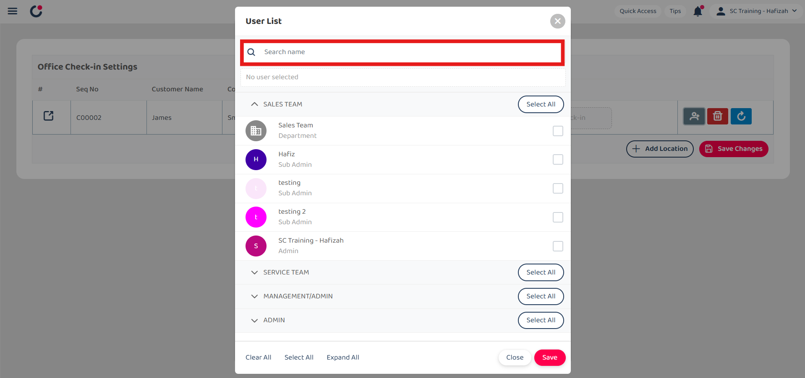
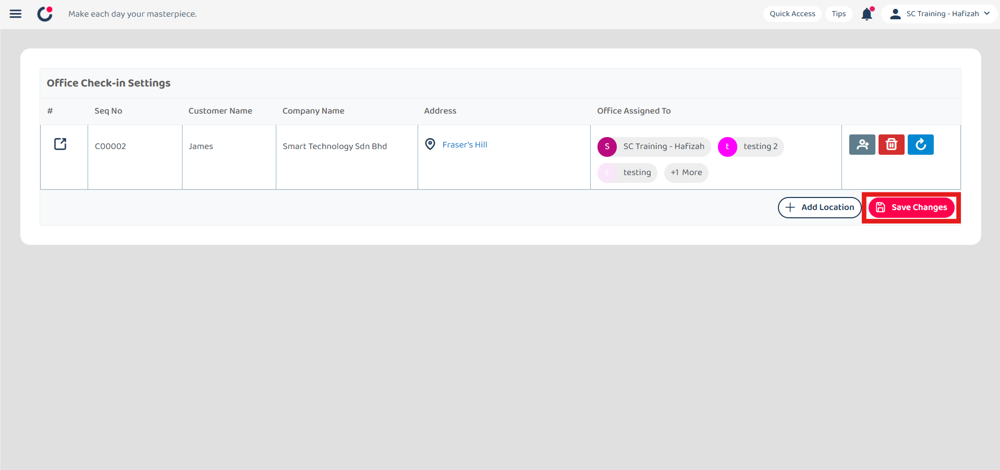
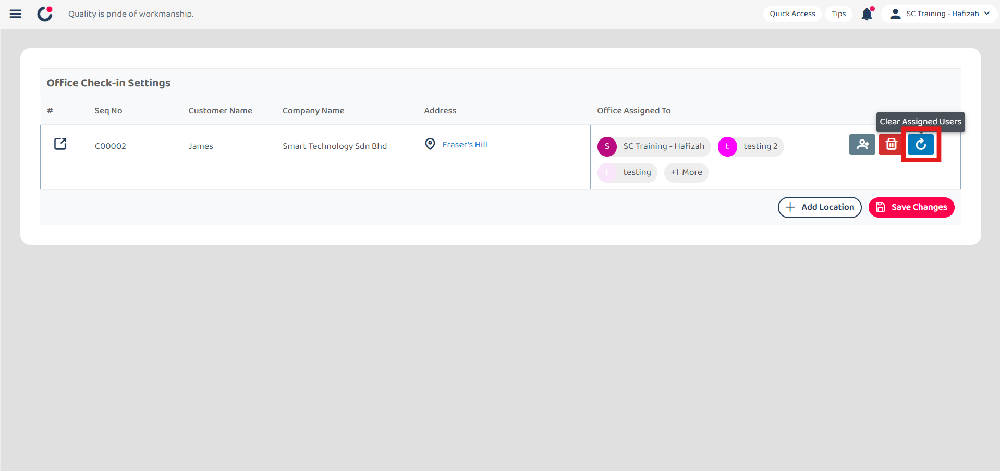
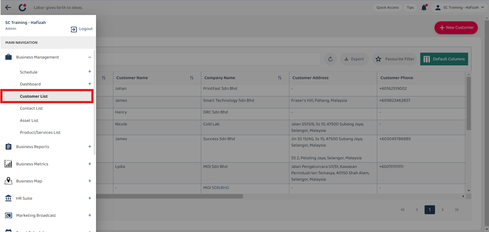
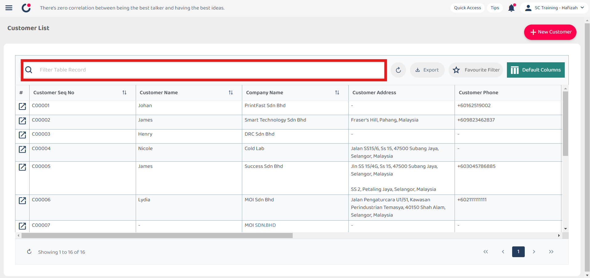
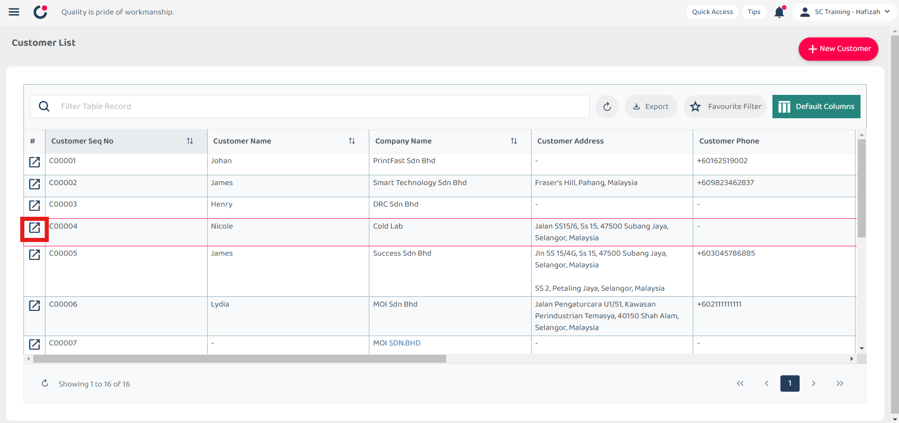
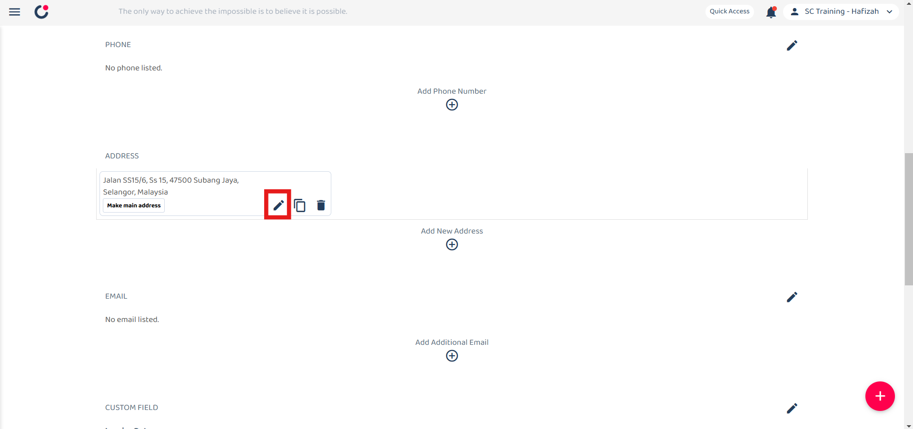
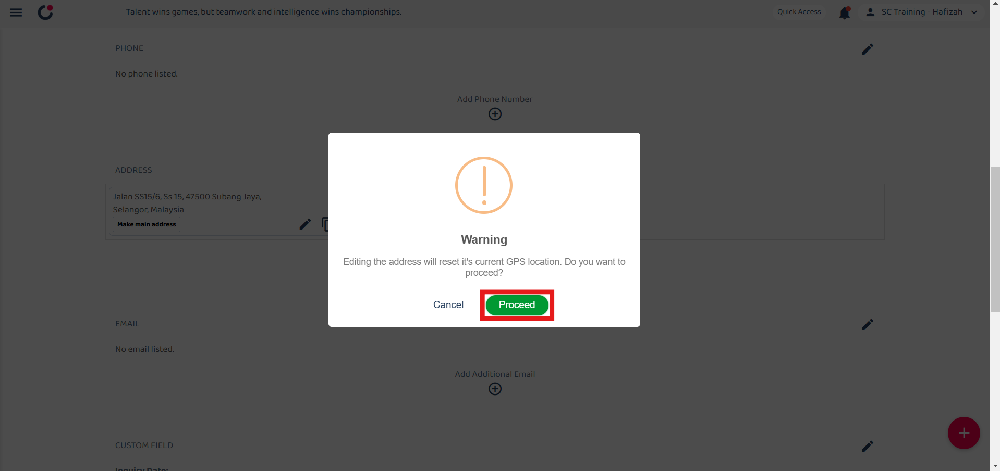
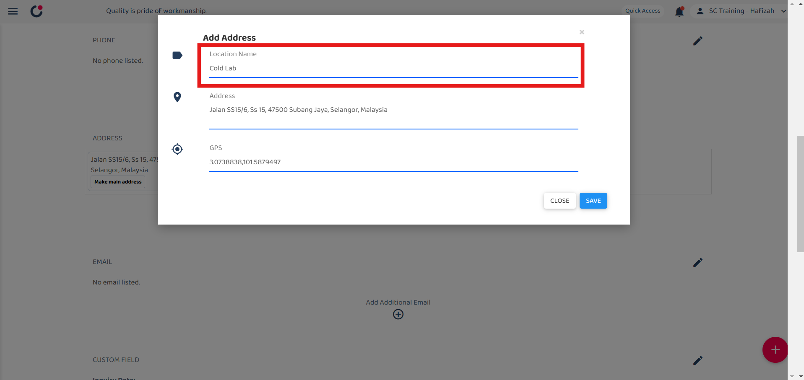
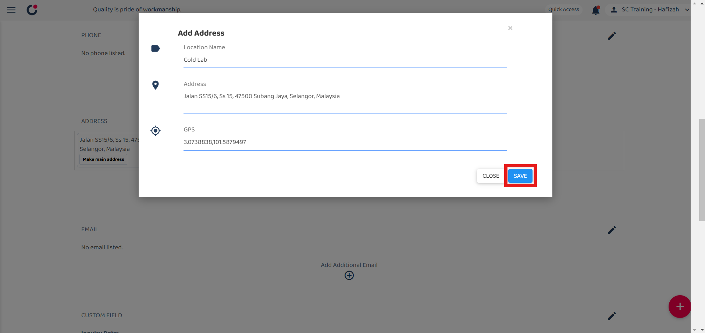

Version 1.0 
Created: 9 July 2024 
Updated: 22 July 2024 
## Office Check-In Settings

Save your office address(es) into the system and set them up for your team to clock in and out of the office with our Office Check-In feature. This gives the team an alternative to check in/out to locations deemed as your office address without requiring a Job on it.  

**Navigate to the section by clicking it.** 

- [Add Office Check-In Location](#section1) 
- [Clear Assigned User](#section2) 
- [Delete Office Check-In Location](#section3) 
- [Edit Office Check-In Location](#section4)
   

### Add Office Check-In Location

1. At the desktop site navigation bar, go to HR Suite > Office Check-in Settings. 
   **Open Office Check-In Settings Here:** [https://salesconnection.my/officecheckin/setting](https://salesconnection.my/officecheckin/setting) 

   

      
   

     
   *Note: You must have access to HR Suite menu to perform this action. Please request permission or help from your admin if you do not have access to the menu. 
   
2. Click "+ Add Location" to add an office check-in.

   

      
   

  
3. The location must come from a registered Customer entry inside your system. For your case, you may add a Customer called HQ with your office address attached to it.

   

      
   

   *Note: Customer may be named as other items in your system (i.e. Site, Client, Company, etc.) 
  
4. Click "Apply Address".

   

      
   

  
5. Click on the "Add User" icon.

   

      
   

  
6. Enter the user name that you want to assign to the office check-in.

   

      
   

  
7. Tick the box of the user accordingly.

   

      
   

  
8. Click on the "Save" button.

   

      
   

  
9. Click "Save Changes".

   

      
   

  
10. The office check-in has been saved successfully when this prompt appears.

    

       
    

    *Note: If no location is set, the user will be able to perform office check-in/out from anywhere. 
      

### Clear Assigned User
To remove/clear off all the assigned users from being able to use the registered location for their office check in/out, follow the steps below. 
1. Click on the "Clear" icon to clear the assigned user.

   

      
   

  
2. Click "Save Changes".

   

      
   

  
3. All the users assigned have been cleared when this prompt appears.

   

      
   

     

### Delete Office Check-In Location
To delete the registered location set for your office check in/out, follow the steps below. 

1. Click on the "Delete" icon beside the office check-in you want to delete.

   

      
   

  
2. Click "Save Changes".

   

      
   

  
3. The office check-in has been deleted when this prompt appears.

   

      
   
  
     

### Edit Office Check-In Location
To edit the registered location set for your office check in/out, follow the steps below. 

1. At the desktop's navigation bar, go to Business Management > Customer List. 
   **Open Customer List Page Here:** [https://salesconnection.my/customers](https://salesconnection.my/customers) 

   

      
   

  
2. Use filter to search the customer.

   

      
   

  
3. Click the "expand" button to open the customer details page.

   

      
   
  

4. Scroll down to the "ADDRESS" column.

   

      
   

  
5. Click on the "pencil" icon of the address.

   

      
   
 

6. Click "Proceed" to edit the address.

   

      
   
  

7. Search the office check-in location.

   

      
   

      
   

9. Enter the location's name.

   

      
   

       
    

      

**Related Articles**
- [I Forgot to Check Out, How?](Assist_Check_Out.md)
- [How to Enable Assist Check Out?](Enable_Assist_Check_Out.md)
- [I am at the location, but the system says I am too far from the location.](Check_In_Address.md)
- [How to Adjust Geofencing Radius?](Adjust_Geofencing_Radius.md)

<!-- [Link Text](https://salesconnection.github.io/Sales-Connection-Support/Office_Check_In_Settings.html) -->
