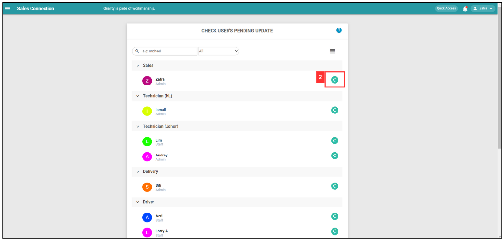
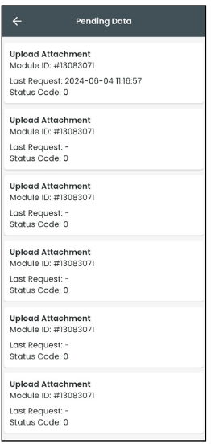
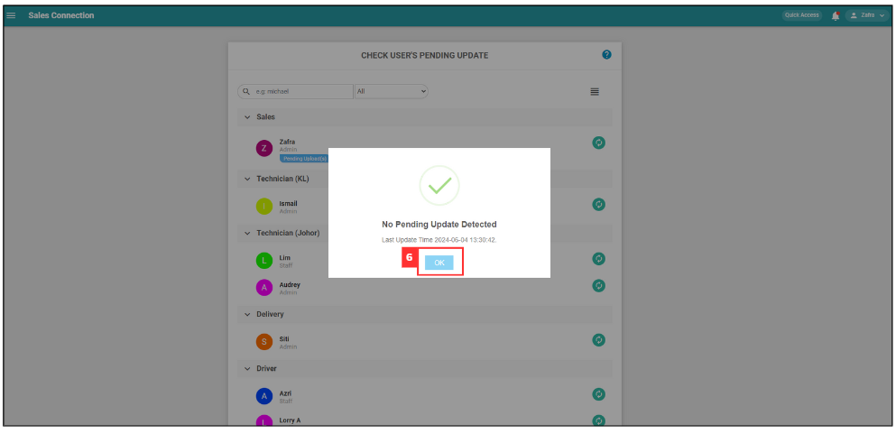

Version 1.0 
Created: 24 May 2024 
Updated: 7 August 2024 

## Pending Data or Updates Guide

### How to Check Pending Data?

Pending data is usually used to check if a user has informed that a comment has been showing as pending for a long time in job details page. In such cases, support team will require user to take screenshot of the pending data so the team can check on it. (As shown below) 

   

      
   
   

*Note: The following step done is done by user in Mobile App.

1. On the Caction mobile app, go to the "Dashboard" page.

   

      
   
 

2. Press on the profile icon.

   

      
   
 

3. Press on the "Pending Data".

   

      
   
 

4. Pending data will be displayed here. Ensure your internet connection is stable, and the attachment will be uploaded as soon as possible.

   

      
   
 

5. If the comment has been showing as pending for a long time on the job details page, you can take a screenshot of the pending data page and send it to your admin so they can check on it.   

### How to check if my staff have any pending updates?

Check on any pending upload item(s) by each of your user. If you receive a message saying "Unable to Retrieve Results", it could mean the following reason(s):

 i. Selected user has an unstable connection and system is unable to connect to their device. 
 ii. Selected user did not have the app running in the background. 
 iii. Selected user had swiped off the app.  

1. At the desktop site's Main Navigation, go to User Management > Check Pending Update. 
   **Check Pending Update here**: [https://system.caction.com/checkPendingUploads](https://system.caction.com/checkPendingUploads) 

   

      
   

   *Note: You must have access to User Management menu to perform this action. Please request permission or help from your admin if you do not have access to the menu.  

2. Click on the refresh button for the user with pending upload.

   

      
   
 

3. This prompt will send the notification to the user's phone.

   

      
   
 

4. Remind the user to press the "Pending Update Check" in their phone.

   

      
   
 

5. After the user press the prompt from previous step, their app will either show one of the result as pictures below. 

   a. The user has pending data:

   

      
   
 

   b. The user didn't have pending data:

   

      
   
 

6. In the desktop admin's view, either one of the results shown in the pictures below will appear. 

   a. The user has pending data:
   

      
   
 

   b. The user didn't have pending data:
   

      
   

   
   *Note: If the user has pending data, these will be updated automatically. Please advise the user to perform this action when their network is stable.

### My updates are not received by my admin and other team members. Why? 
### Here are the potential issues and solutions:

1. Poor Internet Connection: 

   - Check if your internet connection is stable. 
  &emsp;If it's unstable, try switching to a more reliable network, such as a mobile hotspot or a different Wi-Fi network. 

   - Test your internet speed. 
     1. Enter the speed test website: [https://www.speedtest.net/result/16588514558](https://www.speedtest.net/result/16588514558)
     2. Start to test the internet speed.
     3. If the speed is **below 25 Mbps**, you may experience difficulties in updating. If possible, switch to a faster internet connection.  

2. Page Not Refreshed: 

   - Ensure all team members, including your admin, refresh their page to receive the latest updates.  

3. Updates are stuck in pending upload: 

   - Go to your Pending Data in the User Profile page to see if there are any items still loading.
   - Should the list still not move even after connecting to a stronger internet connection, please contact our support team at 012-278 0122. When contacting support, please provide the following information:
     1. Your account details (Company name, username, and phone number/email registered).
     2. The date and time of when the issue occurred. If the issue still persists, inform our team on it as well.
     3. A screenshot of the error page. 

   *Note: Should the issue be updates being stuck on pending upload, DO NOT relog from the system as your pending update data will be lost.
   

**Related Articles** 
- [I can't load the schedule page. Why?](Can't_Load_Schedule_Page.md)
- [How to comment with photo / attachment?](Comment_With_Photo.md)
- [How Does an Admin Reset App Access for a User?](Admin_Reset_App_Access.md)

<!-- [Link Text](https://support.caction.com/Updates_Not_Received_by_Team_Members.html) -->
