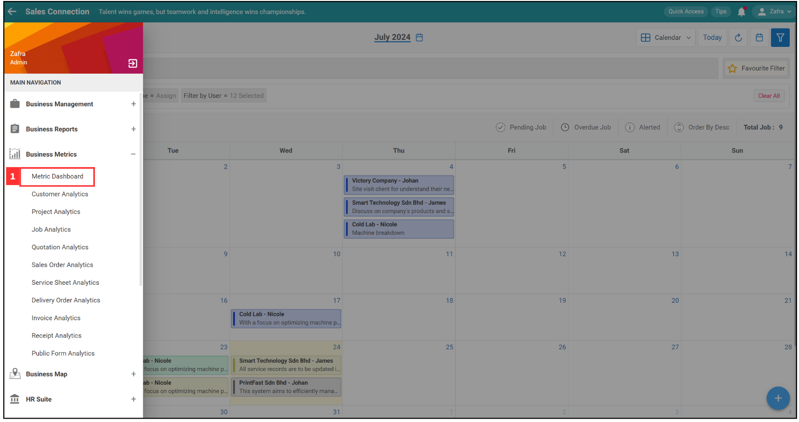
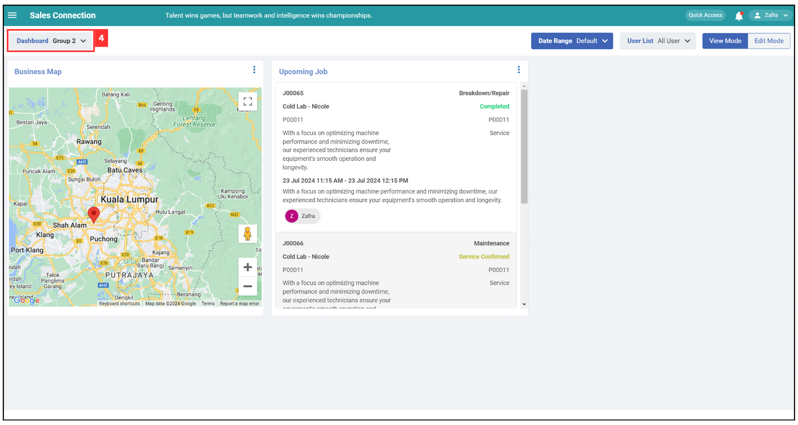

## Performance Metrics (APP)

**Performance Metrics** page provides quick access to key job and project statistics, including overdue jobs, total jobs, completed jobs, top 5 customers by month, and total projects won. Each metric has a "View" button for detailed reports.  

1. At the mobile app's navigation bar, click "Metric". 

   

     
   

2. Click the "three lines" icon to filter the performance metrics.

   

     
   

3. Click "Select" to filter the date.

   

     
   

4. Select the date range to filter.

   

     
   

   
5. Click "Select User" to filter. 

   

     
   

6. Select the user by ticking the box beside the user's name.

   

     
   

7. Click "SAVE".

   

     
   

8. Click "Select Group".

   

     
   

9. Click on the group you want to view.

   

     
   

   
10. Click "SAVE".

    

      
    

11. The performance metrics have been filtered successfully and shown as below.

    

      
    

12. Click on the "Chart" icon to view chart for the .

    

      
    

13. Click "Select Group".

    

      
    

      
   
**Related Articles**

<!-- [Link Text](https://salesconnection.github.io/Sales-Connection-Support/Performance_Metrics_App.html) -->
