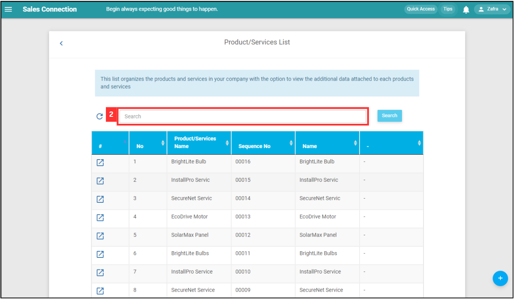

Version 1.0 
Created: 4 July 2024 
Updated: 4 July 2024 
## Product/Services List

**Product/Services List** displays detailed information about the products and services offered by the company, including sequence numbers, names, and additional data for efficient inventory management.  

**Navigate to the section by clicking it.** 

- [Search Bar](#section1) 
- [Refresh](#section2) 
- [Sort By](#section3) 
- [Add New Product/Services](#section4)
   

1. At the desktop's navigation bar, go to Business Management > Product/Services List. 
   **Open Product/Services List Here:** [https://salesconnection.my/templateSettings/ViewProductList](https://salesconnection.my/templateSettings/ViewProductList) 

   

     
   

    

   

   ### Search Bar

2. Click "Search" to filter the list.

   

     
   

3. Click on the "Search" button.

   

     
   

4. The list has been filtered.

   

     
   

5. Click on the "Blue Arrow" button to open the product/services detail page.

   

     
   

    

   

   ### Refresh

6. Click on the "Refresh" icon to get the latest information on the product/services.

   

     
   

    

   

   ### Sort By

7. Click the "Arrow" icon to choose sort ascending or descending for the list.

   

     
   

    

   

   ### Add New Product/Services

8. Click on the "+" button to add new product/services.

   

     
   

      

**Related Articles**
- [Customer List](Customer_List.md)

<!-- [Link Text](https://salesconnection.github.io/Sales-Connection-Support/Product_Services_List.html) -->
