Version 1.0 
Created: 10 July 2024 
Updated: 10 July 2024 
## Project Schedule Page

**Project Schedule** provides an overview of the job timelines of the project. It helps users track the progress and deadlines of various jobs under one project in a calendar format.  

1. At the desktop site navigation bar, go to Business Management > Schedule > Project Schedule. 
   **Open Project Schedule Here:** [https://salesconnection.my/calendar/projectactivityschedule](https://salesconnection.my/calendar/projectactivityschedule) 

   

      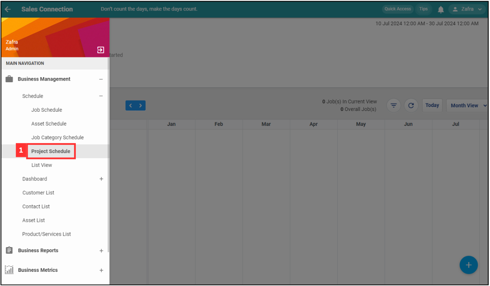
   

2. Click the "three lines" icon.

   

      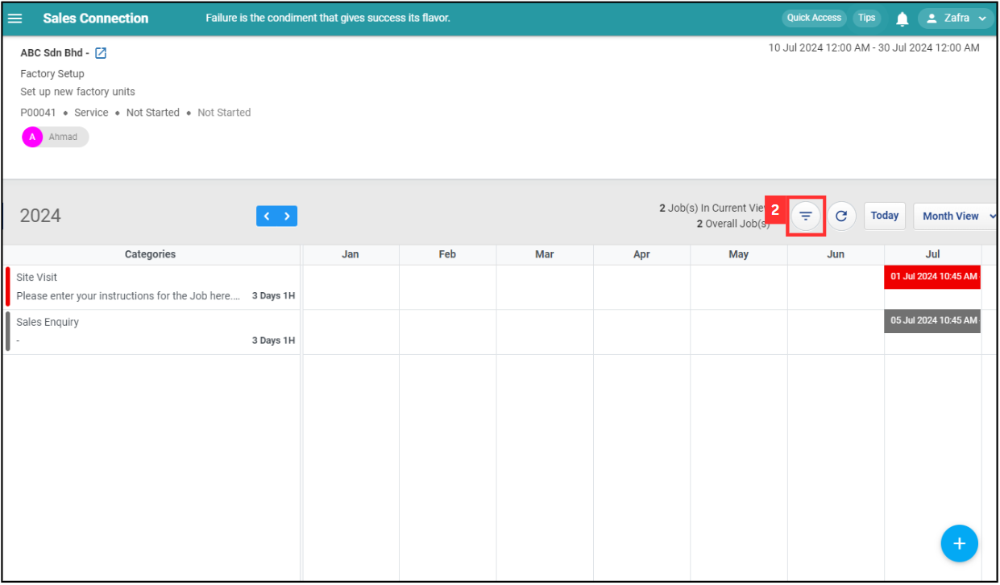
   

  
3. Click "Customer Filter" to filter the customer list.

   

      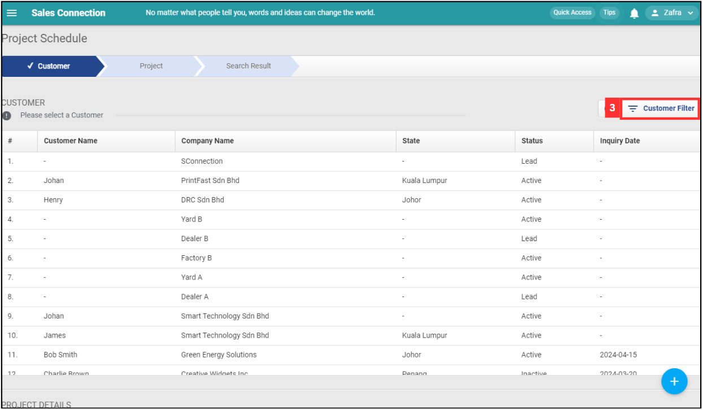
   

   
4. Click "Advanced Filter" if you wish to have more filter options.

   

      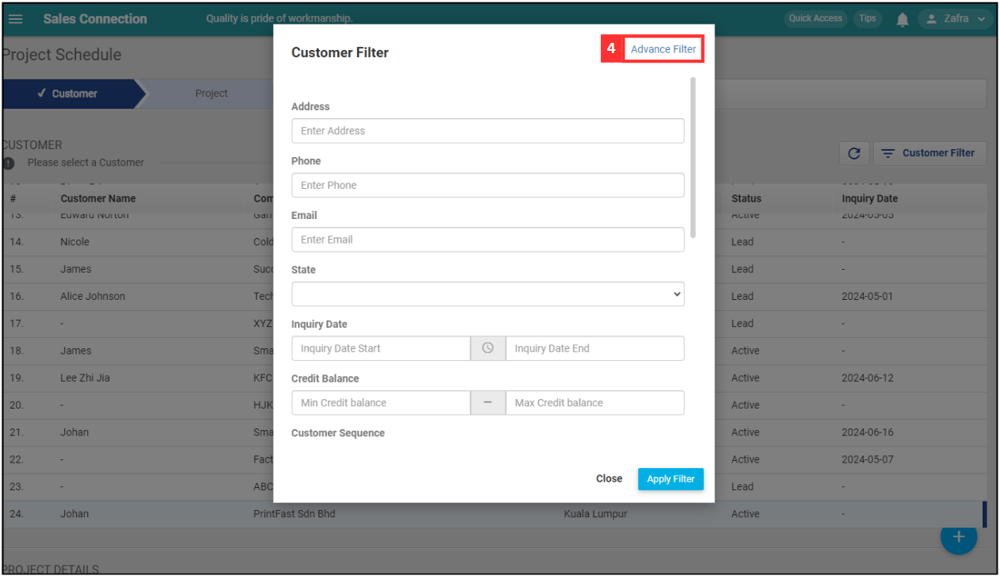
   

5. Select the advanced filter options you want.

   

      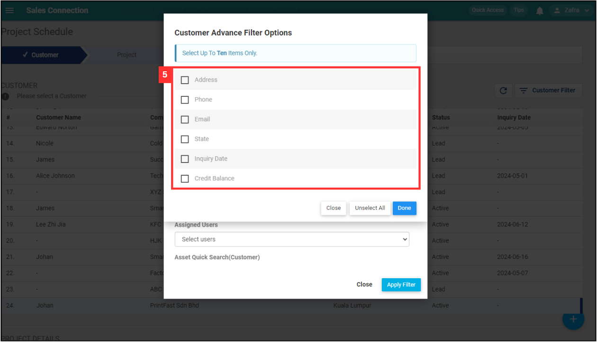
   

6. Click on the "Done" button.

   

      
   

  
7. Enter the customer details to filter.

   

      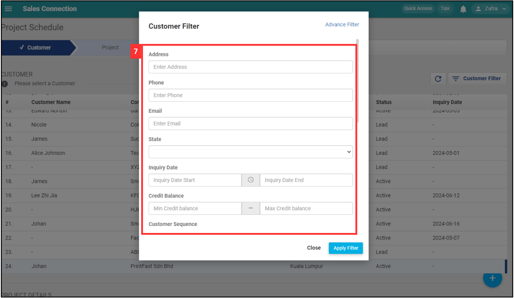
   

  
8. Click "Apply Filter".

   

      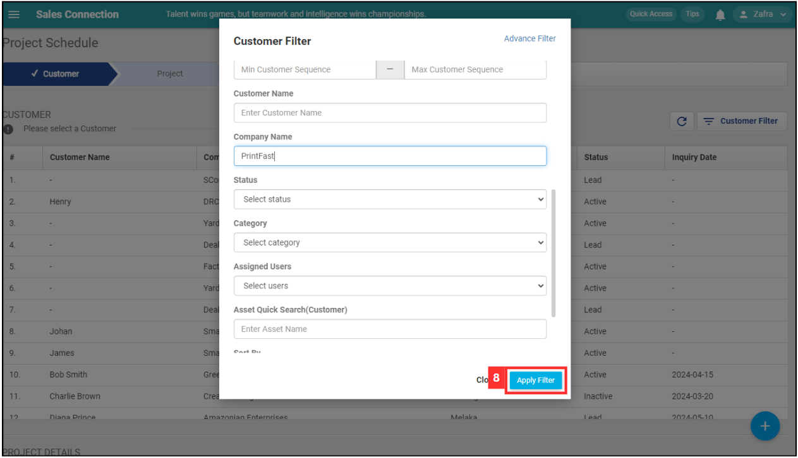
   

  
9. From the list, click on the Customer you would like to select.

   

      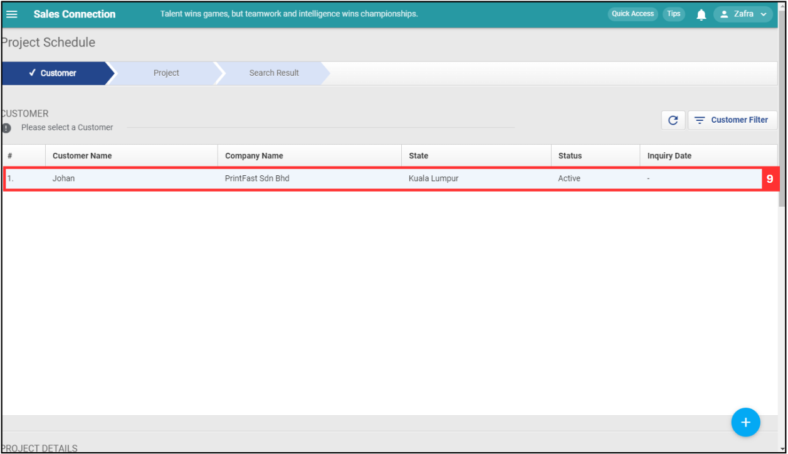
   

  
10. From the list, click on the Project you would like to select.

    

      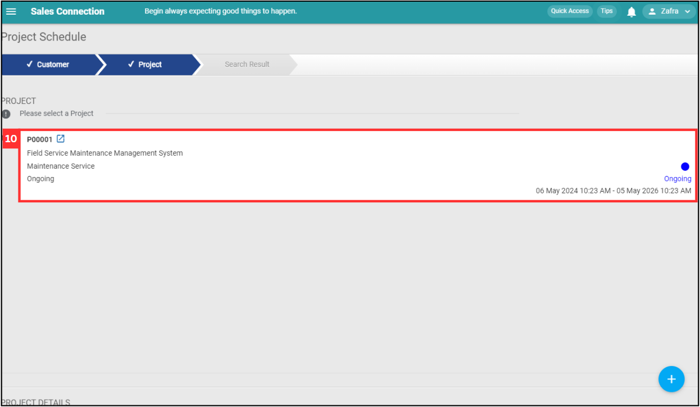
    

11. To have a clearer view of the Jobs, you may change the “Month View” filter by clicking on it.

    

      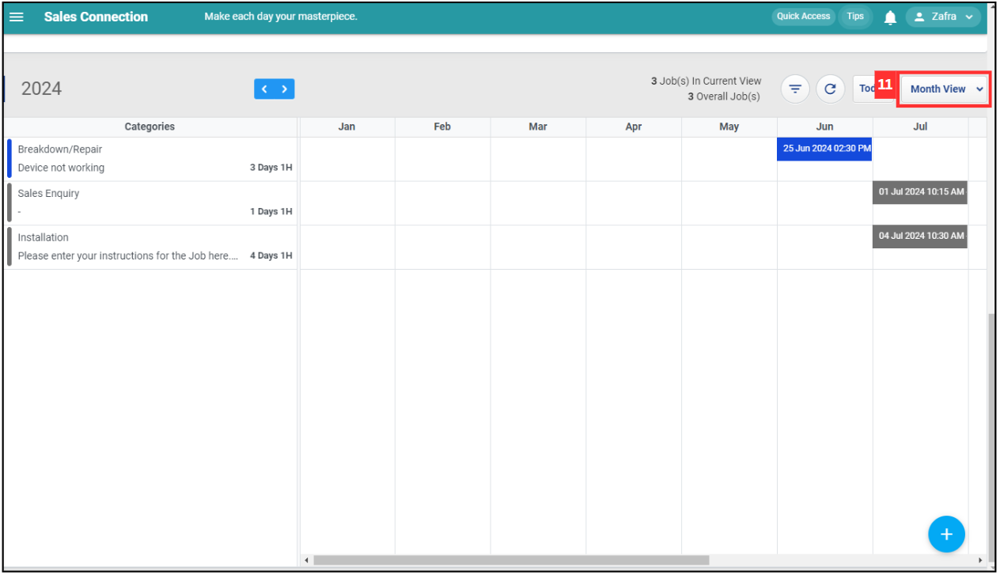
    

  
12. Choose the view options you would like to select. In this example, we will pick “Days View”.

    

      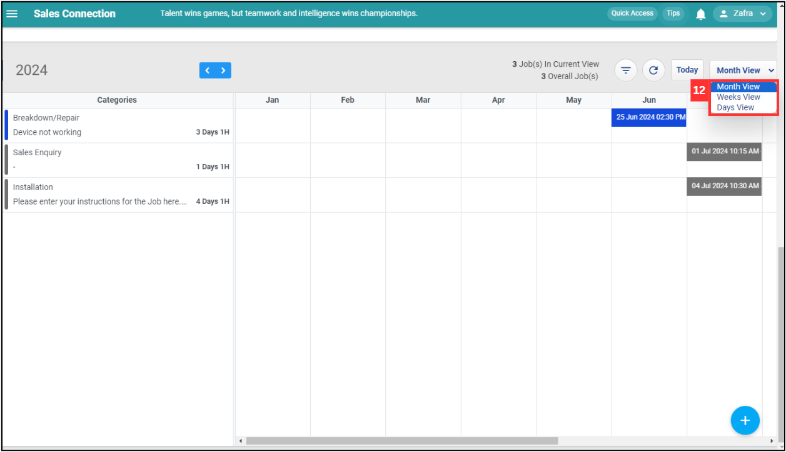
    

  
13. Click the arrow icons to change the month of the calendar during this “Days View”.

    

      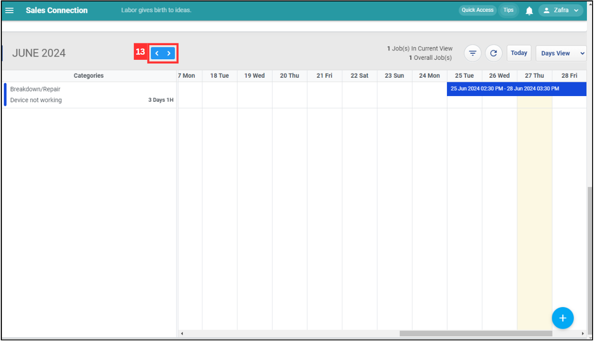
    

14. If you wish to change the date of the job, drag the job to the new date.

    *Note: The duration of the job will not be changed. 

    

      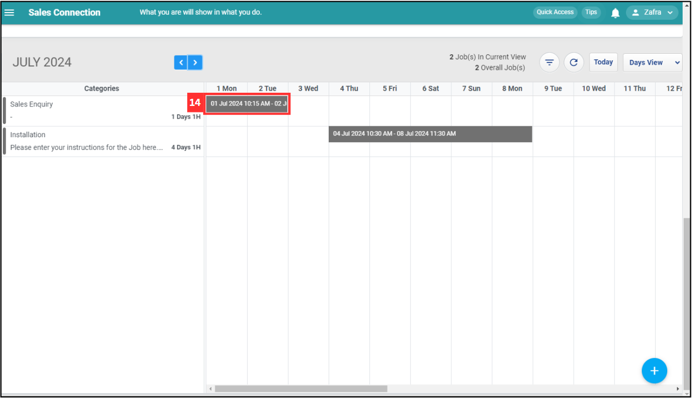
    

  
15. As the next job(s) is/are related to the job, click “Update X Job” if you wish to extend the next job(s).

    *Note: The duration of the job will not be changed. 

    

      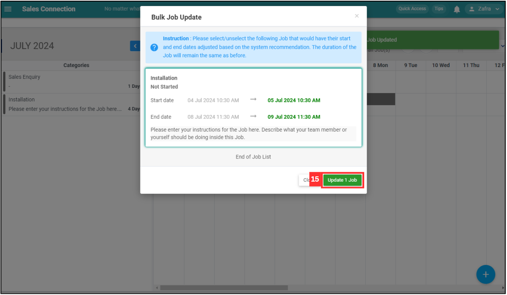
    

  
16. The new date of the jobs have been changed successfully.

    

      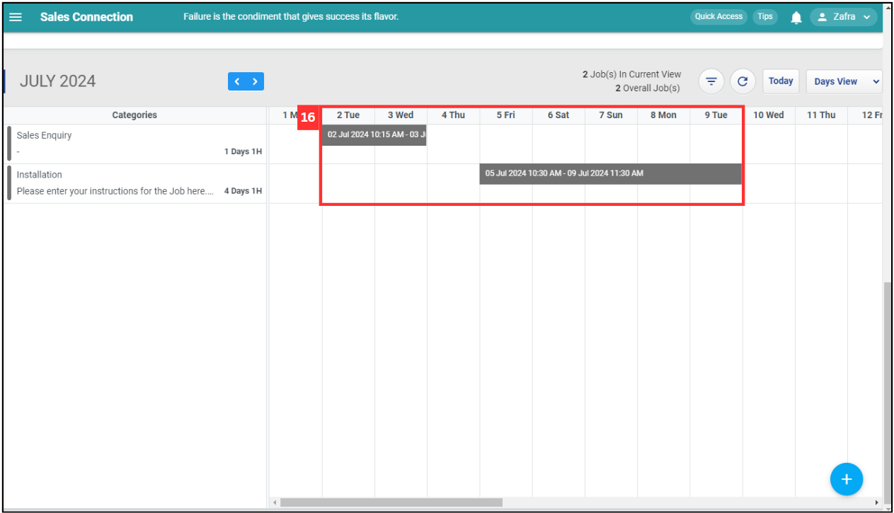
    
  

17. Click the "Refresh" button if you wish to get the latest information of the jobs.
    
    

      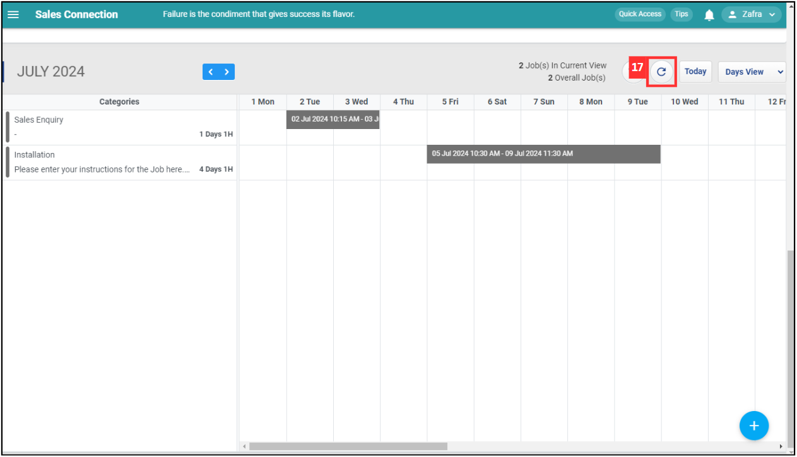
    
  

18. Click on the "+" button if you want to add a new job under this project.
    
    

      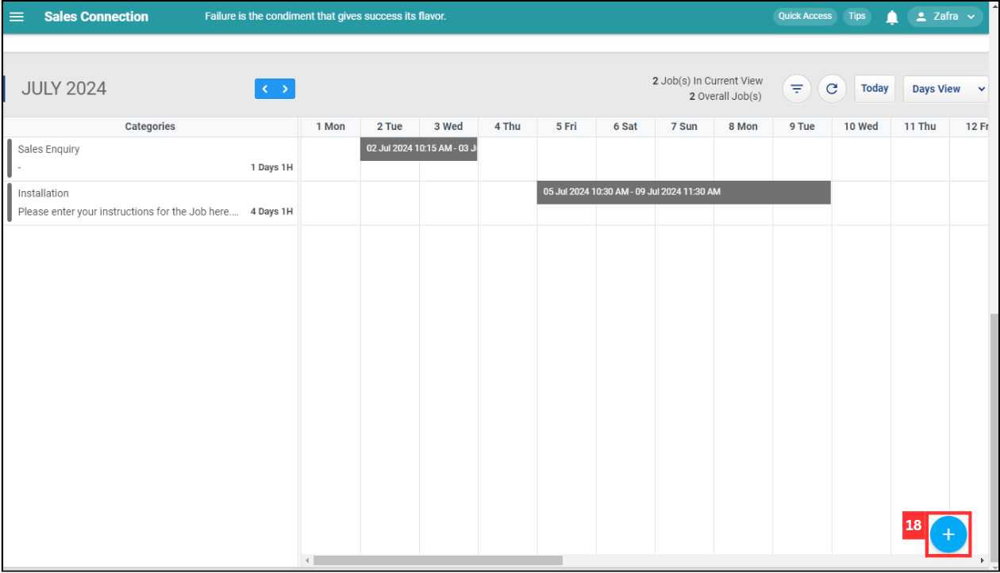
    

       

**Related Articles**
- [How to Add New Project?](Add_New_Project.md)
- [Job Schedule Page](Job_Schedule_Page.md)
- [Wizard Page](Wizard_Page.md)

<!-- [Link Text](https://salesconnection.github.io/Sales-Connection-Support/Project_Schedule_Page.html) -->
