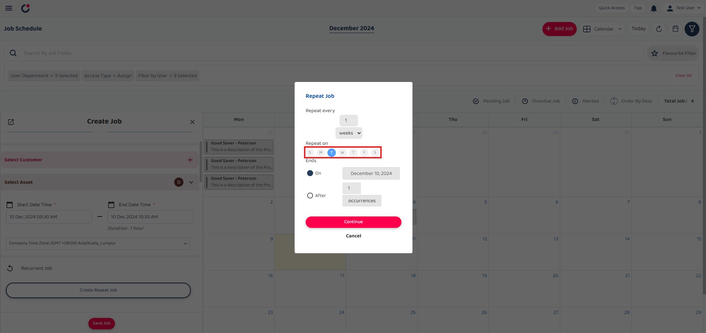
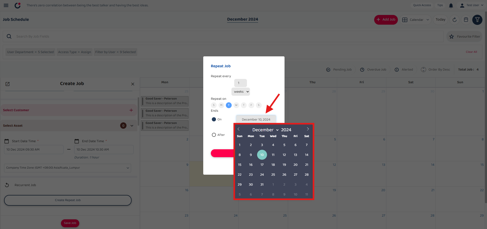

## Repeat Job Guide

1) Select '+ Add Job' button to start create job.  

         

 

2) Select job category and save it.  

         
         

 

3) Scroll down and select 'Create Repeat Job' button.  

         

 

4) Set the frequency of the job to repeat.  
*Note: Choose how often the job should repeat. 
<b>Example:</b>  
<b>Repeat every 1 day </b> means the job will repeat every day.  
<b>Repeat every 1 week </b> means the job will repeat every week.  
<b>Repeat every 1 month </b> means the job will repeat every month.  
         

 

### Scenario 1: Repeat Job by End Date  
*Note: The job will repeats until the specified end date. 

5) Click on "Days" and select your preferred option: Days, Weeks, or Months.   
•If you choose "Weeks", a "Repeat on" section will appear where you can select the days of the week.  
•If you choose "Months", a "Monthly on" section will appear where you can select the day of the month.  
*Note: The 'Repeat on' setting allows you to choose the specific days of the week for the job to repeat, only applicable if the repeat interval is set to weeks. You can select one or more days of the week.

         
         

 

6) Select end date for when the repeat job should stop recurring. (e.g., Dec 11, 2024).  

         

 

7) Click the 'Continue' button to apply and proceed with the selected repeat settings.  

         

 

8) The recurrent job shows the jobs will be repeated weekly on Tuesday until Wednesday 11 December 2024.  

         

 

### Scenario 2: Repeat Job By Occurrence
*Note:  
i. The job repeats until the specified number of occurrences is reached. 
ii. Enter how many times the job should repeat (e.g., 2 times).   
9)  Select ‘After’ and set how many times the job will repeat.  

         

 

10) Click the 'Continue' button to proceed with the selected repeat settings.  

         

 

11) The recurrent job shows the jobs will be repeated weekly on Tuesday for 2 times.   

         

 
