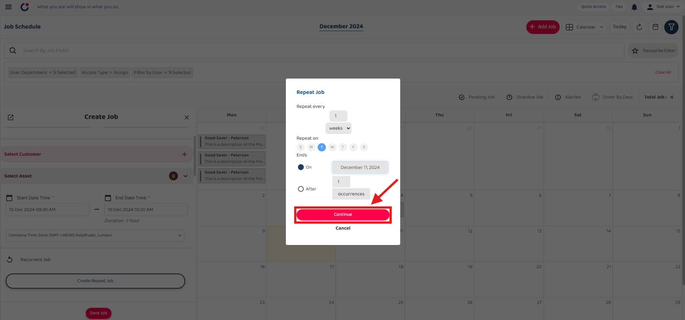
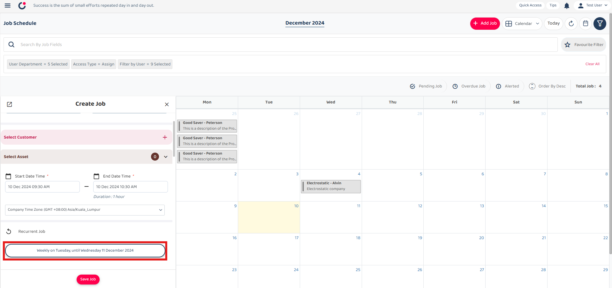

## Repeat Job Guide

1) Select '+ Add Job' button to start create job.  

         

 

2) Select job category and save it.  

         

 

3) Scroll down and select 'Create Repeat Job' button.  

         

 

### Scenario 1: Repeat by days
#### Set with date
4) Set the desired interval by entering the number of days for the job to repeat.  

         

 

5) Select the date to change it to your preferred one.  

         
         

 

6) Click the 'Continue' button to proceed with the selected repeat settings.  

         

 

7) The recurrent job shows the jobs will be repeated every 3 days until Monday 09 December 2024.  

         

 

#### Set with occurences
8) Select and specify the number of occurrences after which the job will stop repeating.  

         

 

9) Click the 'Continue' button to proceed with the selected repeat settings.  

         

 

10) The recurrent job shows the jobs will be repeated every 3 days for 2 occurrences.   

         

 
