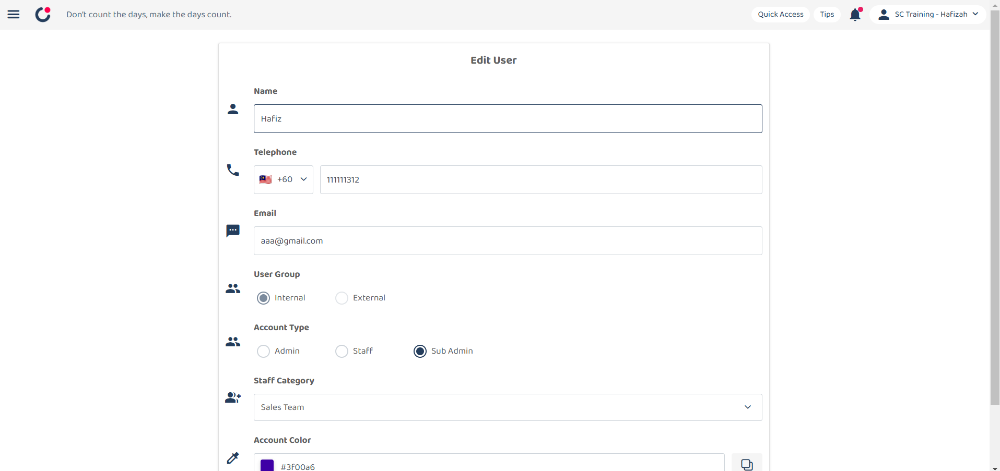

Version 1.0 
Created: 24 May 2024 
Updated: 23 January 2025 
## How to Replace Resigned User with A New User in The System?

**Differences between delete, deactivate and replace user**

|   |  Delete   |   Deactivate   |   Change   |
|-------|----------|----------------|------------|
| User can access the system. | No | No | Yes |
| Data will remain in the system. | No | Yes | Yes |
| The users’ jobs can be traced in the schedule and metrics overview pages. | No | Yes | Yes |

  
**Navigate to others.** 
- [How to Delete a Resigned User?](Delete_User.md)
- [How to Deactivate a Resigned User?](Deactivate_User.md)
   

## ⚠ Change to a New User
### What happens if I replace a resigned user with a new user in the system?
- The resigned user will no longer have the system access. 
- The new user will have all items previously assigned to or created by the resigned user. 
- **All historical data** of the resigned user will be **overwritten** by the new user (e.g. Assigned to/ Creator columns, job schedule, metrics, etc.)  

### How to change to a new user?
1. Go to desktop site navigation bar > HR Suite > User List. 
   **Open User List Page Here:** [https://system.caction.com/usermanage/userlist](https://system.caction.com/usermanage/userlist) 
   *Note: Only certain admins can deactivate users. 

   

      
   

   
2. Navigate to the user you want to change the details to the new user. 

   

      
   

3. Click on the "Blue Pencil" icon to change the user details. 

   

      
   

4. Replace the original details with the new user's information. 
   a. The details include: 
        - Name 
        - Telephone 
        - Email (optional if the user only uses a mobile device) 
        - User Group 
        - Account Type 
        - Staff Category 

   

      
   

5. Click "Submit Form" and the user details has been changed successfully. 

   

      
   

      

**Related Articles** 
- [How to Add New User?](Add_New_User.md)
- [How to Assist My New User to Login?](New_User_Login.md)
- [How to Login Into Caction Using Mobile and Desktop?](Login.md)

<!-- [Link Text](https://support.caction.com/Delete,_Deactivate_or_Change_User.html) -->
