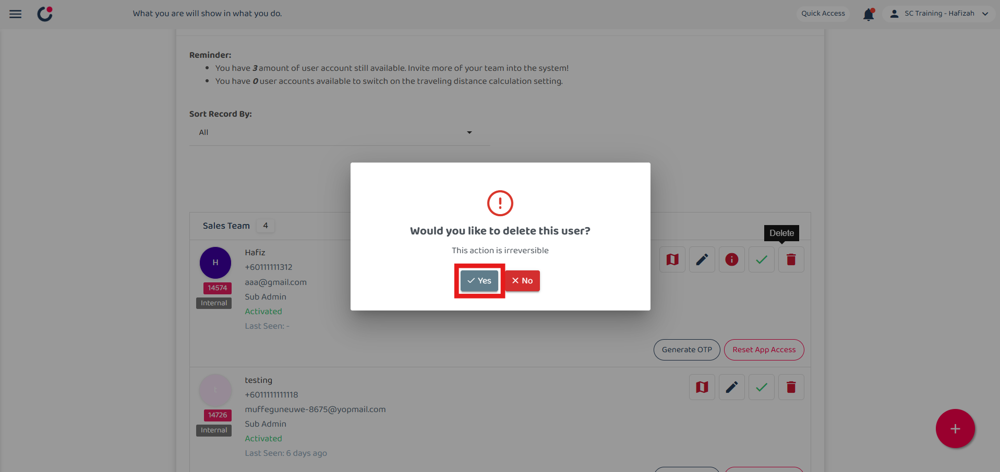
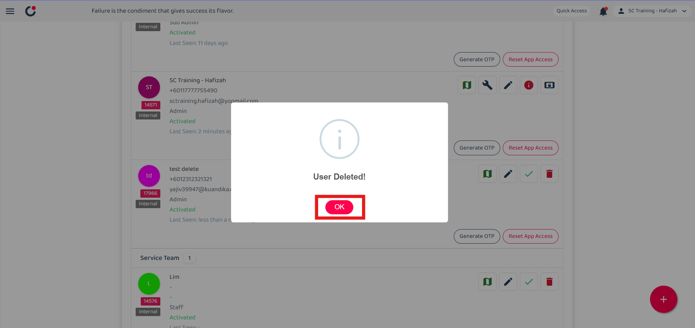

Version 1.0 
Created: 24 May 2024 
Updated: 23 January 2025 
## How to Replace Resigned User with A New User in The System?

**Differences between delete, deactivate and replace user**

|   |  Delete   |   Deactivate   |   Replace  |
|-------|----------|----------------|------------|
| User can access the system. | No | No | Yes |
| Data will remain in the system. | No | Yes | Yes |
| The users’ jobs can be traced in the schedule and metrics overview pages. | No | Yes | Yes |

  
**Navigate to others.** 
- [How to Delete a Resigned User?](Delete_User.md)
- [How to Deactivate a Resigned User?](Deactivate_User.md)
   

## ⚠ Delete a Resigned User
### What happens when a user is deleted from the system?
- The user can't login to the system. 
- The user is removed from all the tasks they were assigned to or created. 
- The users’ jobs won't appear in the schedule and metrics overview pages. 
*Note: All updates, comments, and check-ins/outs by the deleted user will stay in the system.  

### How to delete a user?
1. Go to desktop site navigation bar > HR Suite > User List. 
   **Open User List Page Here:** [https://system.caction.com/usermanage/userlist](https://system.caction.com/usermanage/userlist) 
   *Note: Only certain admins can delete users. 

   

      
   

2. Navigate to the user you want to delete. 

   

      
   

3. Click on the "Red Bin" icon to delete the user. 

   

      
   

4. Click "Yes" to confirm your deletion. 

   

      
   

5. Click "OK" and the user has been deleted successfully. 

   

      
   

   

**Related Articles** 
- [How to Add New User?](Add_New_User.md)
- [How to Assist My New User to Login?](New_User_Login.md)
- [How to Login Into Caction Using Mobile and Desktop?](Login.md)

<!-- [Link Text](https://support.caction.com/Delete,_Deactivate_or_Change_User.html) -->
