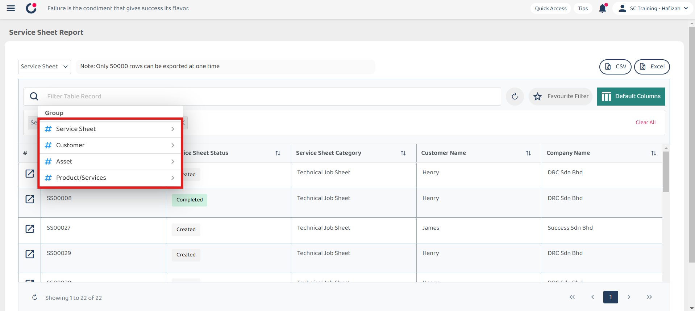
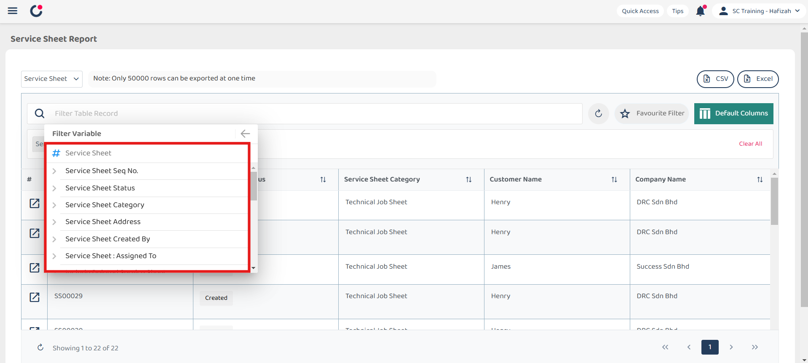
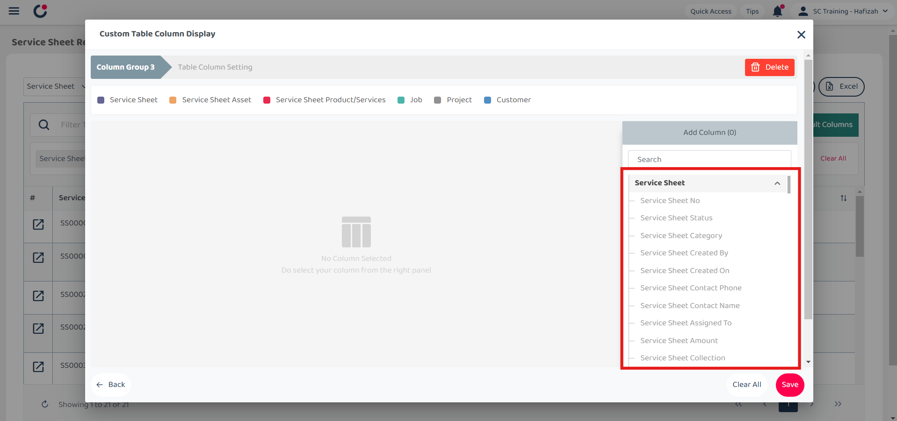
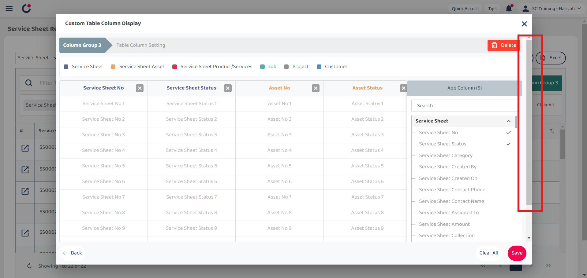
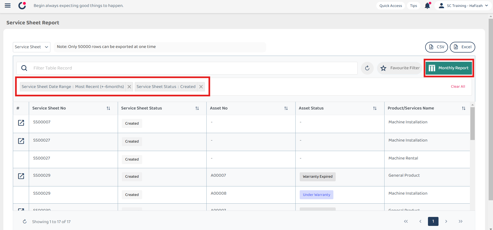

## Report Page

The Report Page allows you to **generate** and **customize** reports across various type including job, project, asset, digital form, public form, and reminder which provide a comprehensive overview and detailed insights into your data. 

**Open Report Page Here:** [https://salesconnection.my/reports/digitalform?code=DR01](https://salesconnection.my/reports/digitalform?code=DR01) 

| No | Terms | Description |
|----|-------|---------|
| 1 | Digital Form Category | Select from various digital form categories. |
| 2 | Filter | Use filter groups to refine your search based on specific criteria. |
| 3 | Favourite Filter | Save your current filter and column settings as a favourite for easy access and automatic application next time. |
| 4 | Default Columns | Customize which columns are displayed by default and save your preferences for future reports. |
| 5 | Export Report | Export your report in different formats for further analysis or sharing. |

  

  

**Navigate to the section by clicking it.** 

- [Digital Form Category](#section1) 
- [Filter](#section2) 
- [Default Columns](#section3) 
- [Favourite Filter](#section4) 
- [Export Report](#section5)
   

### Digital Form Category

1. Select the Digital Form category you want by clicking the expand button beside Quotation.

   

     
   

2. Click on the category you want to select. For example, if you want to have Service Sheet Report, click "Service Sheet".

   

     
   

3. The Service Sheet Report will be shown as below.

   

     
   

     

### Filter

1. For example, if you want to filter status in Service Sheet Report, click on "Filter Table Record".

   

     
   

2. Click on the group you want to filter. For example, click "# Service Sheet".

   

     
   

3. Click on the "Filter Variable" you want. For example, click "Service Sheet Status".

   

     
   

4. Click on the "Operator" you want. For example, click "Contains".

   

     
   

5. Click on the "Filter Value" you want. For example, tick "Created".

   

     
   

6. Click on the "Done" button after selecting the filter.

   

     
   

7. The result will be shown as below.

   

     
   

     

### Default Columns

1. If you want to display different columns for the Report, click on "Default Columns".

   

     
   

2. Click on the "+ Create" button.

   

     
   

3. Select the columns you wish to have from here.

   

     
   

4. After selecting the columns you want to display, click "Save".

   

     
   

5. The new Report with different columns will be shown as below.

   

     
   

     

### Favourite Filter

1. Favourite filter

   

     
   

     

### Export Report 

1. Click on the format you want to export. For example, if you want to export the Quotation Report in Excel, click "Excel".

   

     
   

2. Wait for the system to export the file.

   

     
   

3. Click "Download" to download the file needed.

   

     
   

4. The file is successfully downloaded and it can be viewed in your desktop "File Explorer".

   

**Related Articles**
- [Update Report Page](Report_Update_Page.md)
