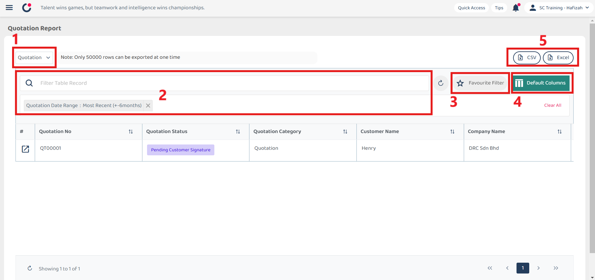

## Report Page

The Report Page allows you to **generate** and **customize** reports across various type including job, project, asset, digital form, public form, and reminder which provide a comprehensive overview and detailed insights into your data. 

**Open Report Page Here:** [https://salesconnection.my/reports/digitalform?code=DR01](https://salesconnection.my/reports/digitalform?code=DR01)  

| No | Terms | Description |
|----|-------|---------|
| 1 | Digital Form Category | Select from various digital form categories. |
| 2 | Filter | Use filter groups to refine your search based on specific criteria. |
| 3 | Favourite Filter | Save your current filter and column settings as a favourite for easy access and automatic application next time. |
| 4 | Default Columns | Customize which columns are displayed by default and save your preferences for future reports. |
| 5 | Export Report | Export your report in different formats for further analysis or sharing. |

  

  

**Navigate to the section by clicking it.** 

- [Digital Form Category](#section1) 
- [Filter](#section2) 
- [Favourite Filter](#section) 
- [Default Columns](#section4) 
- [Export Report](#section5)
   

### Export Report 

1. Click on the format you want to export. For example, if you want to export the Quotation Report in Excel, click "Excel".

   

     
   

2. Wait for the system to export the file.

   

     
   

3. Click "Download" to download the file needed.

   

     
   

4. The file is successfully downloaded and it can be viewed in your desktop "File Explorer".

   

     
   

