### Update Report Page

The Update Report Page allows you to **generate** and **customize** reports across various types similar to the Report Page. In addition to the comprehensive report generation and customization features, this page includes a **comment section** which allowing you to view and manage comments related to each report, enhancing collaboration and tracking. 

**Open Update Report Page Here:** [https://salesconnection.my/reports/digitalform-update?code=DR01](https://salesconnection.my/reports/digitalform-update?code=DR01) 

| No | Terms | Description |
|----|-------|---------|
| 1 | Digital Form Category | Select from various digital form categories. |
| 2 | Filter | Use filter groups to refine your search based on specific criteria. |
| 3 | Favourite Filter | Save your current filter and column settings as a favourite for easy access and automatic application next time. |
| 4 | Default Columns | Customize which columns are displayed by default and save your preferences for future reports. |
| 5 | Export Report | Export your report in different formats for further analysis or sharing. |

  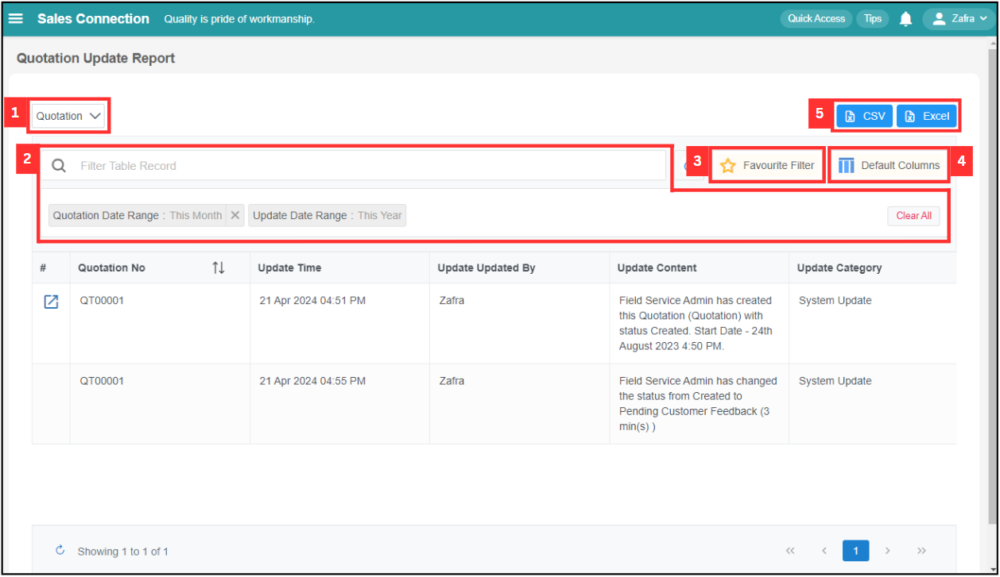

  

**Difference between Report Page and Update Report Page** 

| Report Page | Update Report Page |
|-------------|--------------------|
| Not consist of comment section | Consist of comment section |

  

**Navigate to the section by clicking it.** 

- [Digital Form Category](#section1) 
- [Filter](#section2) 
- [Favourite Filter](#section) 
- [Default Columns](#section4) 
- [Export Report](#section5)
   

### Digital Form Category

1. Select the Digital Form category you want by clicking the expand button beside Quotation.

   

     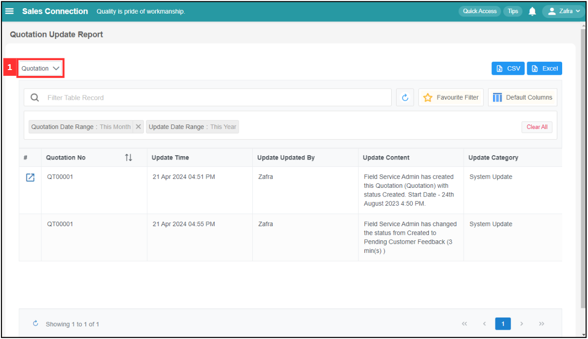
   

2. Click on the category you want to select. For example, if you want to have Service Sheet Update Report, click "Service Sheet".

   

     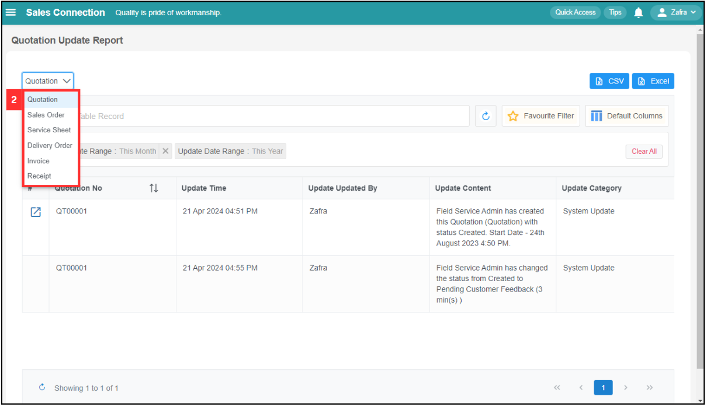
   

3. The Service Sheet Update Report will be shown as below.

   

     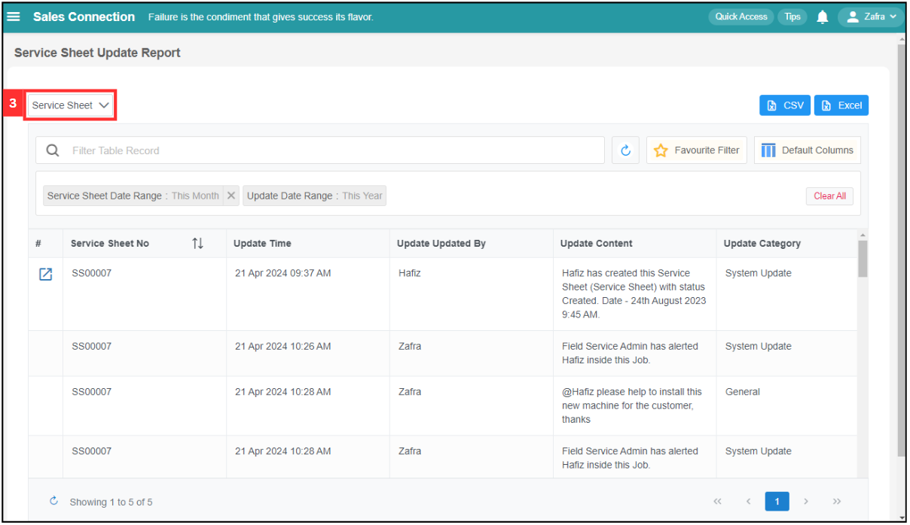
   

     

### Filter

1. For example, if you want to filter update status in Service Sheet Update Report, click on "Filter Table Record".

   

     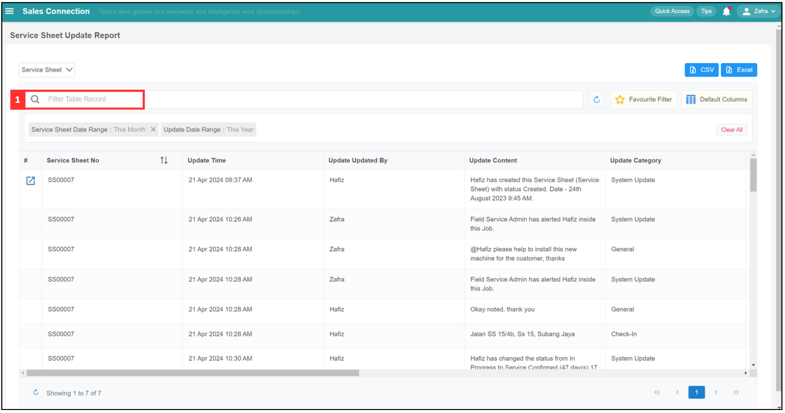
   

2. Click on the group you want to filter. For example, click "# Service Sheet".

   

     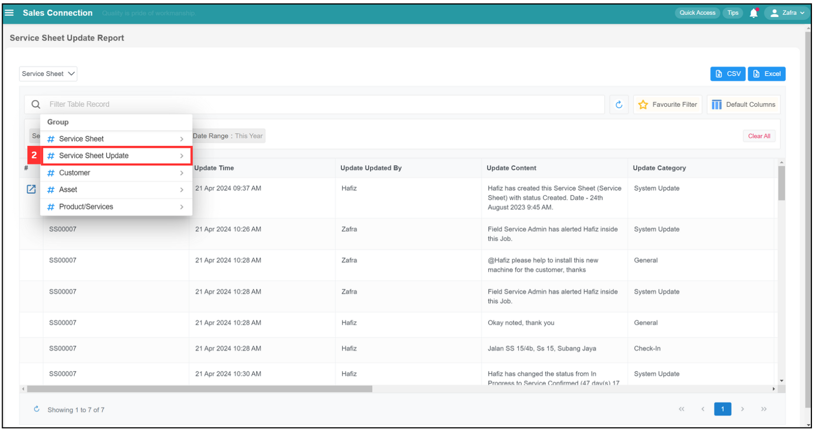
   

3. Click on the "Filter Variable" you want. For example, click "Update Content".

   

     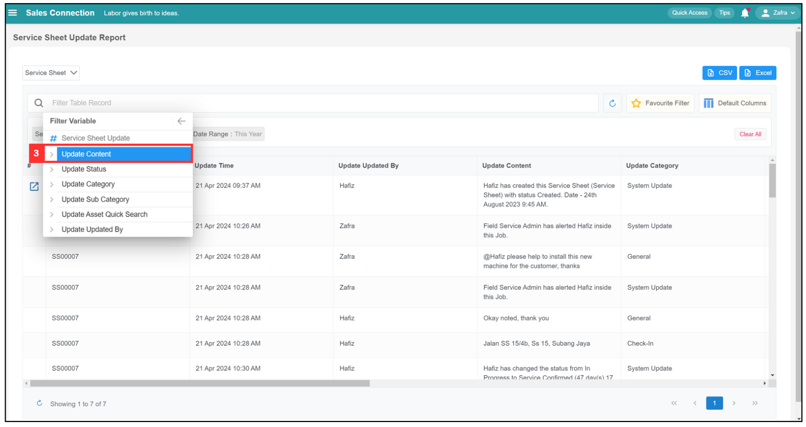
   

4. Click on the "Operator" you want. For example, click "Contains".

   

     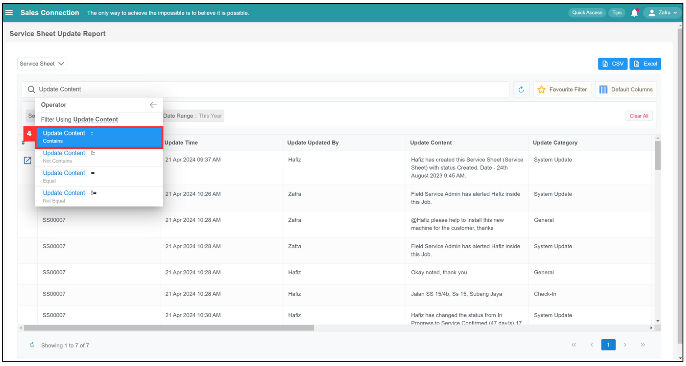
   

5. Click on the blank space in the space bar to enter the update content that you want. 

   

     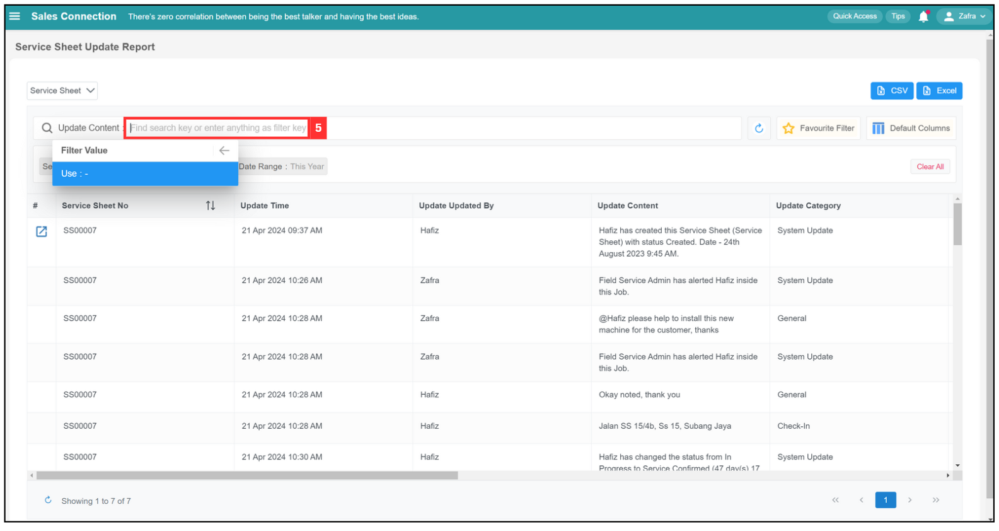
   

6. For example, search for the term "Alert" and press the Enter button on your keyboard.

   

     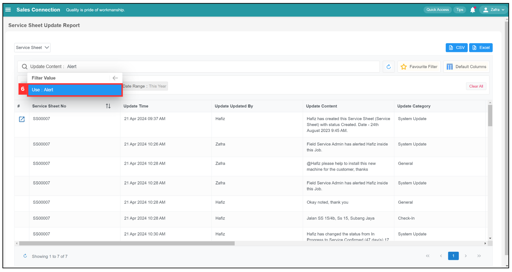
   

7. The result will be shown as below.

   

     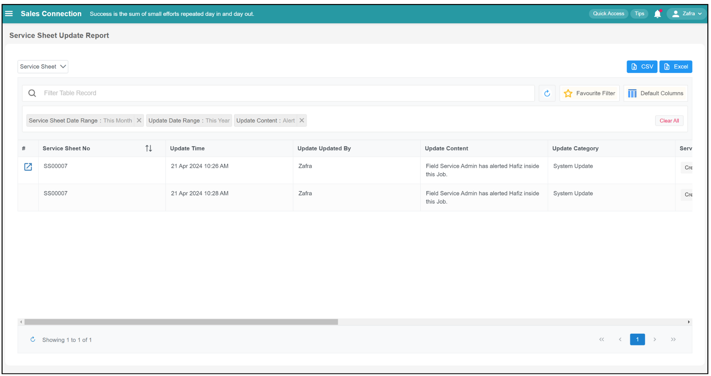
   

  
     

### Favourite Filter

1. Favourite filter

   

     
   

     

### Default Columns

1. Default Columns

   

     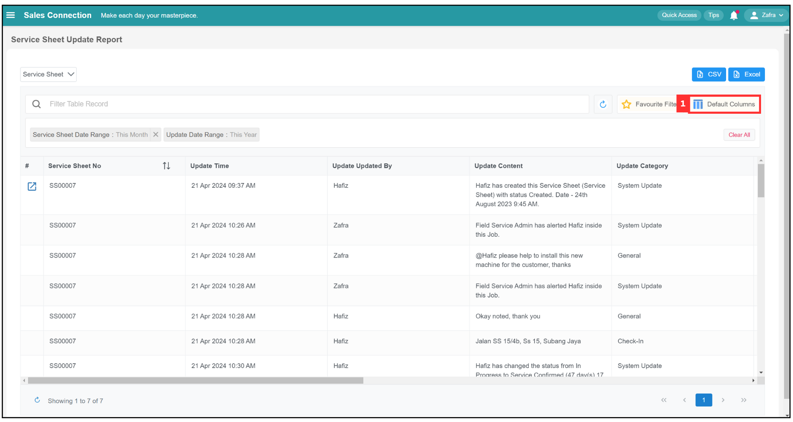
   

     

### Export Report 

1. Click on the format you want to export. For example, if you want to export the Quotation Update Report in Excel, click "Excel".

   

     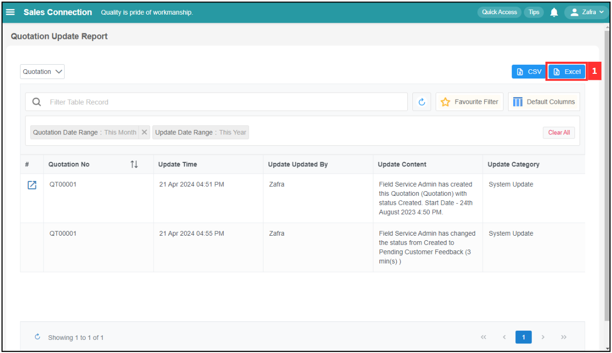
   

2. Wait for the system to export the file.

   

     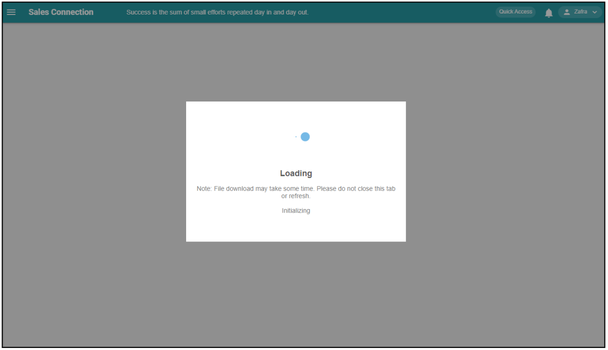
   

3. Click "Download" to download the file needed.

   

     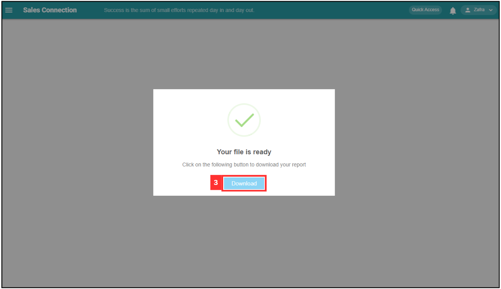
   

4. The file is successfully downloaded and it can be viewed in your desktop "File Explorer".

   

**Related Articles**
- [Report Page](Report_Page.md)
