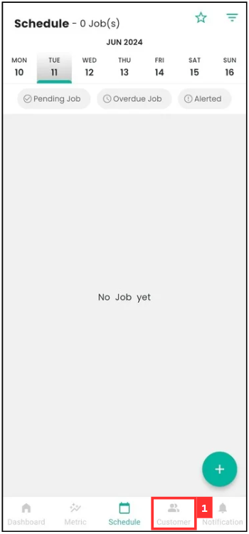
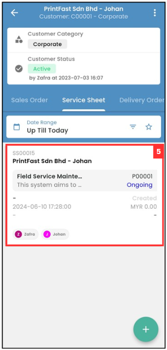
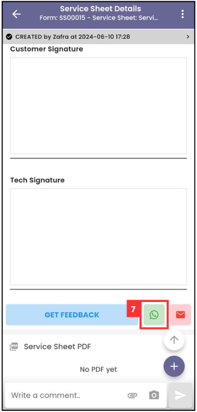
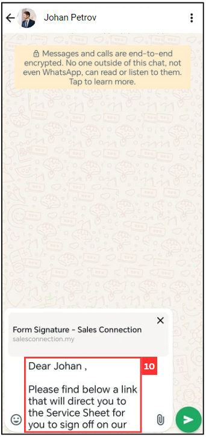

## How to Request for Remote Signature From Customer?

1. For example, if you want to get a remote signature of Service Sheet from customer. At the mobile app's navigation bar, go to Customer. 

   

      
   

 
2. Click on the Customer that the Service Sheet is from. 

   

      
   

3. Scroll to the right to find the relevant "Digital Form".

   

      
   

4. Click the relevant "Digital Form".

   

      
   

5. Click on the relevant "Digital Form" that needs to request remote signature from the customer.

   

      
   

6. Scroll down until you see "Customer Feedback".

   

      
   

7. Click the WhatsApp icon.

   

      
   

8. Select the customer.

   

      
   

9. Click on the "arrow" icon.

   

      
   

10. Edit the message before sending to the customer.

    

      
    

11. Click on the "send" icon.

    

      
    

12. The message has been sent successfully as the picture shown below.

    

      
    

       

**Related Articles**
- [How to Edit Remote Signature Email Template?](Edit_Remote_Signature_Email_Template.md)

  
