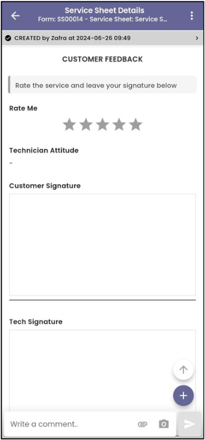
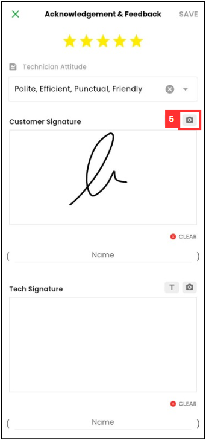
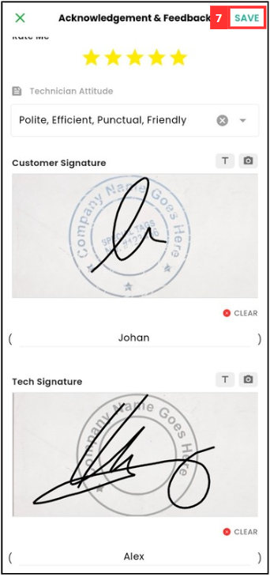

Version 1.0 
Created: 28 June 2024 
Updated: 28 June 2024 
## How to Sign and Upload Company Stamp into Digital Form？

1. Navigate to the Digital Form to be signed. 

   

      
   

2. Scroll down until you see "Customer Feedback".

   

      
   

3. Rate for the technician.

   

      
   

4. Sign on the space. Click the “CLEAR” button to clear the signature box if any mistake during signature.

    

      
    

5. Click on the camera icon to take photo for the company stamp.

    

      
    

6. Enter the name. 

    

      
    

7. Click "SAVE".

    

      
    

8. The feedback has been submitted when this prompt shows.

    

      
    

       

**Related Articles**
- [How to Edit Remote Signature Email Template?](Edit_Remote_Signature_Email_Template.md)
- [How to Request for Remote Signature From Customer?](How_to_Get_Remote_Signature_From_Customer.md)
  
<!-- [Link Text](https://salesconnection.github.io/Sales-Connection-Support/Request_Signature_Company_Stamp.html) -->
