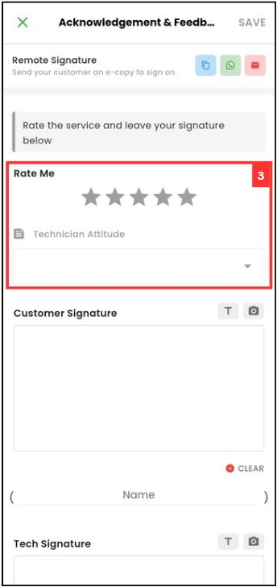
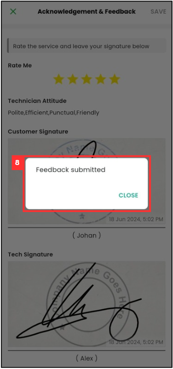

## How to Get Signature and Company Stamp?

1. For example, if you want to get a remote signature of Service Sheet from customer. At the mobile app's navigation bar, go to Customer. 

   

      
   

 
2. Click on the Customer that the Service Sheet is from. 

   

      
   

3. Scroll to the right to find the relevant "Digital Form".

   

      
   

4. Click the relevant "Digital Form".

   

      
   

5. Click on the relevant "Digital Form" that needs to request remote signature from the customer.

   

      
   

6. Scroll down until you see "Customer Feedback".

   

      
   

7. Click "GET FEEDBACK".

   

      
   

8. Rate for the technician.

   

      
   

9. Click to rate the technician attitude.

   

      
   

10. Select the technician attitude.

    

      
    

11. Click "DONE".

    

      
    

12. Sign on the space.

    

      
    

13. Click on the camera icon to take photo for the company stamp.

    

      
    

14. Enter the name. 

    

      
    

15. Repeat step 12 to step 14 for technician.

    

      
    

16. Click "SAVE".

    

      
    

17. The feedback has been submitted when this prompt shows.

    

      
    

       

**Related Articles**
- [How to Edit Remote Signature Email Template?](Edit_Remote_Signature_Email_Template.md)

  
