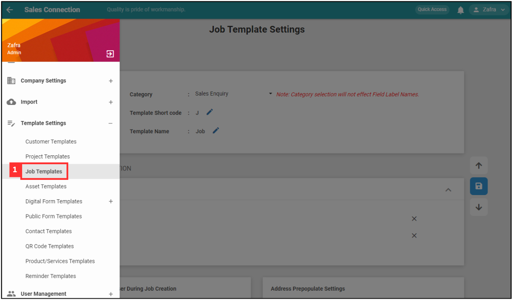
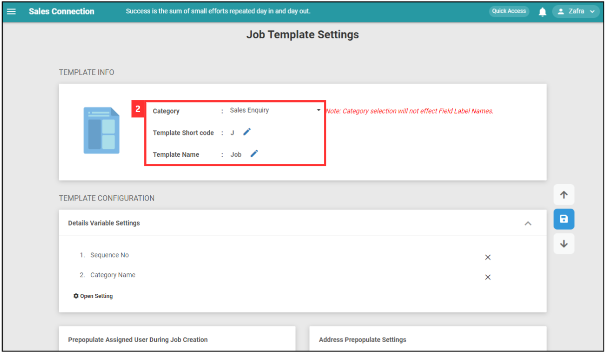
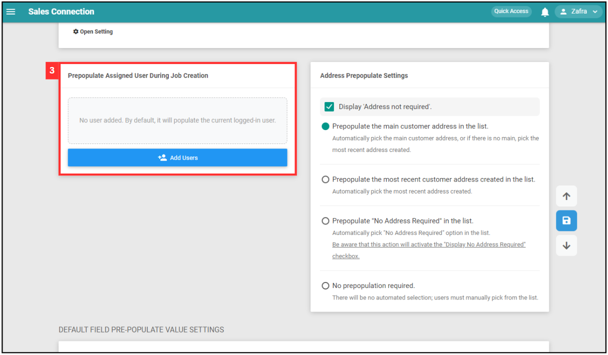
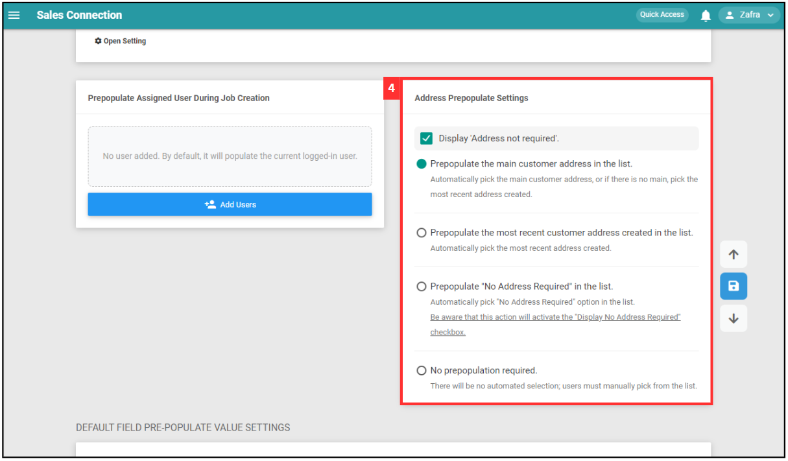
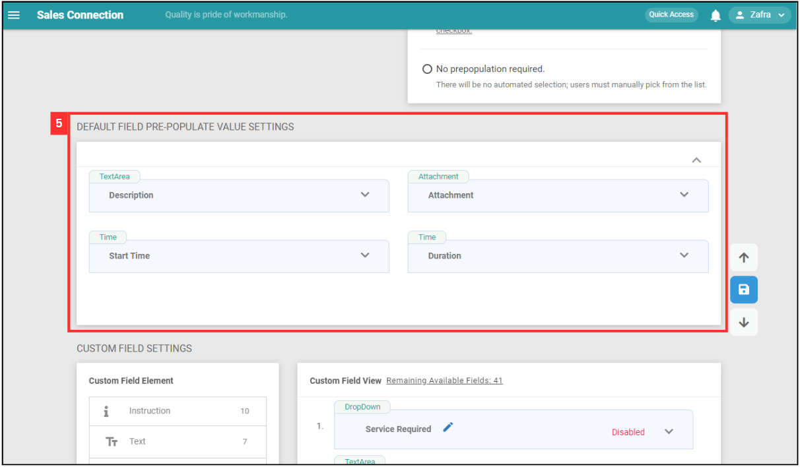
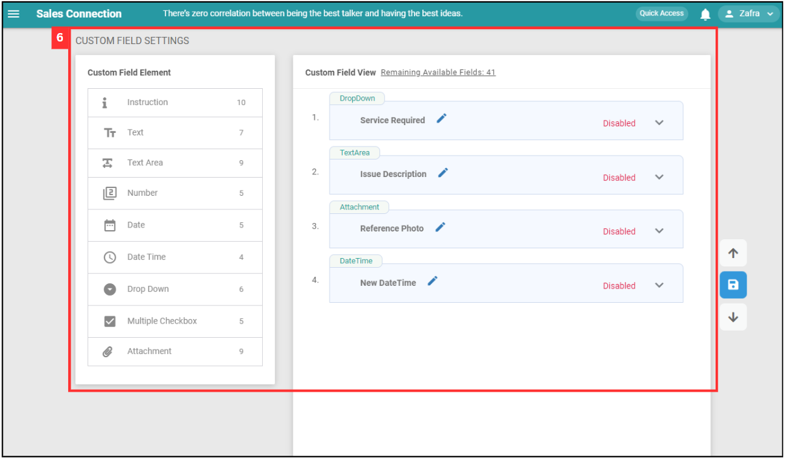
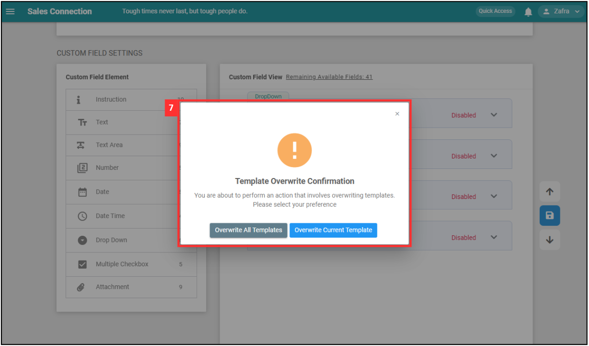

Version 1.0 
Created: 25 June 2024 
Updated: 25 June 2024 
## How to Setup Job Template Page?
    
1. At the desktop site's navigation bar, go to Template Settings > Job Templates. 
   **Open Job Templates Here:** [https://salesconnection.my/reminder/templatev2](https://salesconnection.my/reminder/templatev2) 

   

      
   

   *Note: You must have access to Template Settings menu to perform this action. Please request permission or help from your admin if you do not have access to the menu. 

2. "Template Info" provides basic information about the job template. 

   | Terms | Description |
   |-------|---------|
   | Category | Choose the job category (e.g. sales enquiry, site visit, etc.) |
   | Template Short Code | Code starting with the specified alphabet for identification (e.g. J) |
   | Template Name | Name of the template (e.g. Job) |

   

      
   

3. "Prepopulate Assigned User During Job Creation" is used to automatically assign the user to jobs created under this category. For example, add a user here and the user will be auto-assigned when a "Sales Enquiry" job is created. 

   

      
   

4. "Address Prepopulate Settings" configured who addresses are prepopulated in the job form. 

   | Field | Description |
   |-------|---------|
   | Display "Address not required" | Checkbox to show or hide the option to mark the address as not required. |
   | Prepopulate Option | Select the option to prepopulate address (e.g. Prepopulate the main customer address in the list.) |

   

      
   

5. "Default Field Prepopulate Value Settings" allows to set default values for various fields in the job template. 

   | Field | Description |
   |-------|---------|
   | Description | Set a default description for the job. |
   | Attachment | Specify any default attachments. |
   | Start Time | Set a default start time for the job. |
   | Duration | Set a default duration for the job (default: 2 hours) |

   

      
   

6. "Custom Field Settings" allows to add and configure custom fields for the job template. You can click on the "Custom Field Element" and edit it at the right side. 

   | Field | Description |
   |-------|---------|
   | Custom Field Elements | Different types of custom fields: instruction, text, text area, number, date, date time, dropdown, multiple checkbox, attachment. |
   | Custom Field View | Area to preview and edit custom fields added to the job template. |

   

      
   

7. Upon saving by clicking the "Save" icon on the right side of the page, there are two options. 

   | Field | Description |
   |-------|-------------|
   | Overwrite All Templates | Apply for all job category. |
   | Overwrite Current Template | Apply for existing job category. |

   

      
   

   

**Related Articles**
- [How to Add New Job?](Add_New_Job.md)

<!-- [Link Text](https://salesconnection.github.io/Sales-Connection-Support/Setup_Job_Template.html) -->
