Version 1.0 
Created: 25 June 2024 
Updated: 25 June 2024 
## How to Set Up a Job Template?
    
1. At the desktop site's navigation bar, go to Template Settings > Job Templates. 
   **Open Job Templates Here:** [https://system.caction.com/reminder/templatev2](https://system.caction.com/reminder/templatev2) 

   

      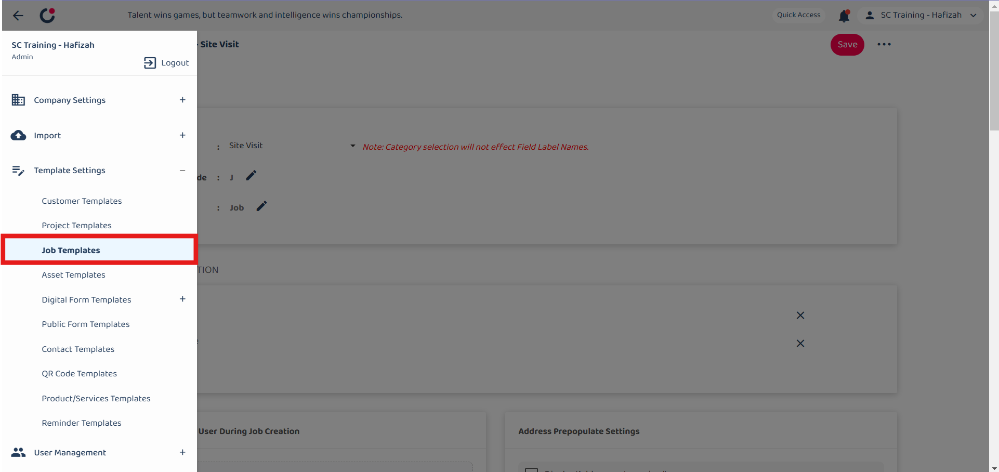
   

   *Note: You must have access to Template Settings menu to perform this action. Please request permission or help from your admin if you do not have access to the menu. 

2. "Template Info" provides basic information about the job template. 

   | Terms | Description |
   |-------|---------|
   | Category | Choose the job category (e.g. sales enquiry, site visit, etc.) |
   | Template Short Code | Code starting with the specified alphabet for identification (e.g. J) |
   | Template Name | Name of the template (e.g. Job) |

   

      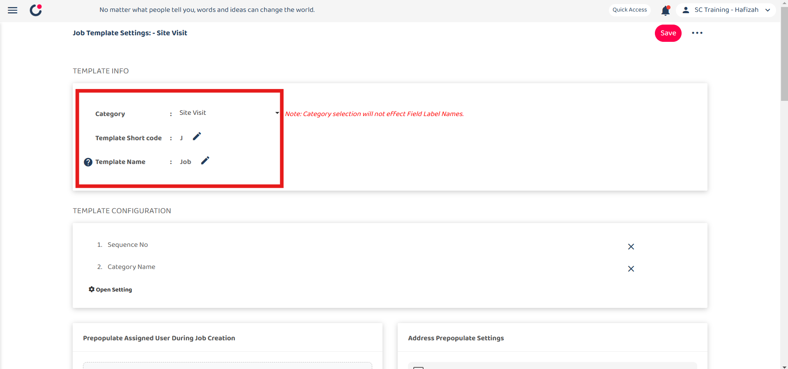
   

3. "Prepopulate Assigned User During Job Creation" is used to automatically assign the user to jobs created under this category. For example, add a user here and the user will be auto-assigned when a "Sales Enquiry" job is created. 

   

      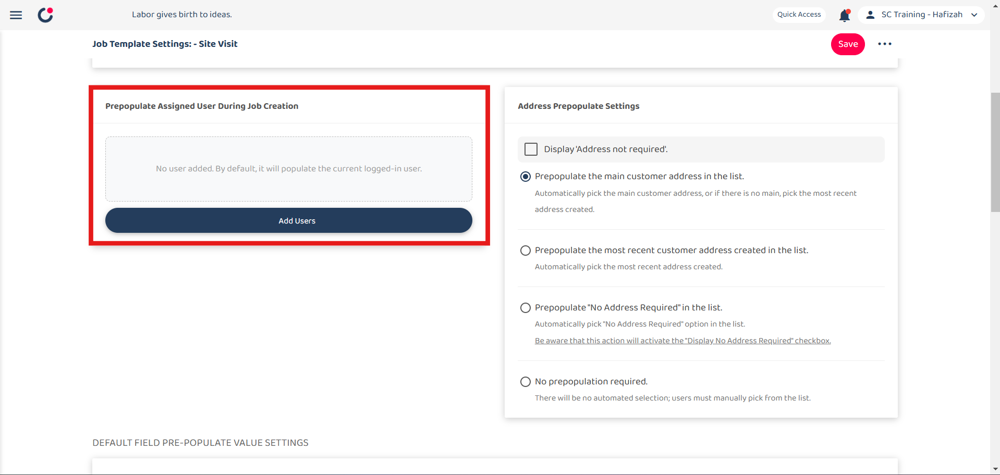
   

4. "Address Prepopulate Settings" configured who addresses are prepopulated in the job form. 

   | Field | Description |
   |-------|---------|
   | Display "Address not required" | Checkbox to show or hide the option to mark the address as not required. |
   | Prepopulate Option | Select the option to prepopulate address (e.g. Prepopulate the main customer address in the list.) |
   | No Prepopulation Required | Select the option to manually pick the address. |

   

      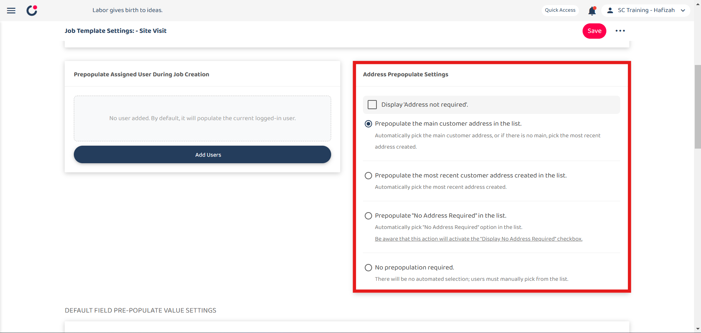
   

6. "Default Field Prepopulate Value Settings" allows to set default values for various fields in the job template. 

   | Field | Description |
   |-------|---------|
   | Description | Set a default description for the job. |
   | Attachment | Specify any default attachments. |
   | Start Date Time | Set a default start time for the job. |
   | End Date Time | Set a default date time for the job. |
   | Integration Code | Code that can be used to filter and search for the job. |

   

      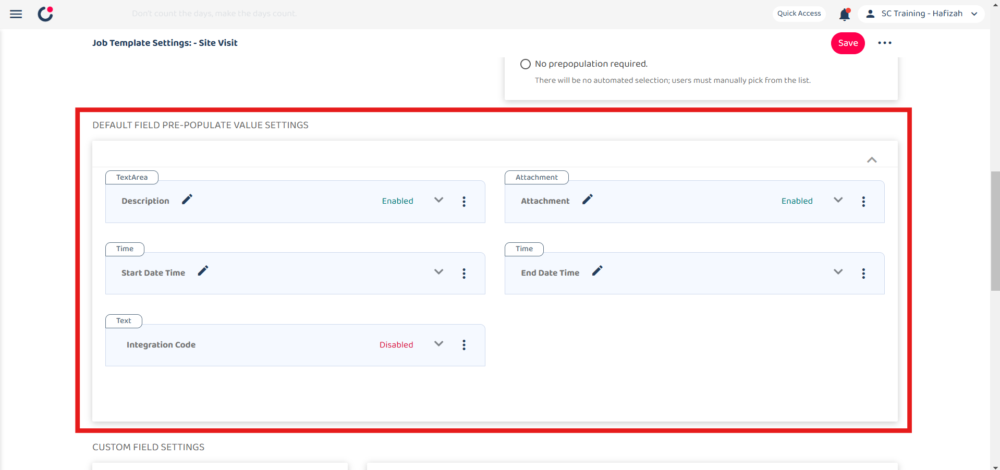
   

7. "Custom Field Settings" allows to add and configure custom fields for the job template. You can click on the "Custom Field Element" and edit it at the right side. 

   | Field | Description |
   |-------|---------|
   | Custom Field Elements | Different types of custom fields: instruction, text, text area, number, date, date time, dropdown, multiple checkbox, attachment. |
   | Custom Field View | Area to preview and edit custom fields added to the job template. |

   

      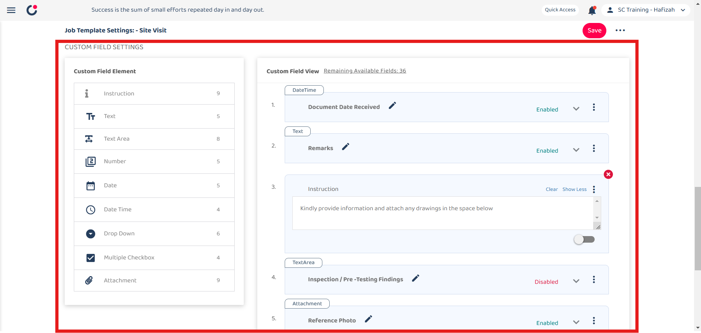
   

8. Click the "Save" button on the right side of the page. 

   

      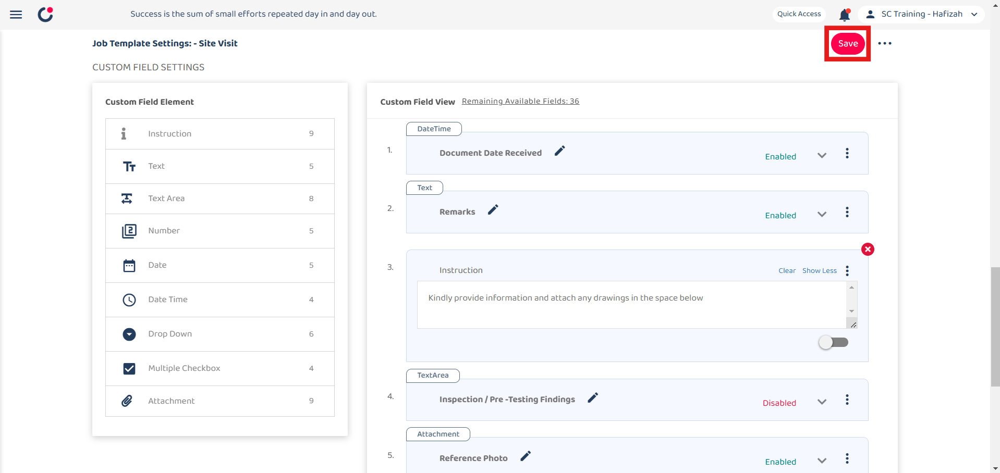
   

9. Write some notes about what you changed. 

   

      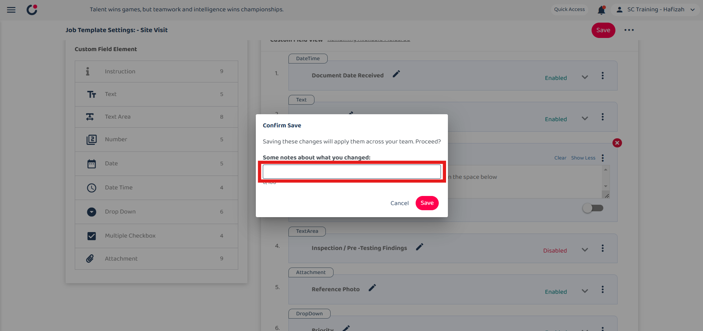
   

*Note: Saving these changes will apply them across your team. 

10. Click the "Save" button. 

   

      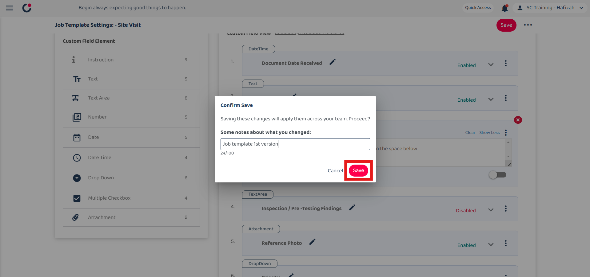
   

11. The job template settings has been saved successfully. 

   

      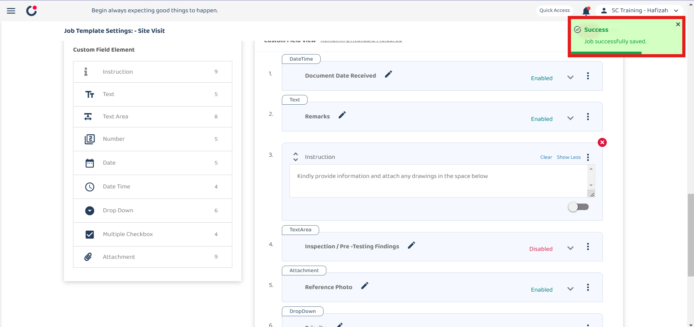
   

   

   **Other features in template setting** 
   - [Version History](#section1)
   - [Save to all categories](#section2)
   - [Copy From](#section3)
    

12. Click the three dots icon and there are three options shown.  

   | Field | Description |
   |-------|-------------|
   | Version History | View the changes and version of the template setting. |
   | Save to all categories | Apply changes to all existing job categories. |
   | Copy From | Copy from other category and apply to current job category. |

   

      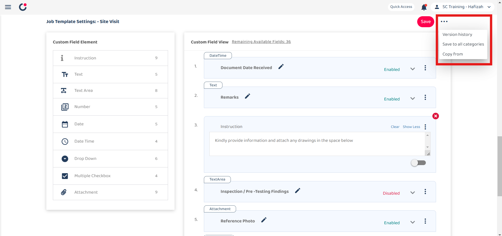
   

 

   **Version History** 
1. 
   

      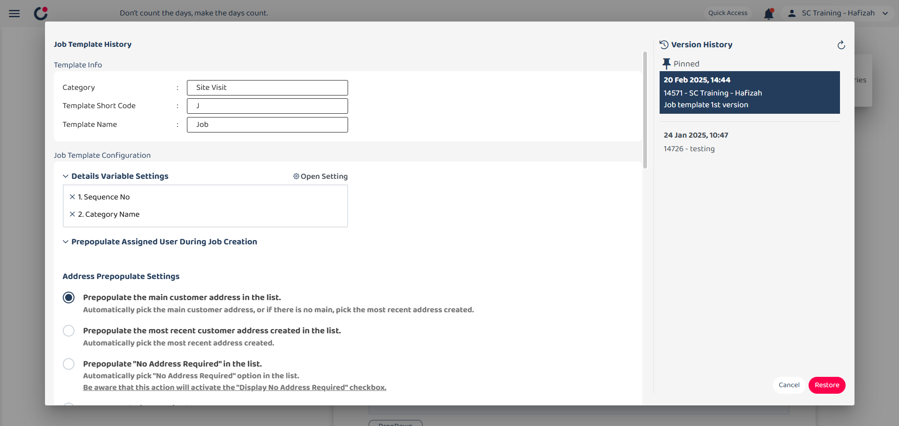
   

   **Save to all categories** 

   **Copy From** 

**Related Articles**
- [How to Add New Job?](Add_New_Job.md)
- [Digital Form Template Settings](Digital_Form_Template_Settings.md)
- [How to Setup Public Form Template Page?](Setup_Public_Form_Template_Page.md)
  
<!-- [Link Text](https://support.caction.com/Setup_Job_Template.html) -->
