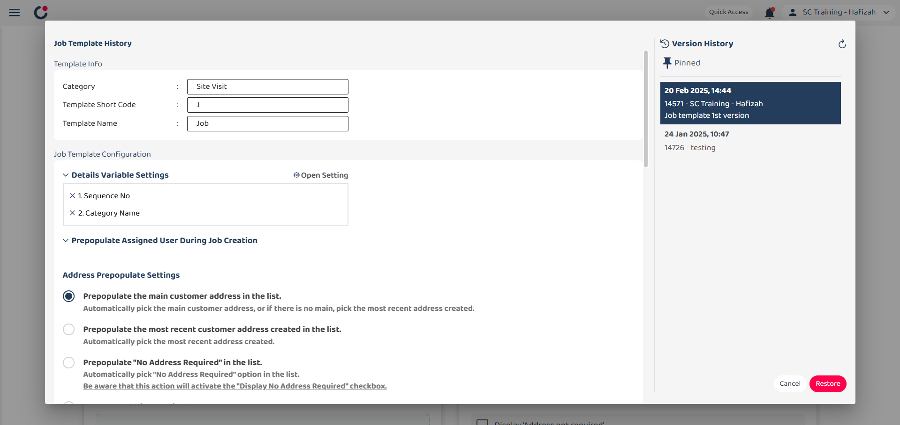
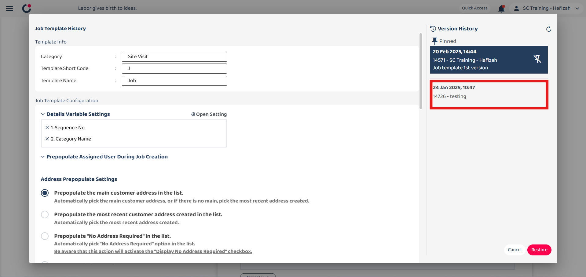

Version 1.0 
Created: 25 June 2024 
Updated: 25 June 2024 
## How to Set Up a Job Template?
    
1. At the desktop site's navigation bar, go to Template Settings > Job Templates. 
   **Open Job Templates Here:** [https://system.caction.com/reminder/templatev2](https://system.caction.com/reminder/templatev2) 

   

      
   

   *Note: You must have access to Template Settings menu to perform this action. Please request permission or help from your admin if you do not have access to the menu. 

2. "Template Info" provides basic information about the job template. 

   | Terms | Description |
   |-------|---------|
   | Category | Choose the job category (e.g. sales enquiry, site visit, etc.) |
   | Template Short Code | Code starting with the specified alphabet for identification (e.g. J) |
   | Template Name | Name of the template (e.g. Job) |

   

      
   

3. "Prepopulate Assigned User During Job Creation" is used to automatically assign the user to jobs created under this category. For example, add a user here and the user will be auto-assigned when a "Sales Enquiry" job is created. 

   

      
   

4. "Address Prepopulate Settings" configured who addresses are prepopulated in the job form. 

   | Field | Description |
   |-------|---------|
   | Display "Address not required" | Checkbox to show or hide the option to mark the address as not required. |
   | Prepopulate Option | Select the option to prepopulate address (e.g. Prepopulate the main customer address in the list.) |
   | No Prepopulation Required | Select the option to manually pick the address. |

   

      
   

5. "Default Field Prepopulate Value Settings" allows to set default values for various fields in the job template. 

   | Field | Description |
   |-------|---------|
   | Description | Set a default description for the job. |
   | Attachment | Specify any default attachments. |
   | Start Date Time | Set a default start time for the job. |
   | End Date Time | Set a default date time for the job. |
   | Integration Code | Code that can be used to filter and search for the job. |

   

      
   

6. "Custom Field Settings" allows to add and configure custom fields for the job template. You can click on the "Custom Field Element" and edit it at the right side. 

   | Field | Description |
   |-------|---------|
   | Custom Field Elements | Different types of custom fields: instruction, text, text area, number, date, date time, dropdown, multiple checkbox, attachment. |
   | Custom Field View | Area to preview and edit custom fields added to the job template. |

   

      
   

7. Click the "Save" button on the right side of the page. 

   

      
   

8. Write some notes about what you changed. 

   

      
   

   *Note: Saving these changes will apply them across your team.

9. Click the "Save" button. 

   

      
   

10. The job template settings has been saved successfully. 

   

      
   

### Other features in template setting 
   - [Version History](#section1)
   - [Save to all categories](#section2)
   - [Copy From](#section3)
   - [Apply To](#section4)
    

   | Field | Description |
   |-------|-------------|
   | Version History | View the changes and version of the template setting. |
   | Save to all categories | Apply changes to all existing job categories. |
   | Copy From | Copy from other category and apply to current job category. |
   | Apply To  | Apply this field configuration to any category of your choice. |
     
   
11. Click the three dots icon and there are three options shown.  

   

      
   

 

### Version History 
*Notes: The system can store up to 16 versions in total, with a maximum of 15 pinned versions, while unpinned versions will be automatically replaced when they become the oldest. 
    Pinned versions remain protected until manually unpinned. 
    
1. The job template details and settings are at the left section while the right section shows the version history of the job template, allowing users to track and manage previous versions. 

   

      
   

2. Hover over a version to reveal the pin or unpin icon. 

   

      
   

3. Click the pin or unpin icon to pin the version log. 
   *Note: Click the refresh button above to refresh version history list.
   

      
   

4. If you want to restore previous template version, you may click the version log you want.
   

      
   

   
5. Click the "Restore" button.
   

      
   

6. The template is restored successfully.
   

      
   

   

### Save to all categories 
*Notes: "Save to all categories" creates a separate version for each category. When restoring from a specific category, it will only affect that category and not overwrite other categories. 

1. Write some notes about what you changed for all categories template. 

   

      
   

2. Pre-populated values will not be included. 

   

      
   
   

3. Click "Yes,apply to all" button. 

   

      
   
   

4. Current category template is saved to all categories template successfully. 

   

      
   
   

5. Click the category and select service contract. 

   

      
   
   

6. Service contract category is selected. 

   

      
   
   

7. Open the version history and the version log that the site visit category saved to all categories is shown. 

   

      
   
   

### Copy From 
*Notes: "Copy From" allows users to copy template settings from another category into the current category template. 

1. After clicked the "Copy From", the select location category will be displayed. 

   

      
   

2. Select the category that you want to copy from. 

   

      
   

3. Select the category that you want to copy from and click "Apply" button.. 

   

      
   

4. The template has been successfully copied. 

   

      
   

### Apply To 
*Notes: "Apply To" allows users to apply the specific field configuration to a selected category. 
Default and Custom fields can

1. After clicked the "Copy From", the select location category will be displayed. 

   

      
   

1. After clicked the "Copy From", the select location category will be displayed. 

   

      
   

**Related Articles**
- [How to Add New Job?](Add_New_Job.md)
- [Digital Form Template Settings](Digital_Form_Template_Settings.md)
- [How to Setup Public Form Template Page?](Setup_Public_Form_Template_Page.md)
  
<!-- [Link Text](https://support.caction.com/Setup_Job_Template.html) -->
