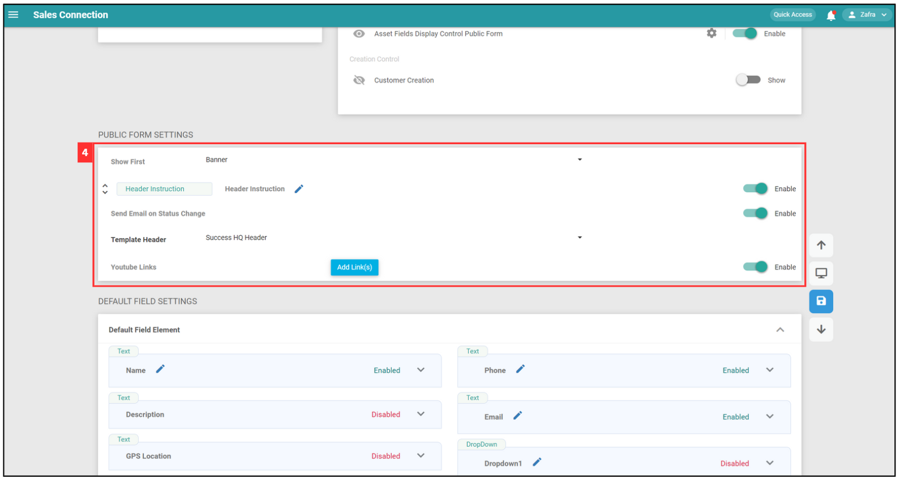

Version 1.0 
Created: 14 August 2024 
Updated: 14 August 2024 
## How to Setup Public Form Template?

1. At the desktop site's navigation bar, go to Template Settings > Public Form Templates. 
   **Open Public Form Templates Here:** [https://salesconnection.my/PublicForm/TemplateSetting](https://salesconnection.my/PublicForm/TemplateSetting) 

   

      
   
 

2. "Template Info" provides basic information about the public form template.

   | Terms | Description |
   |-------|:---------|
   | Template Category | Choose the public form category (e.g. Sales Enquiry, Service Enquiry) |
   | Template Short Code | Code starting with the specified alphabet for identification (e.g. PF) |
   | Template Name | Name of the template (e.g. Public Form / Ticket / etc.) |

   

      
   
 

3. "Report Form Setting" is the settings of control the visibility and functionality of various sections within the digital form.

   | Terms | Description |
   |-------|:---------|
   | Section Visibility | This section allows you to control the visibility of various sections within the public form. You can toggle each option to show or hide specific sections based on your requirements.  |
   | Fields Control | This section allows you to manage the display of customer-specific fields within the form. You can enable or disable the visibility of these fields to customize the form according to your data collection needs.|
   | Creation Control | This section allows you to manage the functionality of creating new customer records directly through the Public Form.|
 
   

      
   
 

4. "PUBLIC FORM SETTINGS" is the section to customise the public form.

   | Terms | Description |
   |-------|:---------|
   | Show First | You can choose either banner or header instruction to show at the top of the Public Form. |
   | Header Instruction | Write a brief description/instruction to inform customer purpose of the form/how to fill in the form. |
   | Send Email on Status Change | To decide if you’d like to email Customer upon Public Form status change. |
   | Template Header | Select the template header. |
   | Youtube Link | Embed a link for customer to see upon opening the Public Form. |

   

      
   

 
5. “Default Field Settings” are to set default values for varies fields in template to be applied to all Public Form Categories.

   | Field | Description |
   |-------|---------|
   | Default Field Elements | Different types of default fields: text, date, date time, dropdown, multiple checkboxes, and attachment. |

   

      
   

6. “Custom Field Settings” are to add and configure custom fields for the public form template for specific categories. You can click on the “Custom Field Element” and edit it at the right side. 

   | Field | Description |
   |-------|---------|
   | Custom Field Elements | Different types of custom fields: header, instruction, break line, text, text area, number, date, date time, time, dropdown, multiple checkboxes, and attachment. |
 
   

      
   
 

   
**Related Articles**
- [How to Generate and Share QR Code for Public Form?](Creation_of_Public_Form.md)
- [How to Setup Public Form Template?](Access_Submitted_Public_Form.md)

<!-- [Link Text](https://salesconnection.github.io/Sales-Connection-Support/Setup_Public_Form_Template_Page.html) -->
