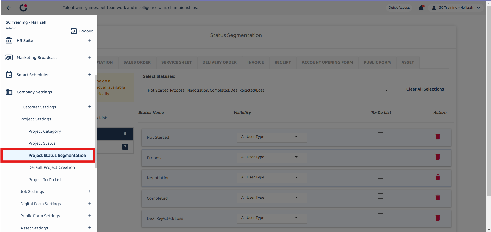
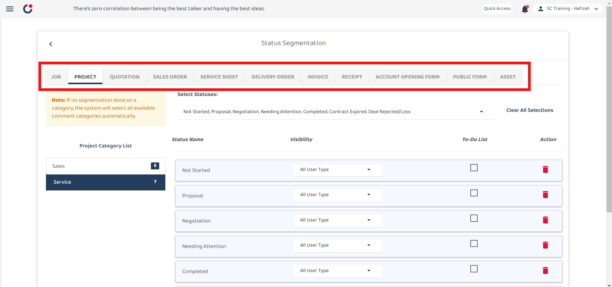
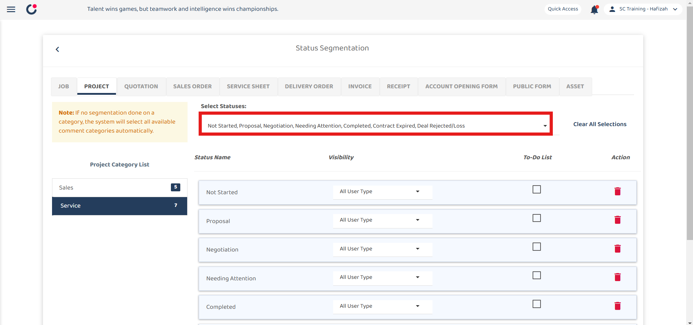
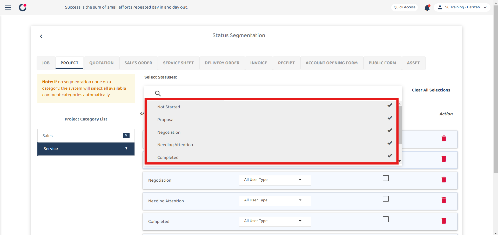
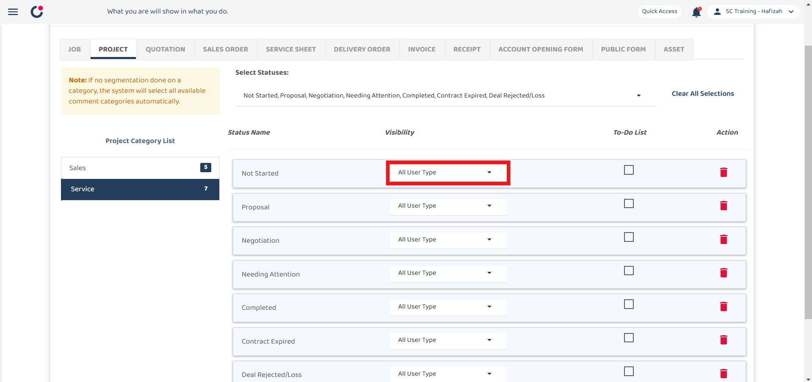
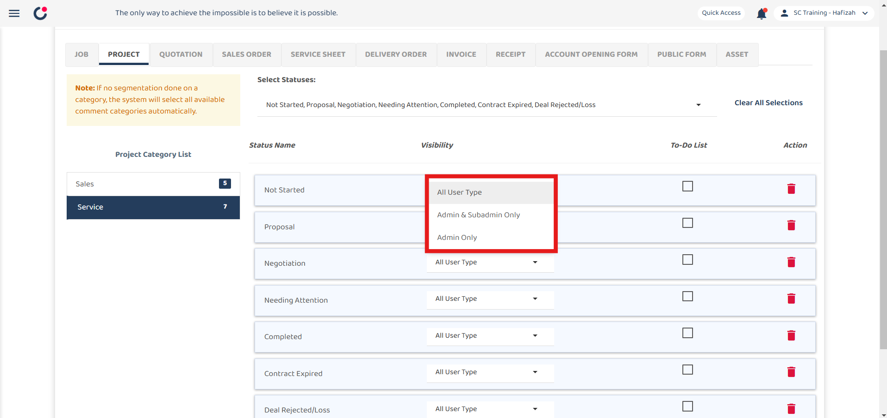
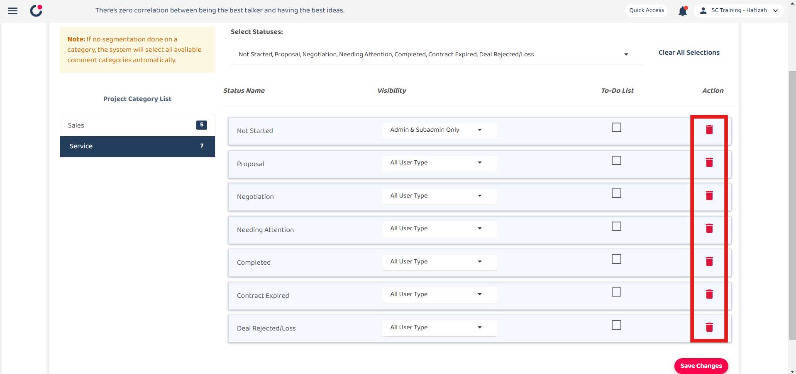
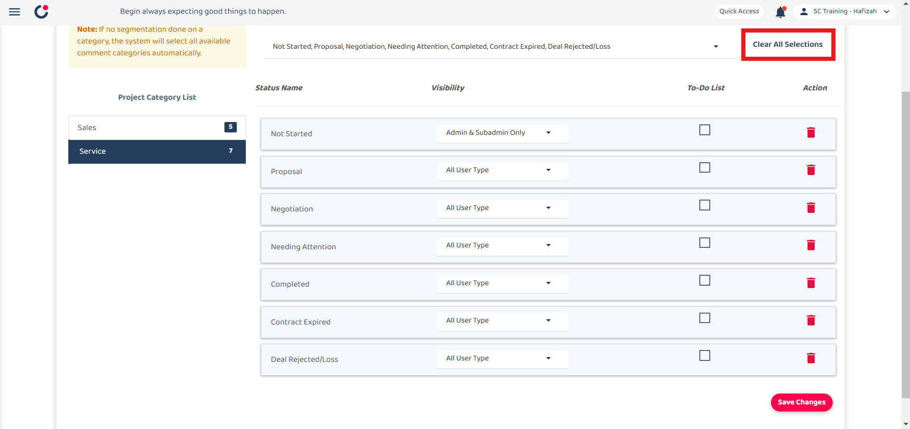
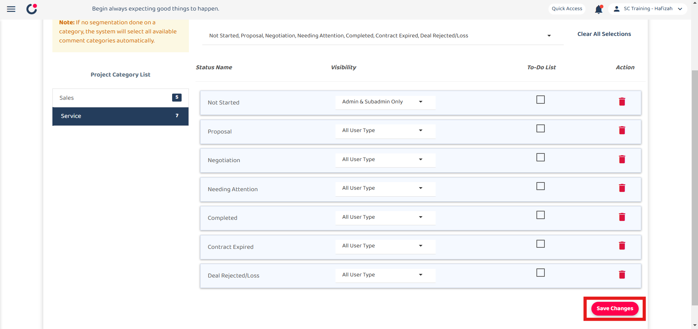
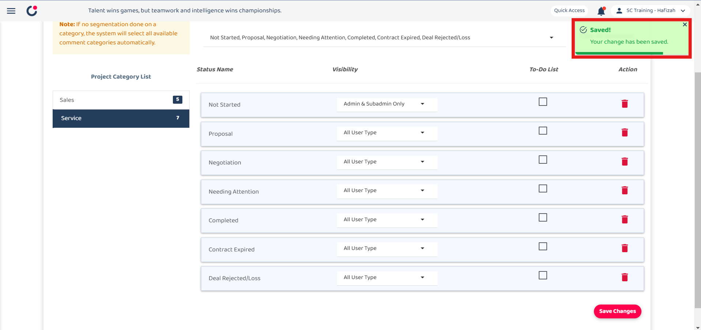

Version 1.0 
Created: 28 February 2025 
Updated: 28 February 2025 

### Status Segmentation Guide
The Status Segmentation page allows users to manage and customize status options across different categories. It ensures that only relevant statuses are available for specific categories. 
*Notes:This settings can be applied to Job, Project, Digital Forms, Public Form and Asset. 

1. On the desktop site, navigate to Company Settings, then select Project Settings, and click Project Status Segmentation. 

  

2. Click the category tab you want at the top of the page. 

  

3. At the category list on the left, select the category you want to modify. 

  

4. Click on Select Statuses, then check or uncheck the relevant statuses. 

  

  

5. Click on the Visibility dropdown to choose who can view the status. 

  

  

6. Check the box under To-Do List if the status needs to be included in task tracking. 

  

7. Click the Trash Icon to remove a status from the selected category. 
*Notes: Uncheck the statuses at above does the same function as this.

  

8. Click Clear All Selections to reset the status segmentation. 
*Notes: All the statuses are removed. 

  

9. Click the "Save Changes" button to save. 

  

10. A successful saved prompt will appear once changes are saved. 

  

**Related Articles**
- [Comment Category Segmentation Guide](Comment_Category_Segmentation.md)
