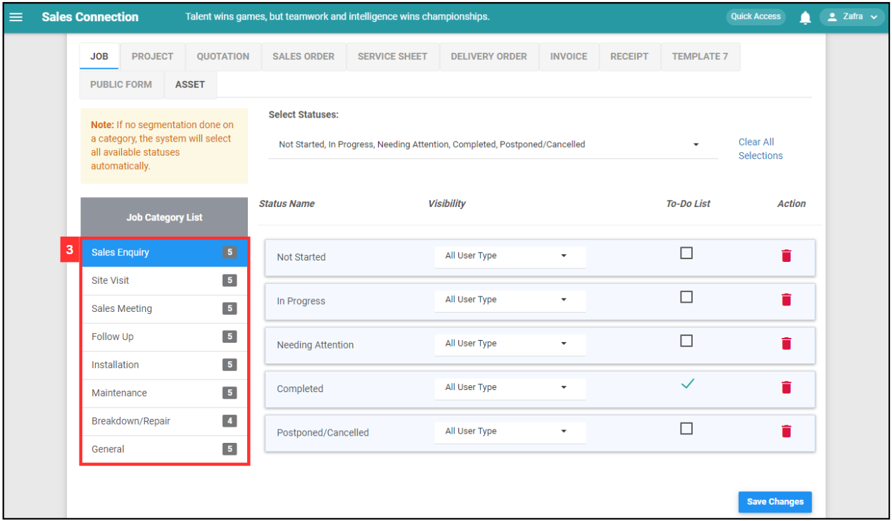

Version 1.0 
Created: 26 June 2024 
Updated: 26 June 2024 
## To-do List Setup

*Note: The tutorial below is based on Job Page but all of these can be applied to other data level such as Project, Digital Form and others.
 

**Navigate to the section by clicking it.** 

- [Job To-do List Settings](#section1) 
- [Job Status Segmentation](#section2) 
- [User Account Customization](#section3)
   

**Job To-do List Settings** 
    
  1. At the desktop site's navigation bar, go to Company Settings > Job Settings > Job To Do List. 
     **Open Job To Do List Settings Here:** [https://salesconnection.my/settings/commentRequirementSettings](https://salesconnection.my/settings/commentRequirementSettings) 
     
     

       
     

  2. Click on "Sales Enquiry". 

     

       
     

  3. Select the Job Category. 

     

       
     

  4. Drag the comment category and drop it to the job status accordingly. 

     

       
     

  5. Click on the "three dots" icon if you want to have an attachment for the comment. 

     

       
     

  6. Choose the type of attachment you want to attach in the comment. 

     

       
     

  7. If you wish to have minimum attachment count for the comment, tick the box and enter a number for the minimum attachment required. 

     

       
     

  8. Click on the "Done" button. 

     

       
     

  9. You will see the attachment is changed to Asset(1) which means this comment required at least one asset attachment. 

     

       
     

  10. Click "Save Changes" after the to-do list is done. 

      

       
      

  11. Your to-do list is successfully saved when the “Saved” prompt appears.

      

       
      

     

**Job Status Segmentation** 

  1. At the desktop site's navigation bar, go to Company Settings > Job Settings > Job Status Segmentation. 
     **Open Job Status Segmentation Here:** [https://salesconnection.my/settings/statusTransaction?page=act](https://salesconnection.my/settings/statusTransaction?page=act) 
     
     

       
     

  2. Select the data level you want. For example, click "JOB". 

     

       
     

  3. Click on the job category you want to add the to-do list. 

     

       
     

  
  4. Tick on the box of the to-do list and select the visibility of the to-do list. 

     

       
     

  
  5. Click on the "Save Changes" button. 

     

       
     

  6. Your to-do list segmentation is successfully saved when the “Saved” prompt appears. 

     

       
     

  7. For example, when the to-do list is ticked for "Site Visit" Job with the status "In Progress", the to-do list box will be displayed in the job as below. 

     

       
     

       
     

**User Account Customization** 

  1. At the desktop navigation bar, go to User Management > User Account Customisation. 
     
     

       
     

  2. Click "Currently selected Department". 

     

       
     

  
  3. Enter the name of the user. 

     

       
     

  4. Click "Select Department". 
     
     

       
     

  5. Click on the "pencil" icon beside the user who needs to follow the to-do-list. 

     

       
     

  6. Press Ctrl + F and enter "To-do List Settings". 
     
     

       
     

  7. Toggle the "To-Do List Settings". 

     | Terms | Description |
     |-------|-------------|
     | Enabled | To-Do List requirement is applied to that user. |
     | Disabled | To-Do List requirement is NOT applied to that user. The user can bypass all To-Do List requirements set in the system. |
     
     

       
     

  8. Click "Save Control Settings". 
     
     

       
     

  9. The to-do list is successfully on when this prompt appears. 

     

       
     

        

**Related Articles** 
- [Data Level Structure](Data_Level_Structure.md)
- [How to Add New Job?](Add_New_Job.md)
- [How to Add New Project?](Add_New_Project.md)

<!-- [Link Text](https://salesconnection.github.io/Sales-Connection-Support/To_Do_List.md) -->
