## To-do List

Note: In your system, Customer may have been renamed to other (i.e Site, Client, Company, etc.) 

**Navigate to the section by clicking it.** 

- [Job To-do List Settings](#section1) 
- [Job Status Segmentation](#section2) 
- [User Account Customization](#section3)
   

**Job To-do List Settings** 
    
  1. At the desktop site's navigation bar, go to Business Management > Customer List. 
     **Add New Customer Here:** [https://salesconnection.my/customers](https://salesconnection.my/customers) 
     
     

       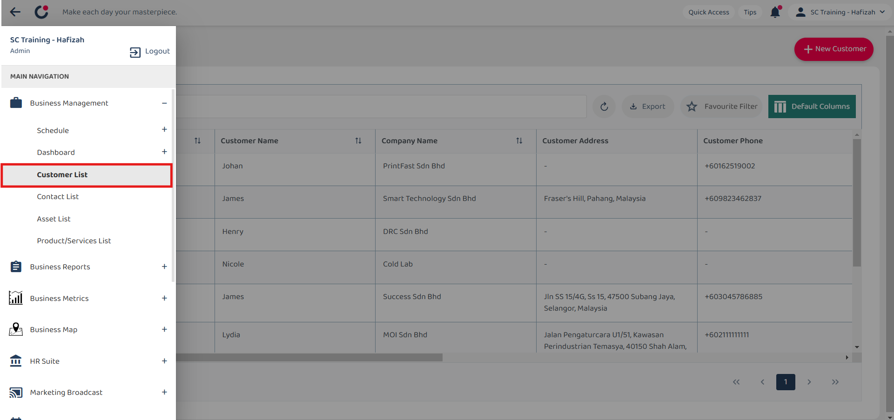
     

  2. Click on the "+" button to add new customer. 
     *Note: If you do not see the "+" button, you may need to request permission or help from your Admin to register new Customer. 

     

       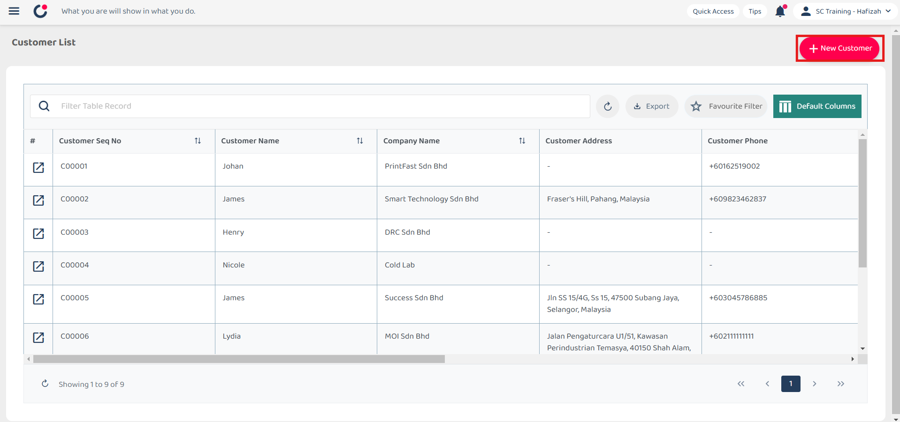
     

  3. Fill out the details of the new Customer. Available fields may differ depending on your company's system setup. 

     | Field Name| Description |
     |-------|---------|
     | Customer Status* | Indicates the current status of the customer. |
     | Customer Category* | Classifies the customer based on their type. |
     | Company Name* | The official name of the customer's company. |
     | Customer Name | The full name of the customer contact person. |
     | Asset | Any asset registered in the system associated with the customer. |
     | Assigned User | The user responsible for managing this customer. |
     | Customer Phone | The customer's contact phone number. |
     | Customer Email | The customer's email address. |
     | Customer Address | The physical address of the customer. |
     
     *Note: Fields marked with an asterisk ( * ) are required. 
     
     

       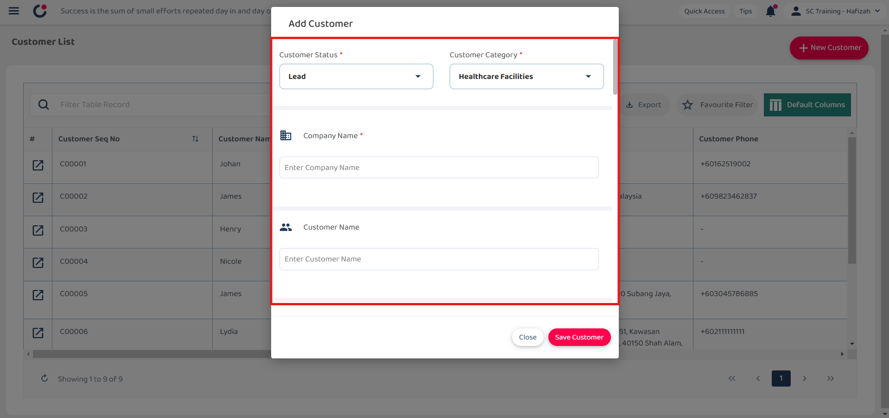
     

  4. Click on the "Save Customer" button. 

     

       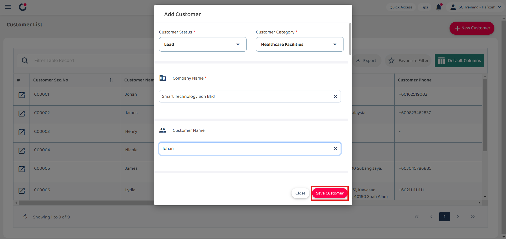
     

  5. Click "OK" and the new customer is added successfully. 

     

       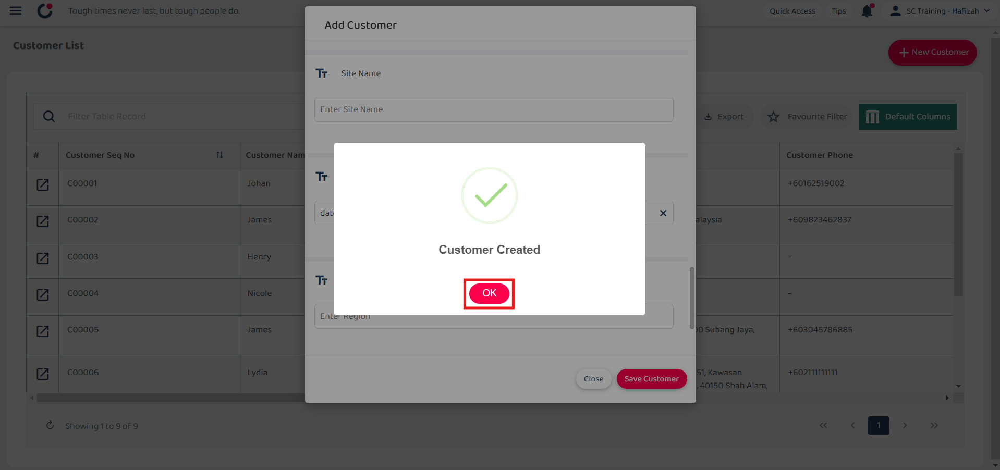
     

     

**Job Status Segmentation** 

  1. At the desktop site's navigation bar, go to Business Management > Schedule > Job Schedule. 
     **Create Job Here:** [https://salesconnection.my/activity/scheduler](https://salesconnection.my/activity/scheduler) 
     
     

       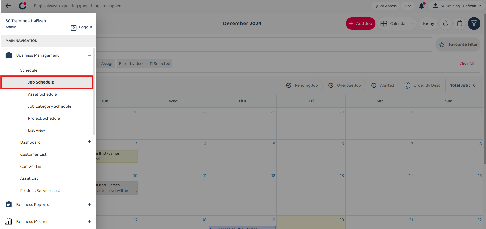
     

  2. Click on the "+" button to create new job. 
     *Note: If you do not see the "+" button, you may need to request permission or help from your Admin to register new job. 

     

       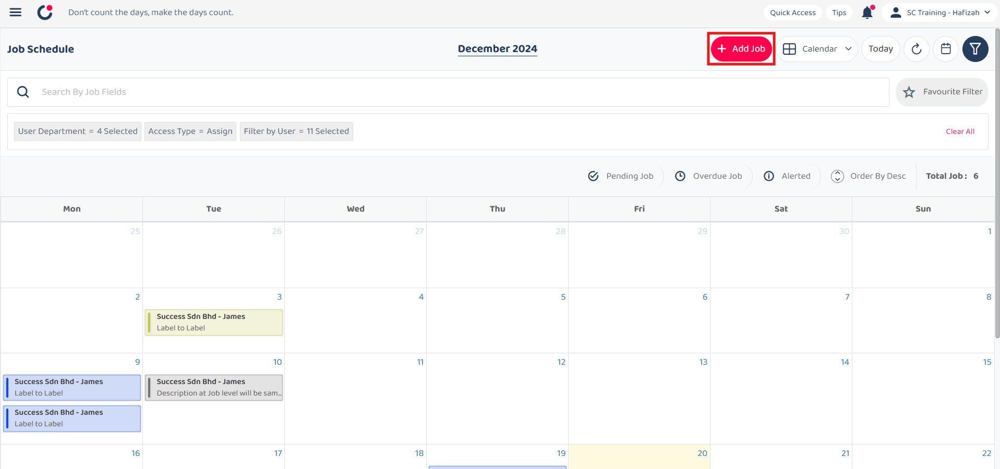
     

  3. Select the job category. 

     

       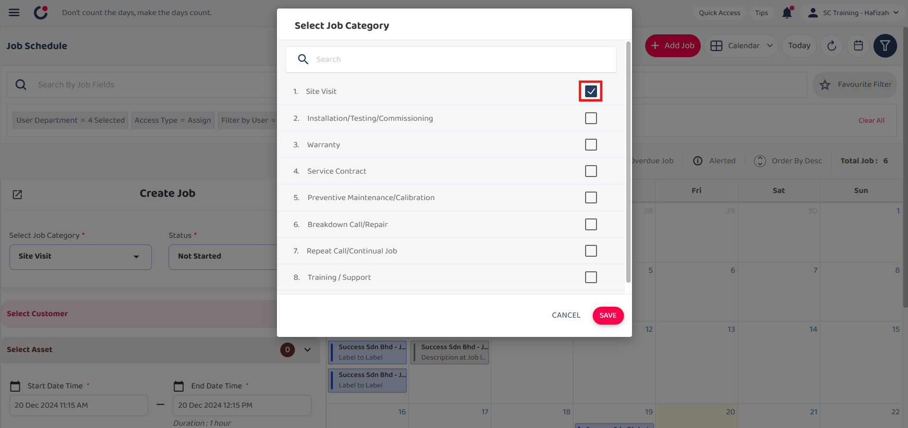
     

  
  4. Click on the "Save" button. 

     

       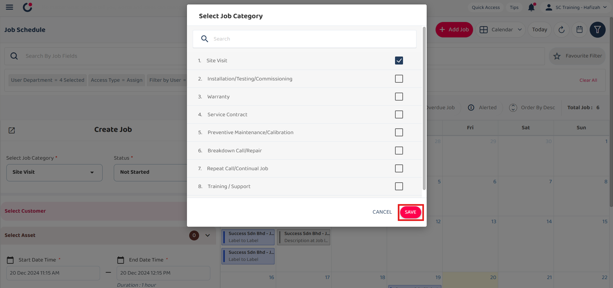
     

  
  5. Click on the "+" button to select customer for the job. 

     

       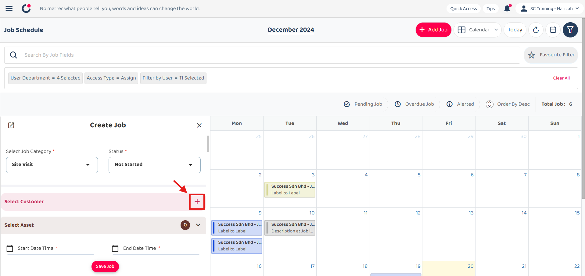
     

  
  6. Click "+" to add new customer. 

     

       
     

  
  7. Fill out the details of the new Customer. Available fields may differ depending on your company's system setup. 

     | Field Name| Description |
     |-------|---------|
     | Customer Status* | Indicates the current status of the customer. |
     | Customer Category* | Classifies the customer based on their type. |
     | Company Name* | The official name of the customer's company. |
     | Customer Name | The full name of the customer contact person. |
     | Asset | Any asset registered in the system associated with the customer. |
     | Assigned User | The user responsible for managing this customer. |
     | Customer Phone | The customer's contact phone number. |
     | Customer Email | The customer's email address. |
     | Customer Address | The physical address of the customer. |
     
     *Note: Fields marked with an asterisk ( * ) are required. 
     
     

       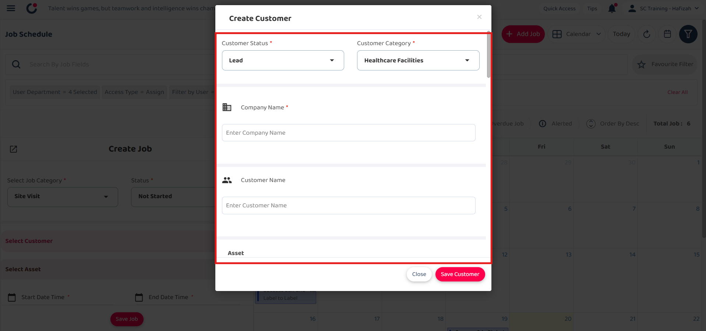
     

  8. Click on the "Save Customer" button. 

     

       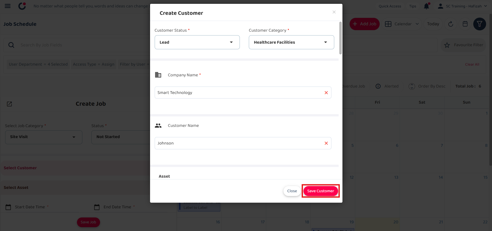
     

  9. Click "OK" and the new customer is added successfully. You may continue with creating a new Job. 

     

       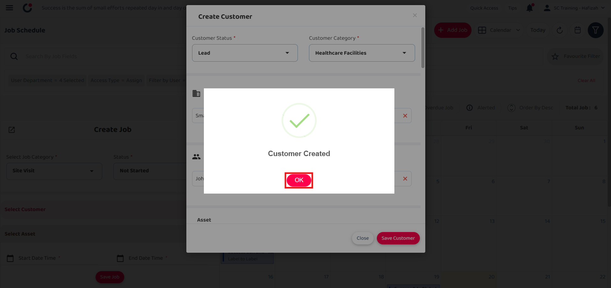
     

       
     

**User Account Customization** 

  1. At the mobile app's navigation bar, go to Customer. 
     
     

       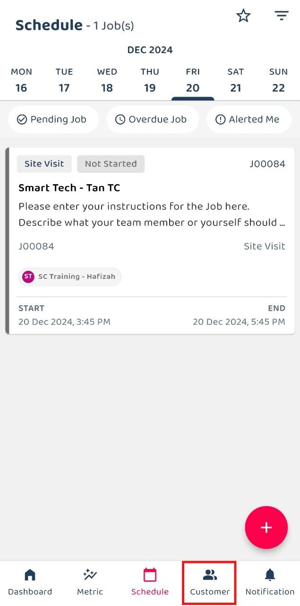
     

  2. Click on the "+" button to add new customer. 
     *Note: If you do not see the "+" button, you may need to request permission or help from your Admin to register new Customer. 

     

       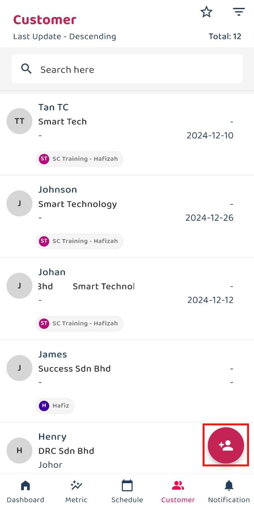
     

  
  3. Fill out the details of the new Customer. Available fields may differ depending on your company's system setup. 

     | Field Name| Description |
     |-------|---------|
     | Category* | Classifies the customer based on their type. |
     | Status* | Indicates the current status of the customer. |
     | Company Name* | The official name of the customer's company. |
     | Customer Name | The full name of the customer contact person. |
     | Phone | The customer's contact phone number. |
     | Email Address | The customer's email address. |
     | Address | The physical address of the customer. |
     | Assigned User | The user responsible for managing this customer. |
     | Asset | Any asset registered in the system associated with the customer. |

     *Note: Fields marked with an asterisk ( * ) are required. 

     

       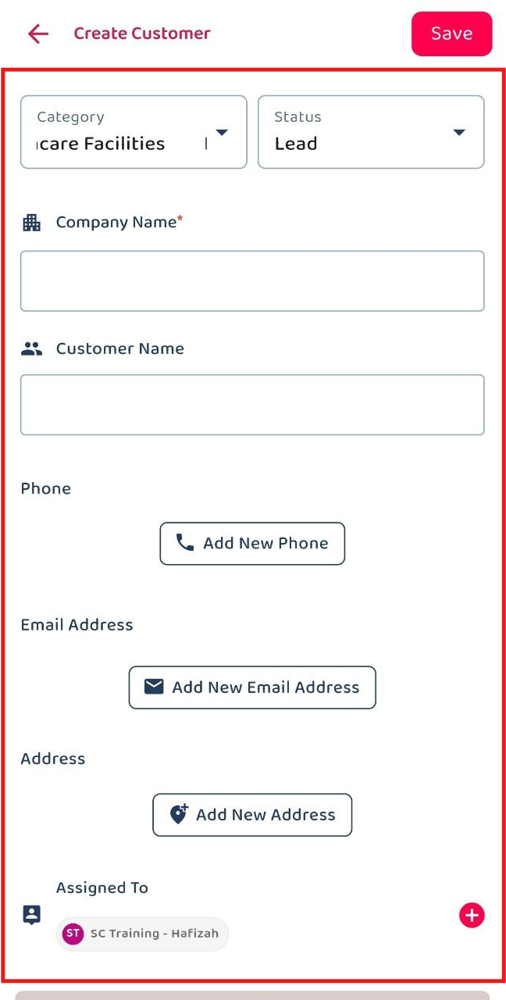
     

  4. Click on the "tick" icon to save the customer. 
     
     

       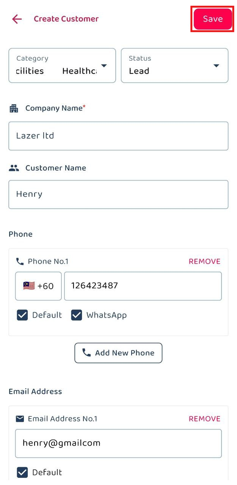
     

  5. The new customer is added successfully when this prompt appears. 

     

       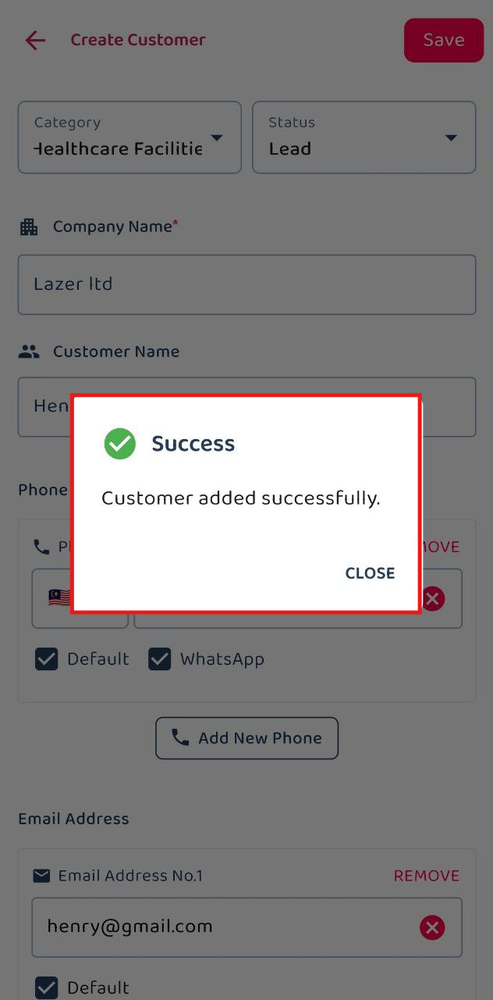
     

        

**Related Articles** 
- [How to Add New Job?](Add_New_Job.md)
- [How to Add New Asset?](How_to_Add_New_Asset.md)
- [How to Import New Customer(s)?](Import_Customer.md)
