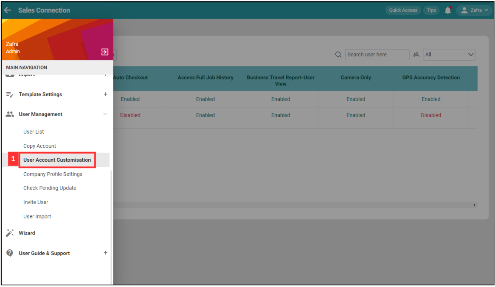
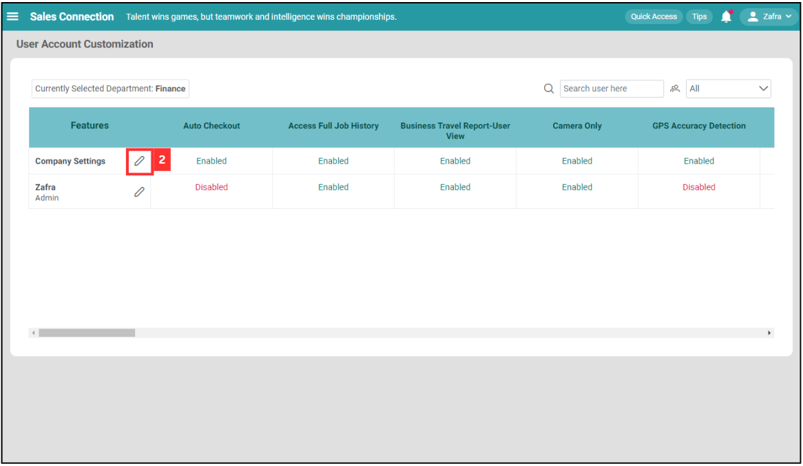
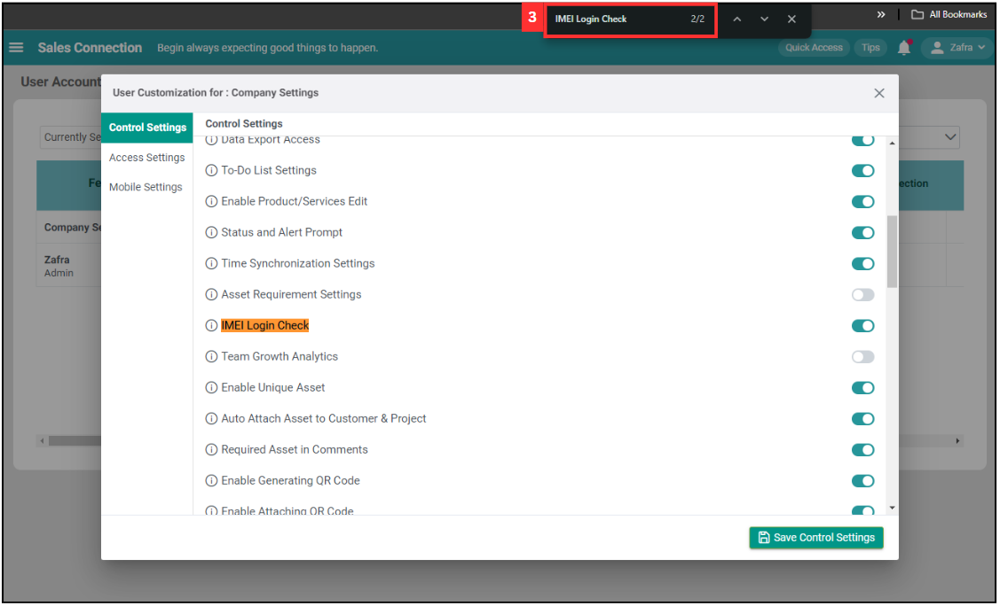
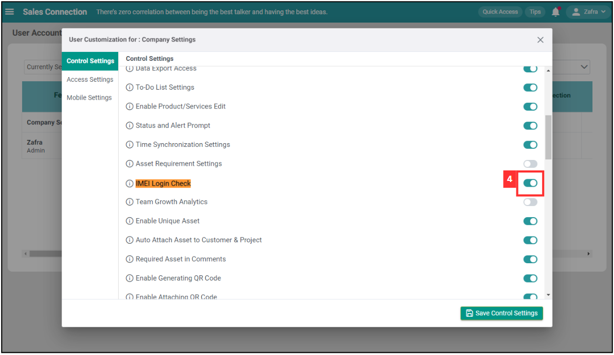
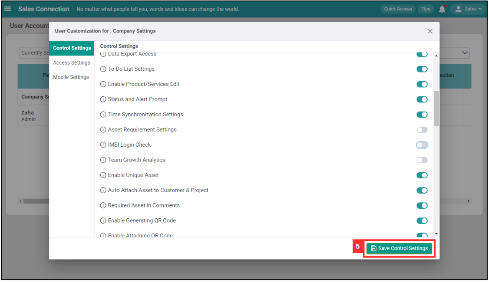
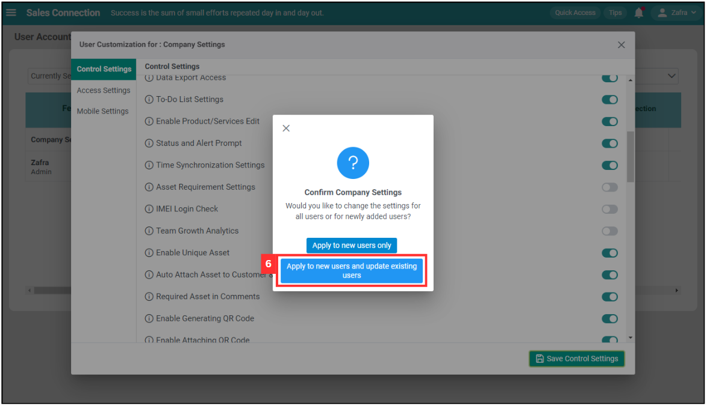
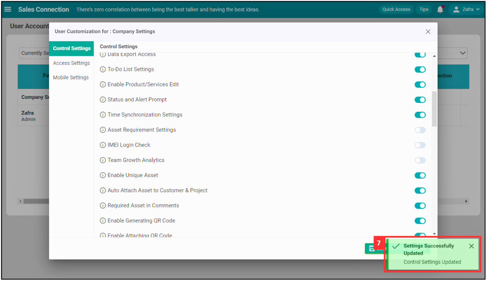

## How to enable or disable IMEI Login Check? (Device Changing Detection)

**IMEI Login Check (Device Changing Detection)** prevents fraudulent logins to a user account from another mobile device without approval. When IMEI Login Check is enabled, the Admin must approve the login to ensure it is done by the respective account holder. This feature can be enabled for specific user accounts or every user account in the system.  

1. To start, go to the desktop site’s navigation bar > User Management > User Account Customisation. 
   **Open User Account Customisation Here:** [https://salesconnection.my/uac](https://salesconnection.my/uac) 

   

     
   

   *Note: Only certain admins can perform this action. 

2. If want to enable or disable this feature for the **whole company**, click the "pencil" icon next to the "Company Settings". 
   If want to enable or disable this for individual user, click the "pencil" icon next to the individual user. 
   
   

     
   

   
3. Press Ctrl + F and enter "IMEI Login Check". 

   

     
   

4. Untoggle "IMEI Login Check" to turn off the IMEI check. 

   

     
   

   
5. Click "Save Control Settings". 

   

     
   

6. Click "Apply to new users and update existing users" to turn off IMEI for all users. 

   

     
   

   
7. All users can login with different devices without approval now. 

   

     
   

   

**Related Articles**
- [I Can’t Login to My Other Phone. Why?](IMEI.md)
- [How to Login Into Sales Connection Using Mobile and Desktop?](Login.md)
- [How to Assist My New User to Login?](New_User_Login.md)
- [My Staff Did Not Receive Their OTP. What Should I Do?](Not_Receiving_OTP.md)
