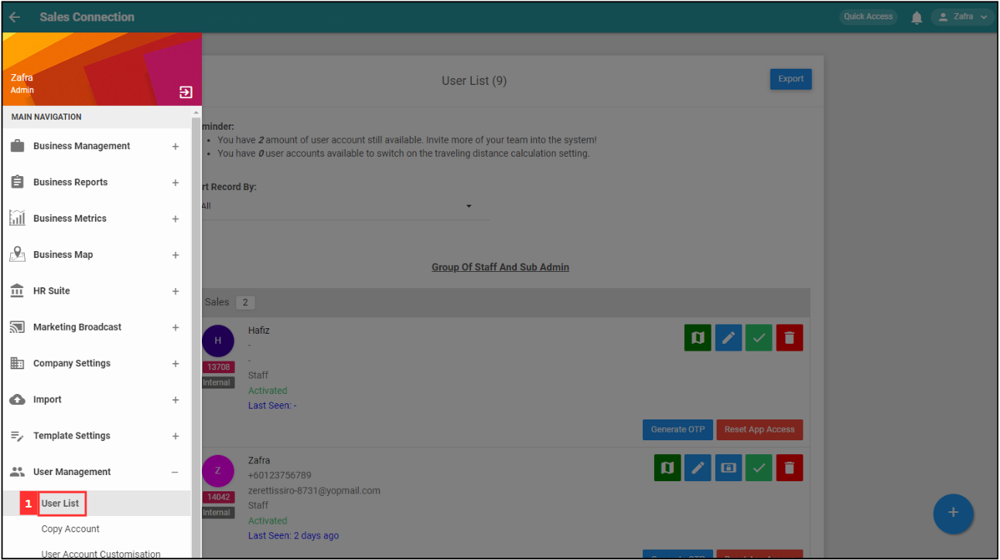

## How to Turn Off Device Check (IMEI)?

1. To enable the IMEI, go to the desktop site’s navigation bar > User Management > User List. 
   **Open User List Here:** [https://salesconnection.my/usermanage/userlist](https://salesconnection.my/usermanage/userlist) 

   

     
   

   *Note: Admins can also perform this action through the notification email received using the verified email address. 

2. The blue icon indicates “IMEI login check”. To approve the user login with a new device, admin needs to approve the blue icon shown below. 

   

     
   

   
3. Click the blue icon and you will see a popup message. Please confirm the details before you allow it. 

   

     
   

   

**Related Articles**
- [How to Login Into Sales Connection Using Mobile and Desktop?](Login.md)
- [How to Assist My New User to Login?](New_User_Login.md)
- [My Staff Did Not Receive Their OTP. What Should I Do?](Not_Receiving_OTP.md)
- [I Forgot to Check Out, How?](Assist_Check_Out.md)
- [How to Enable Assist Check Out?](Enable_Assist_Check_Out.md)
