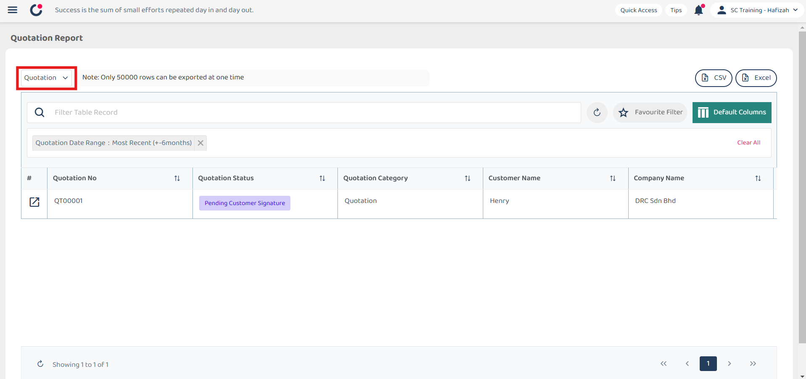
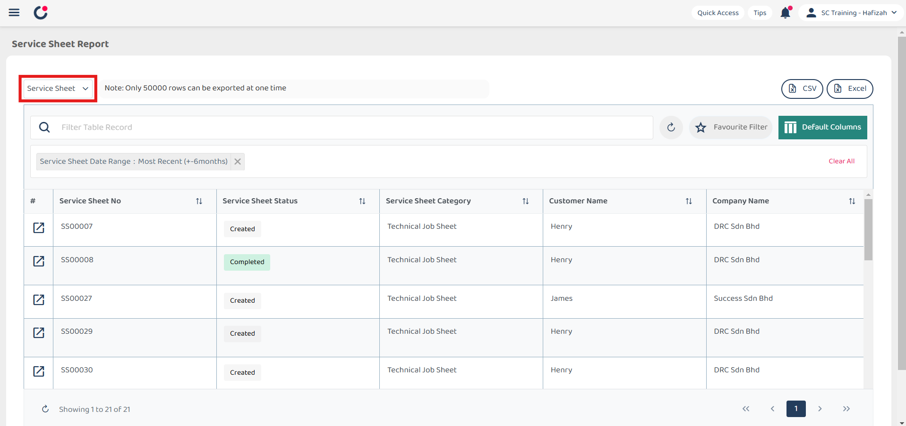

## UAC Policy Management

1. Select the Digital Form category you want by clicking the expand button beside Quotation.

   

     
   

2. Click on the category you want to select. For example, if you want to have Service Sheet Report, click "Service Sheet".

   

     
   

3. The Service Sheet Report will be shown as below.

   

     
   

   

**Related Articles**
- [Update Report Page](Report_Update_Page.md)
- [How to Filter Job by Date Range?](Job_Filter_by_Date_Range.md)
- [How to Set Customized Favourite Filter as Default - Desktop ](Default_Favourite_Filter.md)
- [How to Set Customized Favourite Filter as Default - App ](Default_Favourite_Filter_App.md)
- [How to Set Up the Column View in the Report Page?](How_to_Set_Up_the_Column_View_in_the_Report_Page.md)
- [How to Use Update Report Filter?](Job_Update_Report_Filter.md)
- [How to Pull Out Job/Project/Form Report?](Export_Report.md)
