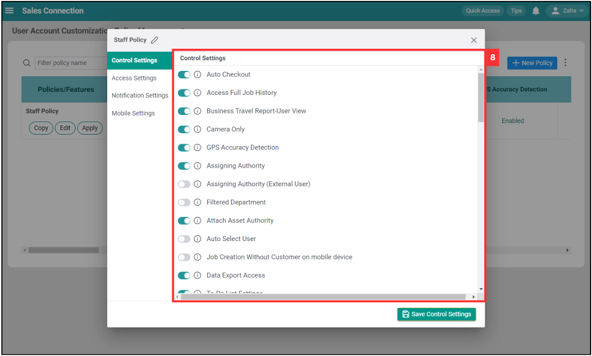

Version 1.0 
Created: 3 July 2024 
Updated: 3 July 2024 
## UAC Policy Management

**UAC Policy Management** is a feature for you to set user setting templates for your users to easily be applied for new users or users being moved to different roles in the system.  

**Navigate to the section by clicking it.** 

- [How to Create/Edit a Policy?](#section1) 
- [How to Apply a Policy?](#section2) 
- [How to Copy a Policy?](#section3) 
- [How to Delete a Policy?](#section4)
   

1. At the desktop's navigation bar, go to User Management > User Account Customisation Policy.

   

     
   

   *Note: You must have access to User Management menu to perform this action. Please request permission or help from your admin if you do not have access to the menu. 
    

   

   ### How to Create/Edit a Policy?
   
3. Click "+ New Policy" to add a new UAC policy.

   

     
   

4. Click the "Edit" button to edit the new policy.

   

     
   

5. Click on the "pencil" icon to edit the name of the policy.

   

     
   

   
6. Enter the name of the UAC policy.

   

     
   

   
7. Click on the "tick" icon to save the policy's name.

   

     
   

   
8. Select the type of settings.

   

     
   

   
9. Edit the control settings.

   

     
   

   
10. Click "Save Control Settings" to save the changes.

    

      
    

   
11. The policy is edited successfully when this prompt appears.

    

      
    

     

    

    ### How to Apply a Policy?
   
12. Click on "Apply" button.

    

      
    

   
13. Enter the user's name to search the users.

    

      
    

   
14. Tick the box of the user to apply the policy.

    

      
    

   
15. Click "Apply Policy".

    

      
    

   
16. The policy is applied successfully when this prompt appears.

    

      
    

     

    

    ### How to Copy a Policy?
   
17. Click on the "Copy" button.

    

      
    

   
18. The policy has been copied successfully.

    

      
    

     

    

    ### How to Delete a Policy?
     
19. Click the "three dots" icon.

    

      
    

20. Click "Delete Policies".

    

      
    

   
21. Tick the box beside the policy that you want to delete.

    

      
    

   
22. Click "Delete Selected Policy".

    

      
    

   
23. Click "Yes" to confirm deletion.

    

      
    

   
24. The selected policies have been deleted when this prompt appears.

    

      
    

       

**Related Articles**
- [How to Copy Account for New User?](Copy_Account.md)

<!-- [Link Text](https://salesconnection.github.io/Sales-Connection-Support/UAC_Policy_Management.html) -->
